# (PART) Curso estadística básica {-}

# Exploración de los datos


 
Cuando abordamos el estudio de un conjunto de datos, antes de introducirnos en cuestiones más detalladas, es necesario hacer una exploración inicial de los mismos. Así podemos tener una idea más clara de las características principales de los datos que hemos recogido, y de las posibles asociaciones.

En primer lugar, daremos unas ideas sobre la manera de presentar ordenadamente y resumir variables consideradas aisladamente de las demás, para después explorar conjuntamente grupos de variables.

## Datos Univariantes
Los métodos para visualizar y resumir los datos dependen de sus tipos, que básicamente diferenciamos en dos: **categóricos** y **numéricos**.

Los datos *categóricos (o factores)* son aquellos que registran categorías o cualidades. Si descargamos la base de datos [centroSalud-transversal.sav](datos/centroSalud-transversal.sav), ejemplos de variables categóricas son el *sexo*, el *estado civil* y el *nivel de estudios*. Dentro de las categóricas podemos a su vez distinguir entre variable **nominal** y **ordinal**. En esta última hay un orden entre las distintas categorías como  se aprecia en la la variable *nivel de estudios* y *tabaqismo*:


```r
df=read_sav("datos/centroSalud-transversal.sav", user_na=FALSE) %>% haven::as_factor()
```

```r
df %>% head() %>% select(sexo:peso) %>% knitr::kable(booktabs=T)
```

<table>
 <thead>
  <tr>
   <th style="text-align:left;"> sexo </th>
   <th style="text-align:left;"> estcivil </th>
   <th style="text-align:left;"> laboral </th>
   <th style="text-align:left;"> nivelest </th>
   <th style="text-align:left;"> tabaco </th>
   <th style="text-align:left;"> sedentar </th>
   <th style="text-align:left;"> diabm </th>
   <th style="text-align:left;"> hipercol </th>
   <th style="text-align:right;"> hijos </th>
   <th style="text-align:right;"> edad </th>
   <th style="text-align:right;"> talla </th>
   <th style="text-align:right;"> peso </th>
  </tr>
 </thead>
<tbody>
  <tr>
   <td style="text-align:left;"> Hombre </td>
   <td style="text-align:left;"> Casado/pareja </td>
   <td style="text-align:left;"> Jubilado </td>
   <td style="text-align:left;"> Primarios </td>
   <td style="text-align:left;"> Fumador </td>
   <td style="text-align:left;"> No </td>
   <td style="text-align:left;"> No </td>
   <td style="text-align:left;"> No </td>
   <td style="text-align:right;"> 1 </td>
   <td style="text-align:right;"> 73 </td>
   <td style="text-align:right;"> 162 </td>
   <td style="text-align:right;"> 60 </td>
  </tr>
  <tr>
   <td style="text-align:left;"> Hombre </td>
   <td style="text-align:left;"> Casado/pareja </td>
   <td style="text-align:left;"> Jubilado </td>
   <td style="text-align:left;"> Superiores </td>
   <td style="text-align:left;"> No fuma </td>
   <td style="text-align:left;"> No </td>
   <td style="text-align:left;"> No </td>
   <td style="text-align:left;"> Sí </td>
   <td style="text-align:right;"> 2 </td>
   <td style="text-align:right;"> 69 </td>
   <td style="text-align:right;"> 174 </td>
   <td style="text-align:right;"> 77 </td>
  </tr>
  <tr>
   <td style="text-align:left;"> Hombre </td>
   <td style="text-align:left;"> Casado/pareja </td>
   <td style="text-align:left;"> Jubilado </td>
   <td style="text-align:left;"> Bachillerato </td>
   <td style="text-align:left;"> Ex fumador (9-) años </td>
   <td style="text-align:left;"> No </td>
   <td style="text-align:left;"> Sí </td>
   <td style="text-align:left;"> No </td>
   <td style="text-align:right;"> 4 </td>
   <td style="text-align:right;"> 68 </td>
   <td style="text-align:right;"> 170 </td>
   <td style="text-align:right;"> 96 </td>
  </tr>
  <tr>
   <td style="text-align:left;"> Mujer </td>
   <td style="text-align:left;"> Casado/pareja </td>
   <td style="text-align:left;"> Trabaja </td>
   <td style="text-align:left;"> Primarios </td>
   <td style="text-align:left;"> No fuma </td>
   <td style="text-align:left;"> Sí </td>
   <td style="text-align:left;"> No </td>
   <td style="text-align:left;"> Sí </td>
   <td style="text-align:right;"> 2 </td>
   <td style="text-align:right;"> 64 </td>
   <td style="text-align:right;"> 168 </td>
   <td style="text-align:right;"> 82 </td>
  </tr>
  <tr>
   <td style="text-align:left;"> Mujer </td>
   <td style="text-align:left;"> Viudo </td>
   <td style="text-align:left;"> Jubilado </td>
   <td style="text-align:left;"> Primarios </td>
   <td style="text-align:left;"> Ex fumador (9-) años </td>
   <td style="text-align:left;"> Sí </td>
   <td style="text-align:left;"> Sí </td>
   <td style="text-align:left;"> No </td>
   <td style="text-align:right;"> 0 </td>
   <td style="text-align:right;"> 72 </td>
   <td style="text-align:right;"> 162 </td>
   <td style="text-align:right;"> 87 </td>
  </tr>
  <tr>
   <td style="text-align:left;"> Hombre </td>
   <td style="text-align:left;"> Casado/pareja </td>
   <td style="text-align:left;"> Jubilado </td>
   <td style="text-align:left;"> Primarios </td>
   <td style="text-align:left;"> No fuma </td>
   <td style="text-align:left;"> Sí </td>
   <td style="text-align:left;"> Sí </td>
   <td style="text-align:left;"> Sí </td>
   <td style="text-align:right;"> 2 </td>
   <td style="text-align:right;"> 71 </td>
   <td style="text-align:right;"> 170 </td>
   <td style="text-align:right;"> 92 </td>
  </tr>
</tbody>
</table>

Siguiendo con la misma base de datos de pacientes, si recogemos, el peso de una persona es una cantidad numérica. En particular **continua** (los valores dentro de cualquier intervalo son posibles); Esto no ocurre cuando recogemos el *número de hijos*; Esta variable es **discreta**.

### Datos categóricos
Los datos categóricos los examinamos bien con tablas de frecuencias o con representaciones gráficas como diagramas de barras o de sectores.


#### Frecuencias y porcentajes
Las frecuencias pueden obtenerse en términos absolutos (frecuencias absolutas), mostrando las repeticiones de cada categoría, o bien en términos relativos (porcentajes), mostrando los participación de cada categoría en relación con el total. Las frecuencias absolutas se utilizan con muestras de tamaño pequeño, y las relativas tienen más sentido con muestras de tamaño grande.


```r
tabla=KreateTableOne(vars=c("sexo","laboral", "nivelest", "tabaco",  "diabm"),data = df) 
```

```r
tabla  %>% knitr::kable()
```

<table>
 <thead>
  <tr>
   <th style="text-align:left;">   </th>
   <th style="text-align:left;"> Overall </th>
  </tr>
 </thead>
<tbody>
  <tr>
   <td style="text-align:left;"> n </td>
   <td style="text-align:left;"> 352 </td>
  </tr>
  <tr>
   <td style="text-align:left;"> sexo = Mujer (%) </td>
   <td style="text-align:left;"> 222 (63.1) </td>
  </tr>
  <tr>
   <td style="text-align:left;"> laboral (%) </td>
   <td style="text-align:left;">  </td>
  </tr>
  <tr>
   <td style="text-align:left;"> Trabaja </td>
   <td style="text-align:left;"> 62 (17.6) </td>
  </tr>
  <tr>
   <td style="text-align:left;"> Parado </td>
   <td style="text-align:left;"> 11 ( 3.1) </td>
  </tr>
  <tr>
   <td style="text-align:left;"> Jubilado </td>
   <td style="text-align:left;"> 164 (46.6) </td>
  </tr>
  <tr>
   <td style="text-align:left;"> Ama de casa </td>
   <td style="text-align:left;"> 115 (32.7) </td>
  </tr>
  <tr>
   <td style="text-align:left;"> nivelest (%) </td>
   <td style="text-align:left;">  </td>
  </tr>
  <tr>
   <td style="text-align:left;"> Sin estudios </td>
   <td style="text-align:left;"> 60 (17.0) </td>
  </tr>
  <tr>
   <td style="text-align:left;"> Sabe leer y escribir </td>
   <td style="text-align:left;"> 107 (30.4) </td>
  </tr>
  <tr>
   <td style="text-align:left;"> Primarios </td>
   <td style="text-align:left;"> 122 (34.7) </td>
  </tr>
  <tr>
   <td style="text-align:left;"> Bachillerato </td>
   <td style="text-align:left;"> 33 ( 9.4) </td>
  </tr>
  <tr>
   <td style="text-align:left;"> Superiores </td>
   <td style="text-align:left;"> 30 ( 8.5) </td>
  </tr>
  <tr>
   <td style="text-align:left;"> tabaco (%) </td>
   <td style="text-align:left;">  </td>
  </tr>
  <tr>
   <td style="text-align:left;"> No fuma </td>
   <td style="text-align:left;"> 112 (31.8) </td>
  </tr>
  <tr>
   <td style="text-align:left;"> Ex fumador (10+) años </td>
   <td style="text-align:left;"> 15 ( 4.3) </td>
  </tr>
  <tr>
   <td style="text-align:left;"> Ex fumador (9-) años </td>
   <td style="text-align:left;"> 178 (50.6) </td>
  </tr>
  <tr>
   <td style="text-align:left;"> Fumador </td>
   <td style="text-align:left;"> 47 (13.4) </td>
  </tr>
  <tr>
   <td style="text-align:left;"> diabm = No (%) </td>
   <td style="text-align:left;"> 245 (69.6) </td>
  </tr>
</tbody>
</table>


Si las variables son categóricas ordinales (o numéricas) pueden sernos de interés los porcentajes acumulados. Nos indican para cada valor de la variable, en qué porcentaje de ocasiones se presentó un valor inferior o igual.


#### Diagrama de barras
El diagrama de barras se representa asignándole a cada modalidad de la variable una barra de una altura proporcional a su frecuencia absoluta o a su porcentaje. En ambos casos el gráfico es el mismo, sólo se modifica la escala.


```r
grid.arrange(plot_frq(df$sexo),  plot_frq(df$laboral) , plot_frq(df$nivelest), plot_frq(df$diabm),ncol=2)
```

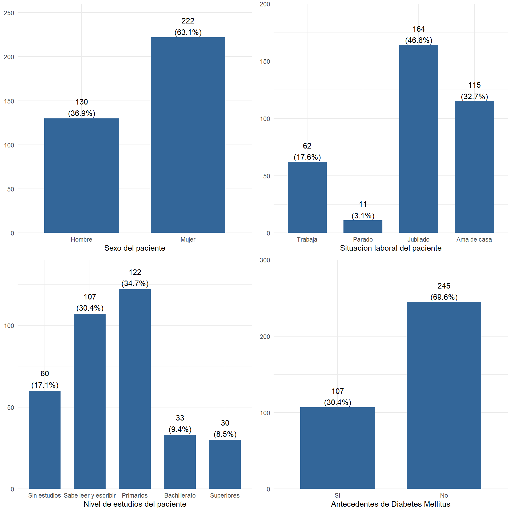


#### Diagramas de sectores
En este diagrama se le asigna a cada valor un sector cuyo ángulo sea proporcional a su frecuencia. Se suele utilizar en datos categóricos nominales y no tanto en los ordinales (es menos clara de interpretar).


```r
grid.arrange(
ggplot(df, aes(x = factor(1), fill = sexo)) + geom_bar(width = 1) + coord_polar(theta = "y") + theme_void(),
ggplot(df, aes(x = factor(1), fill = nivelest)) + geom_bar(width = 1) + coord_polar(theta = "y") + theme_void(),
nrow=1)
```

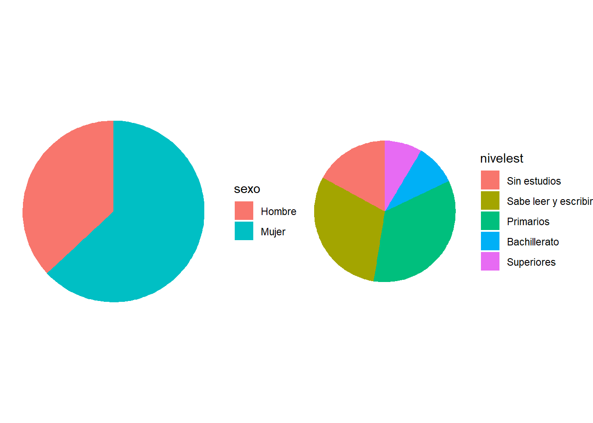


Si usamos SPSS, tanto tablas de frecuencias como los gráficos mencionados los encontramos en la opción de menú “_Analizar – Estadísticos Descriptivos – Frecuencias_”.

### Datos Numéricos.
Los datos numéricos son mucho más ricos en información que los datos categóricos. Por tanto además de las tablas, tenemos otras medidas que sirven para resumir la información que contienen. Dependiendo de cómo se distribuyan los datos, usaremos grupos de medidas de resumen diferentes.

Cuando se tiene una variable numérica, lo primero que nos puede interesar es alrededor de qué valor se agrupan los datos, y cómo se dispersan con respecto a él.

En múltiples ocasiones los datos presentan cierta distribución acampanada como la de la figura adjunta, denominada distribución normal. En estos casos con sólo dos medidas como son la media y la desviación típica tenemos resumida prácticamente toda la información contenida en las observaciones.


```r
plot_frq(df$talla, type = "hist", show.mean = TRUE,normal.curve = TRUE)
```

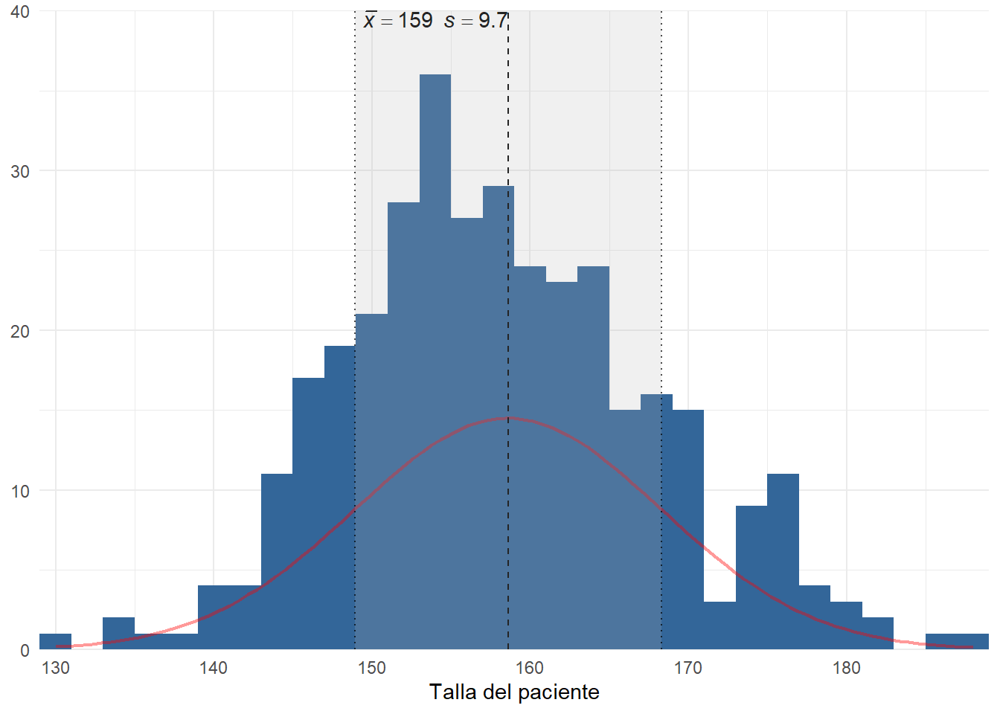


La media: es el promedio de todos los valores de la variable, es decir, la suma de todos los datos dividido por el número de ellos. La **desviación típica (S)** nos da una medida de la dispersión que tienen los datos con respecto a la media. En datos de distribución _acampanada_ (aproximadamente normal), ocurre lo siguiente:

- Entre la media y a una distancia de **una** desviación típica se encuentra (aproximadamente) el **68%** central de los datos.

- Entre la media y a una distancia de **dos** desviación típica se encuentra (aproximadamente) el **95%** central de los datos.

 
> [Sigue este enlace para practicar con la desviación típica](https://www.bioestadistica.uma.es/analisis/teoremacentral/)


La media y la desviación muestral no tienen tanto interés cuando los datos presentan largas colas u observaciones anómalas  (outliers), es decir, son muy influenciables por las asimetrías y los valores extremos. En estos casos, debemos considerar medidas más resistentes a estas influencias. 


```r
grid.arrange(
plot_frq(df$peso, type = "hist", show.mean = TRUE,normal.curve = TRUE)+coord_cartesian(xlim=c(40,160)),
plot_frq(df$peso, type = "boxplot", show.mean = TRUE,normal.curve = TRUE) + 
  coord_cartesian(ylim=c(40,160))+ coord_flip(), nrow=2)
```

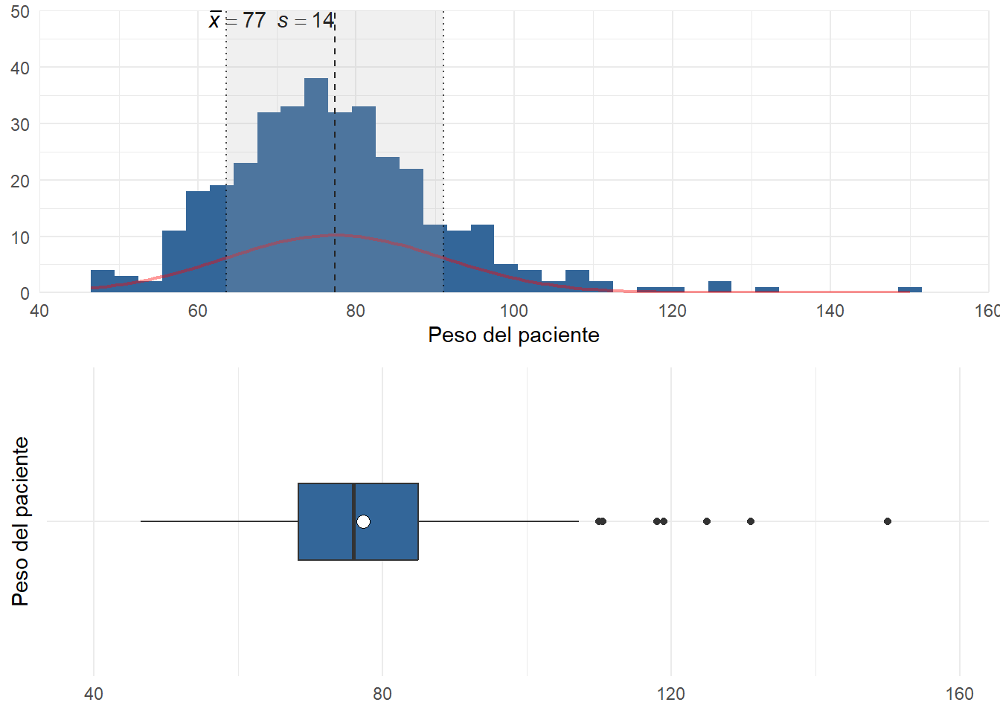

Como medidas de centralización resistentes podemos utilizar en sustitución de la media:

 - La mediana, que es aquel valor que deja la mitad de los datos por debajo de él.

 - La media recortada (trimmed mean), muy utilizada en datos preferentemente simétricos, con muchas observaciones anómalas y, que se obtiene eliminando un determinado porcentaje de los datos menores y mayores; Así calculamos la media sin contar con ese porcentaje de datos extremos, haciendo desaparecer su influencia.

En cuanto a las medidas de dispersión más resistentes podemos utilizar el **rango intercuartílico** (_IQR_), que es la diferencia entre el tercer cuartil y el primero. El primer cuartil (Q1) deja al 25% de los datos por debajo de él y el tercer cuartil (Q3) deja al 75%, por tanto sabemos que entre ambos valores se encuentra el 50% central de las observaciones. 

> [Para practicar con percentiles sigue este enlace](https://www.bioestadistica.uma.es/analisis/percentil/)

Ahora bien, ¿qué criterios aproximados podemos utilizar para clasificar unos datos como normales o no? Para ello destacamos varias características de la distribución normal. El alejamiento de las mismas es indicación de falta de normalidad: 

 - Es simétrica (el coeficiente de asimetría vale cero)
 - Tiene forma de campana (el apuntamiento o curtosis vale cero).
 - Coinciden la media y la mediana
 - Aproximadamente el 95% de las observaciones se encuentran en el intervalo de centro la media y radio dos veces la desviación típica.

 

Los indicadores que miden la simetría y la forma de la campana son el **coeficiente de asimetría** (_skewness_) (negativo en distribuciones con cola a la izquierda, positivo en distribuciones con cola a la derecha) y la **curtosis** (_kurtosis_) (negativa para las aplanadas y positiva para las apuntadas).


```r
generaTablaDescriptivaNumericas(df,c("edad","peso","talla","imc"),
               columnas = c("n", "media","dt","min","p25","p50","p75","max","asim","curtosis")) %>%
  kable(booktabs=T)
```

<table>
 <thead>
  <tr>
   <th style="text-align:left;"> Variable </th>
   <th style="text-align:right;"> n </th>
   <th style="text-align:right;"> media </th>
   <th style="text-align:right;"> dt </th>
   <th style="text-align:right;"> p25 </th>
   <th style="text-align:right;"> p50 </th>
   <th style="text-align:right;"> p75 </th>
   <th style="text-align:right;"> asim </th>
   <th style="text-align:right;"> curtosis </th>
  </tr>
 </thead>
<tbody>
  <tr>
   <td style="text-align:left;"> edad </td>
   <td style="text-align:right;"> 352 </td>
   <td style="text-align:right;"> 66 </td>
   <td style="text-align:right;"> 10.4 </td>
   <td style="text-align:right;"> 59 </td>
   <td style="text-align:right;"> 66 </td>
   <td style="text-align:right;"> 73 </td>
   <td style="text-align:right;"> -0.28 </td>
   <td style="text-align:right;"> 0.11 </td>
  </tr>
  <tr>
   <td style="text-align:left;"> peso </td>
   <td style="text-align:right;"> 352 </td>
   <td style="text-align:right;"> 77 </td>
   <td style="text-align:right;"> 13.8 </td>
   <td style="text-align:right;"> 68 </td>
   <td style="text-align:right;"> 76 </td>
   <td style="text-align:right;"> 85 </td>
   <td style="text-align:right;"> 1.00 </td>
   <td style="text-align:right;"> 2.86 </td>
  </tr>
  <tr>
   <td style="text-align:left;"> talla </td>
   <td style="text-align:right;"> 352 </td>
   <td style="text-align:right;"> 159 </td>
   <td style="text-align:right;"> 9.7 </td>
   <td style="text-align:right;"> 152 </td>
   <td style="text-align:right;"> 158 </td>
   <td style="text-align:right;"> 165 </td>
   <td style="text-align:right;"> 0.27 </td>
   <td style="text-align:right;"> -0.02 </td>
  </tr>
  <tr>
   <td style="text-align:left;"> imc </td>
   <td style="text-align:right;"> 352 </td>
   <td style="text-align:right;"> 31 </td>
   <td style="text-align:right;"> 5.2 </td>
   <td style="text-align:right;"> 28 </td>
   <td style="text-align:right;"> 30 </td>
   <td style="text-align:right;"> 33 </td>
   <td style="text-align:right;"> 1.04 </td>
   <td style="text-align:right;"> 2.05 </td>
  </tr>
</tbody>
</table>


```r
grid.arrange(
ggplot(df,aes(x=edad))+geom_histogram(),
ggplot(df,aes(x=talla))+geom_histogram(),
ggplot(df,aes(x=peso))+geom_histogram(),
ggplot(df,aes(x=imc))+geom_histogram(),
nrow=2)
```

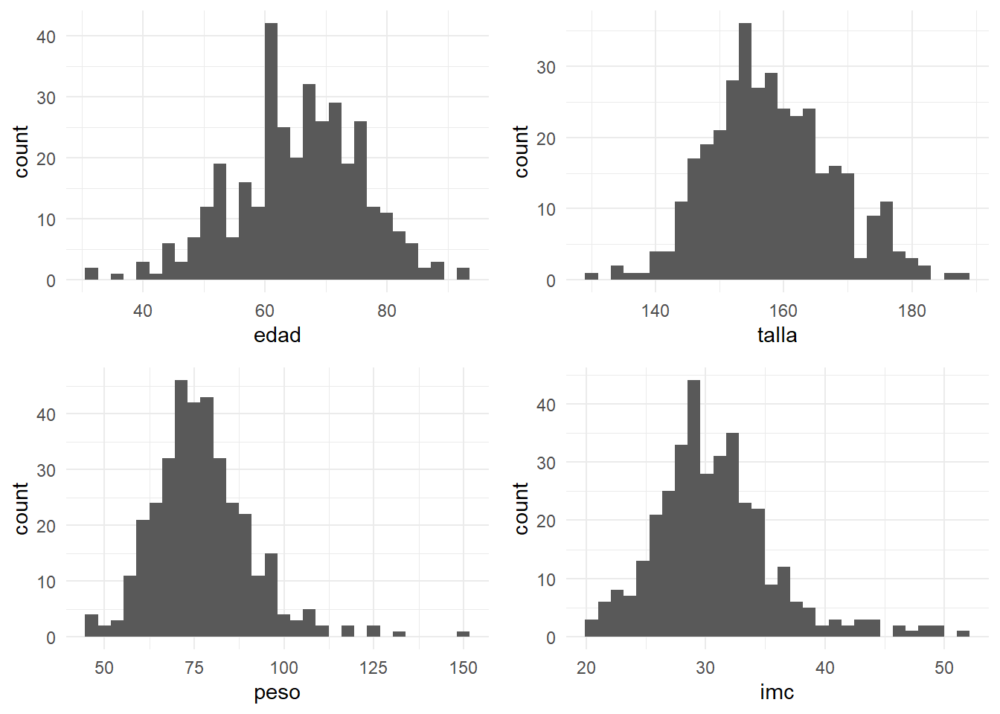


En la tablas anteriores, así como en los gráficos (llamados **histogramas**) vemos como _peso_ e _IMC_ presentan una cierta falta de normalidad; Podríamos entonces presentar un resumen de estas variables del siguiente modo:


```r
tabla=KreateTableOne(data = df %>% select(edad,talla,peso,imc),nonnormal=c("peso","imc"))
```

```r
tabla %>% knitr::kable(booktabs=TRUE)
```

<table>
 <thead>
  <tr>
   <th style="text-align:left;">   </th>
   <th style="text-align:left;"> Overall </th>
  </tr>
 </thead>
<tbody>
  <tr>
   <td style="text-align:left;"> n </td>
   <td style="text-align:left;"> 352 </td>
  </tr>
  <tr>
   <td style="text-align:left;"> edad (mean (SD)) </td>
   <td style="text-align:left;"> 65.51 (10.45) </td>
  </tr>
  <tr>
   <td style="text-align:left;"> talla (mean (SD)) </td>
   <td style="text-align:left;"> 158.61 (9.69) </td>
  </tr>
  <tr>
   <td style="text-align:left;"> peso (median [IQR]) </td>
   <td style="text-align:left;"> 76.00 [68.38, 85.00] </td>
  </tr>
  <tr>
   <td style="text-align:left;"> imc (median [IQR]) </td>
   <td style="text-align:left;"> 30.11 [27.59, 33.20] </td>
  </tr>
</tbody>
</table>


La falta de normalidad no es fácil de apreciarlo mirando directamente el histograma. Hay gráficos como el Q-Q plot, que nos indican la falta de normalidad como desviaciones de la observaciones con respecto a una línea recta:


```r
grid.arrange(
ggplot(df, aes(sample =edad))  +  stat_qq() + stat_qq_line()+ggtitle("edad"),
ggplot(df, aes(sample =talla))  +  stat_qq() + stat_qq_line()+ggtitle("peso"),
ggplot(df, aes(sample =peso)) + stat_qq() +  stat_qq_line()+ggtitle("talla"),
ggplot(df, aes(sample =imc))   +  stat_qq() + stat_qq_line()+ggtitle("imc"), 
nrow=2)
```

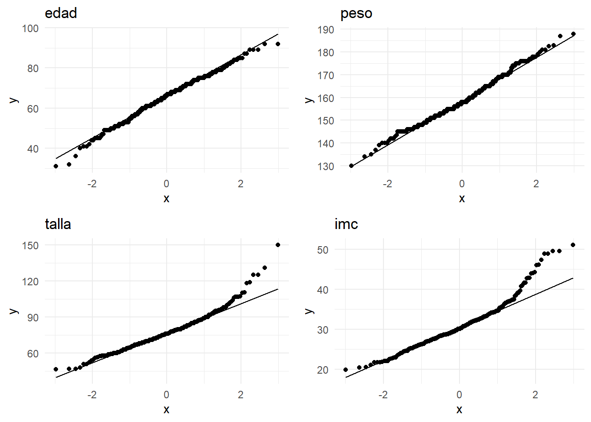


Las medida mencionadas podemos calcularlas con SPSS en el menú “_Analizar – Estadísticos Descriptivos – Frecuencias_”  y pulsando el botón “_Estadísticos…_”, o bien podemos usar el menú "_Analizar - Estadísticos descriptivos - Explorar_", donde podemos añadir los gráficos con pruebas de normalidad.


## Datos bivariantes
Si resumir la información de una variable es de por sí interesante, en investigación lo es mucho más el poner de manifiesto la posible relación entre dos de ellas:

> ¿Hay relación entre el tabaco y el cáncer de pulmón? ¿Aumentando la dosis de un medicamento, mejoramos la respuesta? 

Para ello realizamos estudios donde intervienen ambas variables simultáneamente. Según sean los tipos de cada una de ellas usaremos técnicas diferentes.

### Categórica-categórica
Cuando ambas variables son categóricas (o discretas con pocas modalidades), se suele presentar las observaciones en una tabla de contingencia. Esta una tabla de doble entrada donde se presentan la distribución de frecuencias conjunta de las dos variables.

Continuando con la base de datos del ejemplo, podríamos estudiar qué distribución presentan otras variables cualitativas según el sexo del paciente. Lo mostraríamos como sigue:

```r
tabla=KreateTableOne(vars = c("tabaco","estcivil","sedentar","diabm","hipercol"), strata = "sexo" , data = df)
```

```r
tabla %>% knitr::kable(booktabs=T)
```

<table>
 <thead>
  <tr>
   <th style="text-align:left;">   </th>
   <th style="text-align:left;"> Hombre </th>
   <th style="text-align:left;"> Mujer </th>
   <th style="text-align:left;"> p </th>
   <th style="text-align:left;"> test </th>
  </tr>
 </thead>
<tbody>
  <tr>
   <td style="text-align:left;"> n </td>
   <td style="text-align:left;"> 130 </td>
   <td style="text-align:left;"> 222 </td>
   <td style="text-align:left;">  </td>
   <td style="text-align:left;">  </td>
  </tr>
  <tr>
   <td style="text-align:left;"> tabaco (%) </td>
   <td style="text-align:left;">  </td>
   <td style="text-align:left;">  </td>
   <td style="text-align:left;"> &lt;0.001 </td>
   <td style="text-align:left;">  </td>
  </tr>
  <tr>
   <td style="text-align:left;"> No fuma </td>
   <td style="text-align:left;"> 39 (30.0) </td>
   <td style="text-align:left;"> 73 (32.9) </td>
   <td style="text-align:left;">  </td>
   <td style="text-align:left;">  </td>
  </tr>
  <tr>
   <td style="text-align:left;"> Ex fumador (10+) años </td>
   <td style="text-align:left;"> 13 (10.0) </td>
   <td style="text-align:left;"> 2 ( 0.9) </td>
   <td style="text-align:left;">  </td>
   <td style="text-align:left;">  </td>
  </tr>
  <tr>
   <td style="text-align:left;"> Ex fumador (9-) años </td>
   <td style="text-align:left;"> 43 (33.1) </td>
   <td style="text-align:left;"> 135 (60.8) </td>
   <td style="text-align:left;">  </td>
   <td style="text-align:left;">  </td>
  </tr>
  <tr>
   <td style="text-align:left;"> Fumador </td>
   <td style="text-align:left;"> 35 (26.9) </td>
   <td style="text-align:left;"> 12 ( 5.4) </td>
   <td style="text-align:left;">  </td>
   <td style="text-align:left;">  </td>
  </tr>
  <tr>
   <td style="text-align:left;"> estcivil (%) </td>
   <td style="text-align:left;">  </td>
   <td style="text-align:left;">  </td>
   <td style="text-align:left;"> &lt;0.001 </td>
   <td style="text-align:left;">  </td>
  </tr>
  <tr>
   <td style="text-align:left;"> Soltero </td>
   <td style="text-align:left;"> 4 ( 3.1) </td>
   <td style="text-align:left;"> 12 ( 5.4) </td>
   <td style="text-align:left;">  </td>
   <td style="text-align:left;">  </td>
  </tr>
  <tr>
   <td style="text-align:left;"> Casado/pareja </td>
   <td style="text-align:left;"> 115 (88.5) </td>
   <td style="text-align:left;"> 124 (55.9) </td>
   <td style="text-align:left;">  </td>
   <td style="text-align:left;">  </td>
  </tr>
  <tr>
   <td style="text-align:left;"> Separado </td>
   <td style="text-align:left;"> 2 ( 1.5) </td>
   <td style="text-align:left;"> 11 ( 5.0) </td>
   <td style="text-align:left;">  </td>
   <td style="text-align:left;">  </td>
  </tr>
  <tr>
   <td style="text-align:left;"> Viudo </td>
   <td style="text-align:left;"> 9 ( 6.9) </td>
   <td style="text-align:left;"> 75 (33.8) </td>
   <td style="text-align:left;">  </td>
   <td style="text-align:left;">  </td>
  </tr>
  <tr>
   <td style="text-align:left;"> sedentar = No (%) </td>
   <td style="text-align:left;"> 82 (63.1) </td>
   <td style="text-align:left;"> 107 (48.2) </td>
   <td style="text-align:left;"> 0.010 </td>
   <td style="text-align:left;">  </td>
  </tr>
  <tr>
   <td style="text-align:left;"> diabm = No (%) </td>
   <td style="text-align:left;"> 102 (78.5) </td>
   <td style="text-align:left;"> 143 (64.4) </td>
   <td style="text-align:left;"> 0.008 </td>
   <td style="text-align:left;">  </td>
  </tr>
  <tr>
   <td style="text-align:left;"> hipercol = No (%) </td>
   <td style="text-align:left;"> 97 (74.6) </td>
   <td style="text-align:left;"> 147 (67.1) </td>
   <td style="text-align:left;"> 0.176 </td>
   <td style="text-align:left;">  </td>
  </tr>
</tbody>
</table>


En la tabla anterior hay una columna denominada _p_ (**significación**) que será my importante en temas posteriores.
 

En cuanto a la representación gráfica, podemos utilizar  el diagrama de barras apiladas o agrupadas, aunque en ellos no es inmediato apreciar las diferencias por sexos

```r
grid.arrange(
plot_grpfrq(df$tabaco, df$sexo,show.prc = FALSE),
plot_grpfrq(df$estcivil, df$sexo,,show.prc = FALSE),
plot_grpfrq(df$sedentar, df$sexo,show.prc = FALSE),
plot_grpfrq(df$diabm, df$sexo,show.prc = FALSE),
plot_grpfrq(df$hipercol, df$sexo,show.prc = FALSE),ncol=1)
```

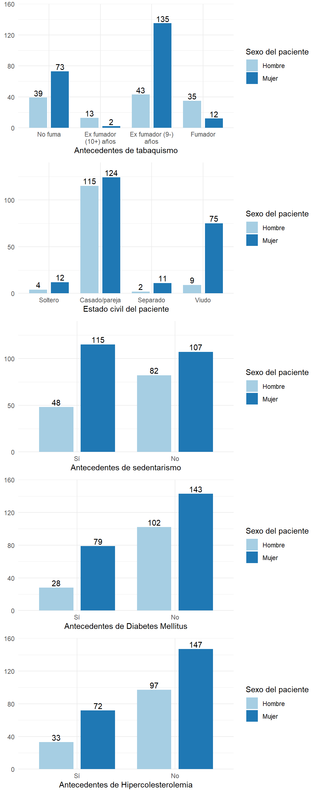
 
Desglosando en cada categoría de la variable los porcentajes de cada sexo es más sencillo de ver:
 

```r
dftmp=df %>% select(sexo,tabaco)%>% filter(!is.na(tabaco)) %>% 
  mutate(cuenta=1) %>% group_by(sexo,tabaco) %>% 
  tally() %>% mutate(fraccion=n/sum(n))
ggplot(dftmp, aes(fill=sexo, y=fraccion, x=tabaco)) + 
    geom_bar( stat="identity", position="fill")
```

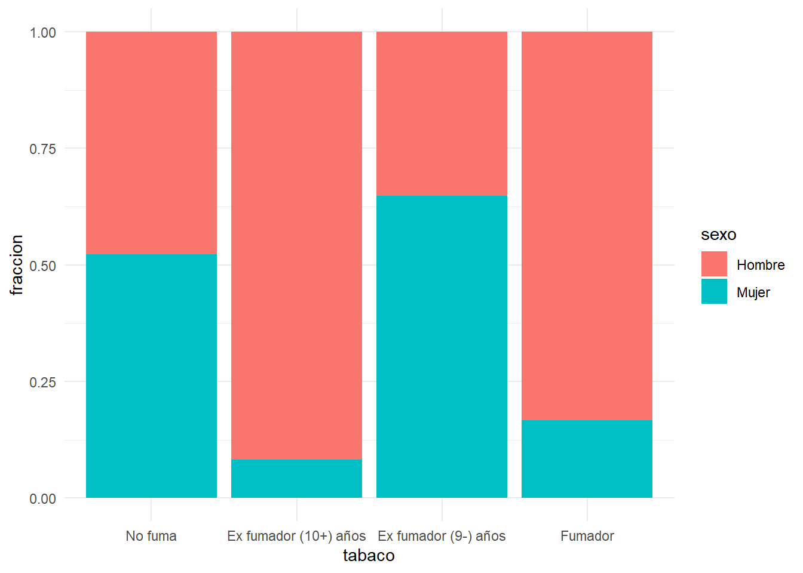


```r
dftmp=df %>% select(sexo,diabm) %>% filter(!is.na(diabm)) %>% mutate(cuenta=1) %>% group_by(sexo,diabm) %>% tally() %>% mutate(fraccion=n/sum(n))
ggplot(dftmp, aes(fill=sexo, y=fraccion, x=diabm)) + 
    geom_bar( stat="identity", position="fill")
```

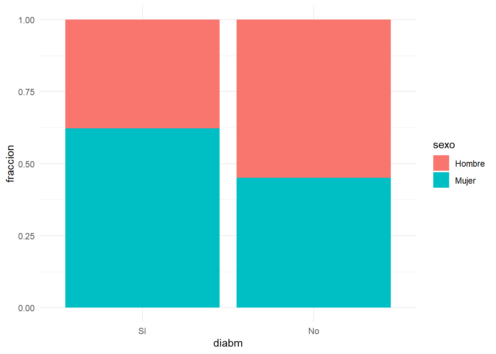
 
 


### Categórica-Numérica


Supongamos que tenemos datos numéricos para varias categorías. Por ejemplo, en un experimento donde hacemos mediciones numéricas en dos grupos: uno al que se le aplica determinado tratamiento y otro de control. Podemos describir los resultados del experimento con sólo dos variables: Una variable categórica que representa el grupo de tratamiento, y otra que representa el resultado numérico

En estos casos, lo que se realiza es un estudio descriptivo de la variable numérica en cada una de las muestras y comparamos los resultados.

Volviendo a nuestro ejemplo, vamos a comparar las variables numéricas de la base de datos entre sexos:


```r
tabla=KreateTableOne(vars = c("edad", "talla","peso","imc"), strata = "sexo" , data = df) 
```


```r
tabla %>% knitr::kable(booktabs=T)
```

<table>
 <thead>
  <tr>
   <th style="text-align:left;">   </th>
   <th style="text-align:left;"> Hombre </th>
   <th style="text-align:left;"> Mujer </th>
   <th style="text-align:left;"> p </th>
   <th style="text-align:left;"> test </th>
  </tr>
 </thead>
<tbody>
  <tr>
   <td style="text-align:left;"> n </td>
   <td style="text-align:left;"> 130 </td>
   <td style="text-align:left;"> 222 </td>
   <td style="text-align:left;">  </td>
   <td style="text-align:left;">  </td>
  </tr>
  <tr>
   <td style="text-align:left;"> edad (mean (SD)) </td>
   <td style="text-align:left;"> 63.78 (11.11) </td>
   <td style="text-align:left;"> 66.53 (9.93) </td>
   <td style="text-align:left;"> 0.017 </td>
   <td style="text-align:left;">  </td>
  </tr>
  <tr>
   <td style="text-align:left;"> talla (mean (SD)) </td>
   <td style="text-align:left;"> 166.99 (7.24) </td>
   <td style="text-align:left;"> 153.70 (7.28) </td>
   <td style="text-align:left;"> &lt;0.001 </td>
   <td style="text-align:left;">  </td>
  </tr>
  <tr>
   <td style="text-align:left;"> peso (mean (SD)) </td>
   <td style="text-align:left;"> 81.36 (14.08) </td>
   <td style="text-align:left;"> 74.98 (13.02) </td>
   <td style="text-align:left;"> &lt;0.001 </td>
   <td style="text-align:left;">  </td>
  </tr>
  <tr>
   <td style="text-align:left;"> imc (mean (SD)) </td>
   <td style="text-align:left;"> 29.07 (3.82) </td>
   <td style="text-align:left;"> 31.81 (5.57) </td>
   <td style="text-align:left;"> &lt;0.001 </td>
   <td style="text-align:left;">  </td>
  </tr>
</tbody>
</table>


```r
tabla=KreateTableOne(data=df,vars = c("edad","peso","talla","imc","pas","pad","fc"), strata = "tabaco" ) 
```


```r
tabla %>% knitr::kable(booktabs=T)
```

<table>
 <thead>
  <tr>
   <th style="text-align:left;">   </th>
   <th style="text-align:left;"> No fuma </th>
   <th style="text-align:left;"> Ex fumador (10+) años </th>
   <th style="text-align:left;"> Ex fumador (9-) años </th>
   <th style="text-align:left;"> Fumador </th>
   <th style="text-align:left;"> p </th>
   <th style="text-align:left;"> test </th>
  </tr>
 </thead>
<tbody>
  <tr>
   <td style="text-align:left;"> n </td>
   <td style="text-align:left;"> 112 </td>
   <td style="text-align:left;"> 15 </td>
   <td style="text-align:left;"> 178 </td>
   <td style="text-align:left;"> 47 </td>
   <td style="text-align:left;">  </td>
   <td style="text-align:left;">  </td>
  </tr>
  <tr>
   <td style="text-align:left;"> edad (mean (SD)) </td>
   <td style="text-align:left;"> 68.38 (9.06) </td>
   <td style="text-align:left;"> 63.07 (7.39) </td>
   <td style="text-align:left;"> 66.13 (10.45) </td>
   <td style="text-align:left;"> 57.13 (10.13) </td>
   <td style="text-align:left;"> &lt;0.001 </td>
   <td style="text-align:left;">  </td>
  </tr>
  <tr>
   <td style="text-align:left;"> peso (mean (SD)) </td>
   <td style="text-align:left;"> 77.60 (14.19) </td>
   <td style="text-align:left;"> 79.66 (10.76) </td>
   <td style="text-align:left;"> 75.89 (13.45) </td>
   <td style="text-align:left;"> 81.43 (14.08) </td>
   <td style="text-align:left;"> 0.085 </td>
   <td style="text-align:left;">  </td>
  </tr>
  <tr>
   <td style="text-align:left;"> talla (mean (SD)) </td>
   <td style="text-align:left;"> 158.50 (9.59) </td>
   <td style="text-align:left;"> 165.67 (5.25) </td>
   <td style="text-align:left;"> 155.84 (8.60) </td>
   <td style="text-align:left;"> 167.13 (9.03) </td>
   <td style="text-align:left;"> &lt;0.001 </td>
   <td style="text-align:left;">  </td>
  </tr>
  <tr>
   <td style="text-align:left;"> imc (mean (SD)) </td>
   <td style="text-align:left;"> 30.93 (5.06) </td>
   <td style="text-align:left;"> 28.92 (2.76) </td>
   <td style="text-align:left;"> 31.33 (5.59) </td>
   <td style="text-align:left;"> 29.07 (3.67) </td>
   <td style="text-align:left;"> 0.025 </td>
   <td style="text-align:left;">  </td>
  </tr>
  <tr>
   <td style="text-align:left;"> pas (mean (SD)) </td>
   <td style="text-align:left;"> 148.01 (20.29) </td>
   <td style="text-align:left;"> 131.20 (14.74) </td>
   <td style="text-align:left;"> 142.61 (19.08) </td>
   <td style="text-align:left;"> 136.81 (16.95) </td>
   <td style="text-align:left;"> &lt;0.001 </td>
   <td style="text-align:left;">  </td>
  </tr>
  <tr>
   <td style="text-align:left;"> pad (mean (SD)) </td>
   <td style="text-align:left;"> 80.51 (10.78) </td>
   <td style="text-align:left;"> 80.93 (12.66) </td>
   <td style="text-align:left;"> 81.76 (9.92) </td>
   <td style="text-align:left;"> 83.68 (10.41) </td>
   <td style="text-align:left;"> 0.359 </td>
   <td style="text-align:left;">  </td>
  </tr>
  <tr>
   <td style="text-align:left;"> fc (mean (SD)) </td>
   <td style="text-align:left;"> 73.86 (12.32) </td>
   <td style="text-align:left;"> 76.67 (12.47) </td>
   <td style="text-align:left;"> 71.65 (10.39) </td>
   <td style="text-align:left;"> 73.15 (12.68) </td>
   <td style="text-align:left;"> 0.212 </td>
   <td style="text-align:left;">  </td>
  </tr>
</tbody>
</table>


En las tablas anteriores aparecen de nuevos las cantidades **p** **(significación)** de las que hablaremos más adelante.


Los diagramas de cajas muestran los cuartiles en unas cajas centrales, así como observaciones más alejadas, y permiten hacerse una idea visual de qué diferencias existen entre los grupos. Por ejemplo, en las tablas anteriores se apreciaba una cierta diferencia de *talla* entre hombres y mujeres, aunque no así en *pad*:


```r
grid.arrange(
ggplot(df,aes(x=sexo,y=talla))+geom_boxplot(),
ggplot(df,aes(x=sexo,y=pad))+geom_boxplot(),ncol=2)
```

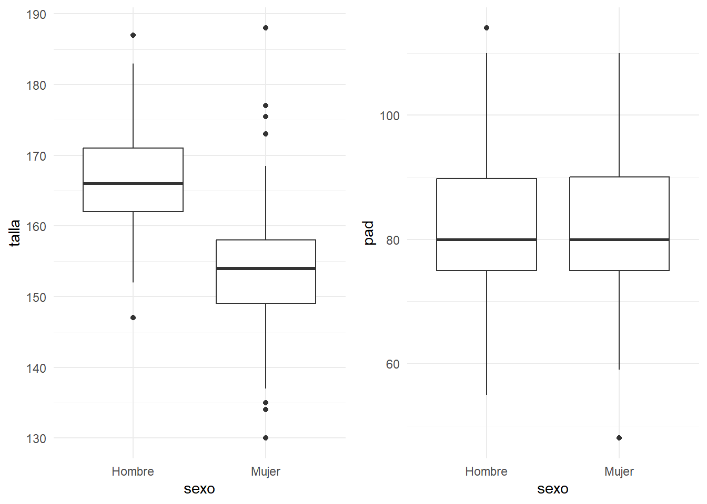


Si usamos _SPSS_, tenemos a nuestra disposición la opción de menú “*Analizar – Estadísticos descriptivos – Explorar…*”. En la casilla denominada “_dependientes_” situamos la variable numérica y en “_factores_” situamos la categórica. 

### Numérica-Numérica.

Cuando hablamos de comparar dos variables numéricas, pensamos en establecer la posible relación entre ellas. 

>¿Estarán relacionados la altura y el peso de los individuos? ¿Cuanto mayor es el tamaño del cerebro, mayor es el coeficiente intelectual?

La vía más directa para estudiar la posible asociación consiste en inspeccionar visualmente un diagrama de dispersión (nube de puntos). Si reconocemos una tendencia, es una indicación de que puede valer la pena explorar con más profundidad. Si es el caso, puede interesarnos proseguir con un análisis de regresión. En este tipo de análisis se pretende encontrar un modelo matemático (recta de regresión) que explique los valores de una de las variables (dependiente) en función de la otra (independiente). A ello le dedicamos un capítulo con posterioridad.


Por ejemplo, en la base de datos con que trabajamos, es lógico esperar una buena relación entre el _peso_ y el _imc_, y eso es justo lo que encontramos.


```r
ggplot(df, aes(x=peso, y=imc)) + geom_jitter(alpha=0.3)
```

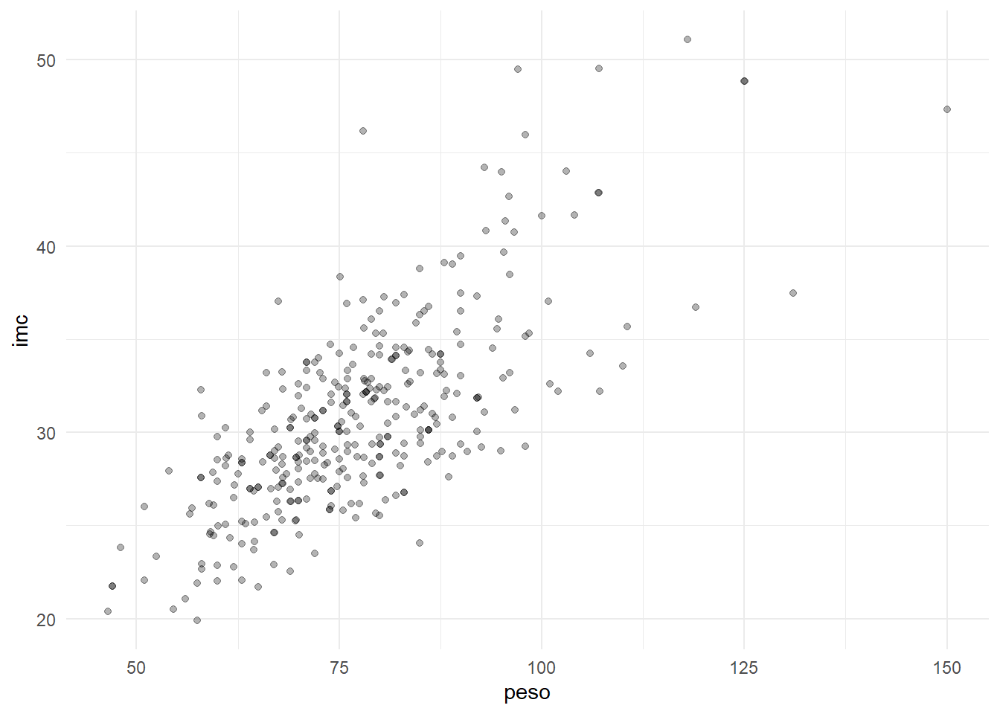

En otras variables la relación no es tan evidente, como la que existe entre _edad_ y mayor _presión arterial diastólica_ y menor _presión arterial sistólica_. Las rectas de regresión no serán muy útiles para percibir la tendencia con más facilidad (aunque esto solo lo utilizamos ahora como ayuda visual).


```r
grid.arrange(
  ggplot(df, aes(x=edad, y=pas)) + geom_jitter(alpha=0.3)+geom_smooth(method="lm"),
ggplot(df, aes(x=edad, y=pad)) + geom_jitter(alpha=0.3)+geom_smooth(method="lm"),nrow=1)
```

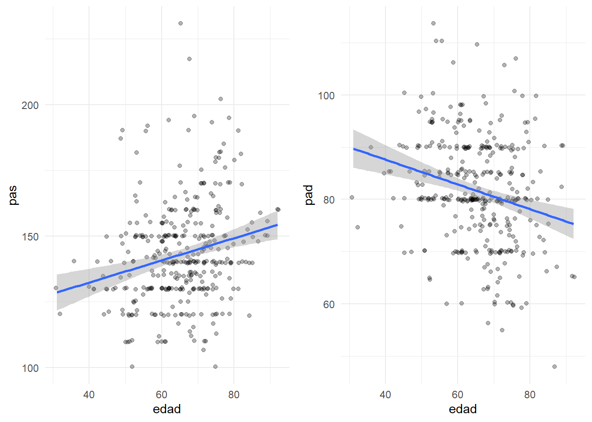


 
Para describir numéricamente el grado de asociación lineal dentre variables numéricas suele usarse el **coeficiente de correlación lineal de Pearson (r)**. Esta es una cantidad adimensional que toma valores entre -1 y 1. Cuando _r=0_ se dice que hay *incorrelación* (nada de asociación lineal). Cuánto más se aleje r de cero, mayor es el grado de asociación lineal entre las vaiables.

> [Para practicar con el coeficiente de correlación lineal de Pearson, siga este enlace](https://www.bioestadistica.uma.es/analisis/correlacion/)


Los gráficos mostrados se realizan en *SPSS* en el menú: “*Gráficos – Dispersión… – Simple*“. El *coeficiente de correlacion lineal de Pearson* lo encontramos en el menú: "*Analizar - Correlaciones - Bivariadas*".


Si queremos mostrar todas las correlaciones existentes entre las variables numéricas de nuestra base de datos, tendremos un *r* que mostrar por cada par de variables. Eso hace una buena cantidad de números. Una forma habitual de mostrarlos sin ocupar mucho espacio es esta:


```r
df %>% generaTablaCorrelaciones(vNumericas = c("edad","peso","talla","imc","pas","pad","fc")) %>%
  knitr::kable(booktabs=T)
```

<table>
 <thead>
  <tr>
   <th style="text-align:left;"> Variable </th>
   <th style="text-align:left;"> edad </th>
   <th style="text-align:left;"> [01] </th>
   <th style="text-align:left;"> [02] </th>
   <th style="text-align:left;"> [03] </th>
   <th style="text-align:left;"> [04] </th>
   <th style="text-align:left;"> [05] </th>
  </tr>
 </thead>
<tbody>
  <tr>
   <td style="text-align:left;"> [01] peso </td>
   <td style="text-align:left;"> -0.28*** </td>
   <td style="text-align:left;">  </td>
   <td style="text-align:left;">  </td>
   <td style="text-align:left;">  </td>
   <td style="text-align:left;">  </td>
   <td style="text-align:left;">  </td>
  </tr>
  <tr>
   <td style="text-align:left;"> [02] talla </td>
   <td style="text-align:left;"> -0.31*** </td>
   <td style="text-align:left;"> 0.44*** </td>
   <td style="text-align:left;">  </td>
   <td style="text-align:left;">  </td>
   <td style="text-align:left;">  </td>
   <td style="text-align:left;">  </td>
  </tr>
  <tr>
   <td style="text-align:left;"> [03] imc </td>
   <td style="text-align:left;"> -0.06 </td>
   <td style="text-align:left;"> 0.73*** </td>
   <td style="text-align:left;"> -0.28*** </td>
   <td style="text-align:left;">  </td>
   <td style="text-align:left;">  </td>
   <td style="text-align:left;">  </td>
  </tr>
  <tr>
   <td style="text-align:left;"> [04] pas </td>
   <td style="text-align:left;"> 0.23*** </td>
   <td style="text-align:left;"> 0.03 </td>
   <td style="text-align:left;"> -0.10 </td>
   <td style="text-align:left;"> 0.09 </td>
   <td style="text-align:left;">  </td>
   <td style="text-align:left;">  </td>
  </tr>
  <tr>
   <td style="text-align:left;"> [05] pad </td>
   <td style="text-align:left;"> -0.24*** </td>
   <td style="text-align:left;"> 0.13* </td>
   <td style="text-align:left;"> 0.10 </td>
   <td style="text-align:left;"> 0.07 </td>
   <td style="text-align:left;"> 0.34*** </td>
   <td style="text-align:left;">  </td>
  </tr>
  <tr>
   <td style="text-align:left;"> [06] fc </td>
   <td style="text-align:left;"> -0.01 </td>
   <td style="text-align:left;"> -0.02 </td>
   <td style="text-align:left;"> -0.07 </td>
   <td style="text-align:left;"> 0.04 </td>
   <td style="text-align:left;"> 0.07 </td>
   <td style="text-align:left;"> 0.22*** </td>
  </tr>
</tbody>
</table>


