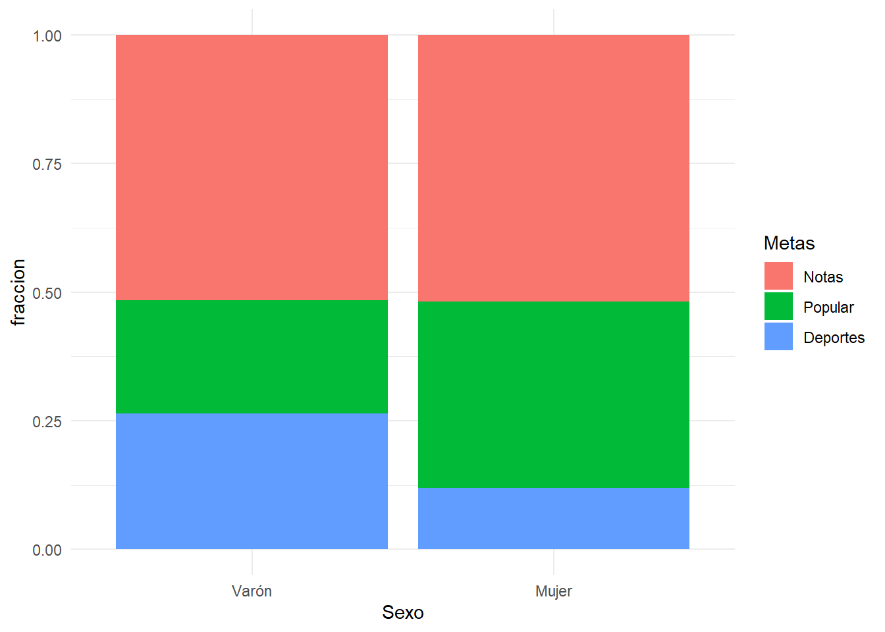
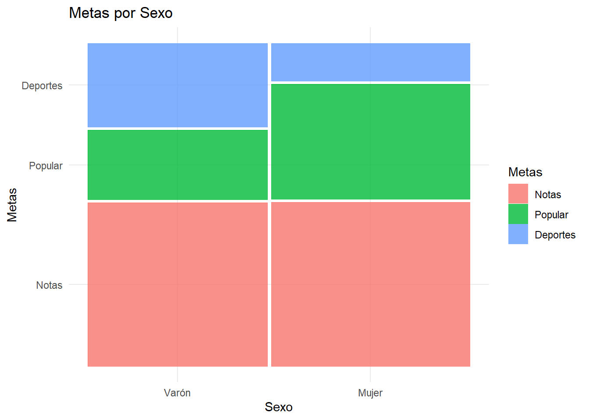
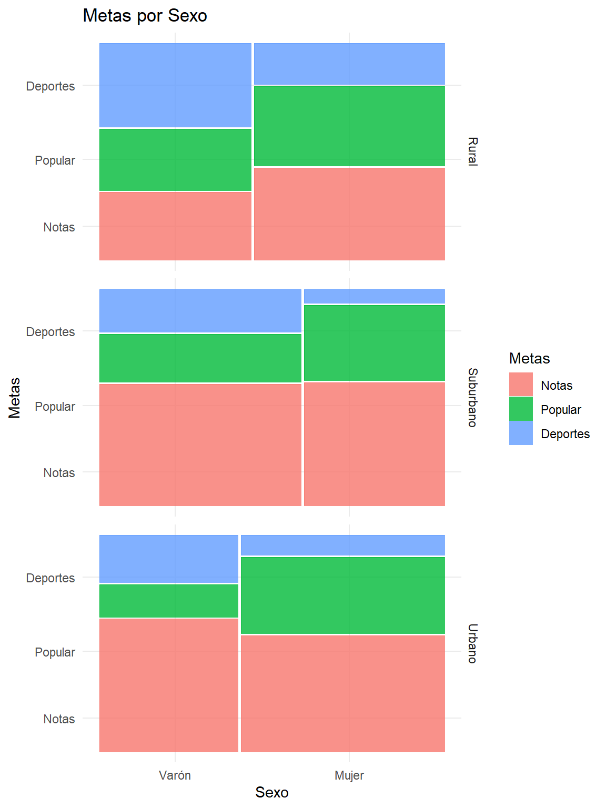

# Independencia de variables categóricas
Las tablas de contingencia se utilizan para examinar la relación entre dos variables categóricas, o bien explorar la distribución que posee una variable categórica entre diferentes muestras.

Hay diferentes cuestiones que surgen al examinar una tabla de contingencia, y en este tema vamos a tratar la cuestión de la independencia. 

La independencia de dos variables consiste en que la distribución de una de las variables es similar sea cual sea el nivel que examinemos de la otra. Esto se traduce en una tabla de contingencia en que las frecuencias de las filas (y las columnas) son aproximadamente proporcionales. Esto es equivalente a observar que los porcentajes por columnas(o filas) son similares.

La prueba de independencia $\chi^2$ (chi-cuadrado) contrasta la hipótesis de que las variables son independientes, frente a la hipótesis alternativa de que una variable se distribuye de modo diferente para diversos niveles de la otra.

### Ejemplo:Prioridades en niños y sexo {-}
Vamos a usar la base de datos [coolKids.sav](datos/coolKids.sav) donde se recogen las respuestas de unos escolares de 10 a 12 años a los que se les preguntó, entre otras cosas, a qué daban más prioridad de entre tres posibilidades: Tener buenas notas, destacar en los deportes o ser popular entre los compañeros. Examinemos las primeras líneas de la base de datos:

 

```r
df=read_sav("datos/coolKids.sav", user_na=FALSE) %>% haven::as_factor() 
```


```r
df %>% head() %>% knitr::kable(booktabs=T)
```

<table>
 <thead>
  <tr>
   <th style="text-align:left;"> Sexo </th>
   <th style="text-align:right;"> Curso </th>
   <th style="text-align:right;"> Edad </th>
   <th style="text-align:left;"> Raza </th>
   <th style="text-align:left;"> Entorno </th>
   <th style="text-align:left;"> Escuela </th>
   <th style="text-align:left;"> Metas </th>
   <th style="text-align:right;"> Notas </th>
   <th style="text-align:right;"> Deportes </th>
   <th style="text-align:right;"> Apariencia </th>
   <th style="text-align:right;"> Dinero </th>
  </tr>
 </thead>
<tbody>
  <tr>
   <td style="text-align:left;"> Varón </td>
   <td style="text-align:right;"> 5 </td>
   <td style="text-align:right;"> 11 </td>
   <td style="text-align:left;"> Blanco </td>
   <td style="text-align:left;"> Rural </td>
   <td style="text-align:left;"> Elm </td>
   <td style="text-align:left;"> Deportes </td>
   <td style="text-align:right;"> 1 </td>
   <td style="text-align:right;"> 2 </td>
   <td style="text-align:right;"> 4 </td>
   <td style="text-align:right;"> 3 </td>
  </tr>
  <tr>
   <td style="text-align:left;"> Varón </td>
   <td style="text-align:right;"> 5 </td>
   <td style="text-align:right;"> 10 </td>
   <td style="text-align:left;"> Blanco </td>
   <td style="text-align:left;"> Rural </td>
   <td style="text-align:left;"> Elm </td>
   <td style="text-align:left;"> Popular </td>
   <td style="text-align:right;"> 2 </td>
   <td style="text-align:right;"> 1 </td>
   <td style="text-align:right;"> 4 </td>
   <td style="text-align:right;"> 3 </td>
  </tr>
  <tr>
   <td style="text-align:left;"> Mujer </td>
   <td style="text-align:right;"> 5 </td>
   <td style="text-align:right;"> 11 </td>
   <td style="text-align:left;"> Blanco </td>
   <td style="text-align:left;"> Rural </td>
   <td style="text-align:left;"> Elm </td>
   <td style="text-align:left;"> Popular </td>
   <td style="text-align:right;"> 4 </td>
   <td style="text-align:right;"> 3 </td>
   <td style="text-align:right;"> 1 </td>
   <td style="text-align:right;"> 2 </td>
  </tr>
  <tr>
   <td style="text-align:left;"> Mujer </td>
   <td style="text-align:right;"> 5 </td>
   <td style="text-align:right;"> 11 </td>
   <td style="text-align:left;"> Blanco </td>
   <td style="text-align:left;"> Rural </td>
   <td style="text-align:left;"> Elm </td>
   <td style="text-align:left;"> Popular </td>
   <td style="text-align:right;"> 2 </td>
   <td style="text-align:right;"> 3 </td>
   <td style="text-align:right;"> 4 </td>
   <td style="text-align:right;"> 1 </td>
  </tr>
  <tr>
   <td style="text-align:left;"> Mujer </td>
   <td style="text-align:right;"> 5 </td>
   <td style="text-align:right;"> 10 </td>
   <td style="text-align:left;"> Blanco </td>
   <td style="text-align:left;"> Rural </td>
   <td style="text-align:left;"> Elm </td>
   <td style="text-align:left;"> Popular </td>
   <td style="text-align:right;"> 4 </td>
   <td style="text-align:right;"> 2 </td>
   <td style="text-align:right;"> 1 </td>
   <td style="text-align:right;"> 3 </td>
  </tr>
  <tr>
   <td style="text-align:left;"> Mujer </td>
   <td style="text-align:right;"> 5 </td>
   <td style="text-align:right;"> 11 </td>
   <td style="text-align:left;"> Blanco </td>
   <td style="text-align:left;"> Rural </td>
   <td style="text-align:left;"> Elm </td>
   <td style="text-align:left;"> Popular </td>
   <td style="text-align:right;"> 4 </td>
   <td style="text-align:right;"> 2 </td>
   <td style="text-align:right;"> 1 </td>
   <td style="text-align:right;"> 3 </td>
  </tr>
</tbody>
</table>

Vamos a estudiar por sexos si por *sexo* hay diferencias en la distribución de las *metas*:

```r
df %>% generaTablaChi2PorGrupo(vGrupo = "Sexo",vCuali = "Metas") %>% 
  select(1:5) %>% 
  knitr::kable(booktabs=T) %>%collapse_rows(1:5,valign = "top")
```

<table>
 <thead>
  <tr>
   <th style="text-align:left;"> Variable </th>
   <th style="text-align:left;"> Valores </th>
   <th style="text-align:left;"> Varón </th>
   <th style="text-align:left;"> Mujer </th>
   <th style="text-align:left;"> p </th>
  </tr>
 </thead>
<tbody>
  <tr>
   <td style="text-align:left;"> Metas </td>
   <td style="text-align:left;"> Notas </td>
   <td style="text-align:left;"> 51.5(117) </td>
   <td style="text-align:left;"> 51.8(130) </td>
   <td style="text-align:left;"> &lt;0.001* </td>
  </tr>
  <tr>
   <td style="text-align:left;"> Metas </td>
   <td style="text-align:left;"> Popular </td>
   <td style="text-align:left;"> 22.0(50) </td>
   <td style="text-align:left;"> 36.3(91) </td>
   <td style="text-align:left;"> &lt;0.001* </td>
  </tr>
  <tr>
   <td style="text-align:left;"> Metas </td>
   <td style="text-align:left;"> Deportes </td>
   <td style="text-align:left;"> 26.4(60) </td>
   <td style="text-align:left;"> 12.0(30) </td>
   <td style="text-align:left;"> &lt;0.001* </td>
  </tr>
</tbody>
</table>
La significación que se observa en la tabla (p), es la de la prueba Chi-cuadrado. Nos indica que las diferencias en porcentajes que se aprecian en las columnas de niños y niñas van más allá de lo que se esperaría que ocurriese por puro azar.

Con un poco de atención se observa porcentajes similares de niños y niñas en cuanto a la importancia que tienen para ellos las notas. Donde más diferencia se observa entre los sexos es en la preferencia que muestran muchos chicos por los deportes y muchas chicas por la popularidad.

Gráficamente podríamos mostrarlo con diagramas de barras apiladas:

```r
dftmp=df %>% select(Sexo,Metas)  %>% mutate(cuenta=1) %>% group_by(Sexo,Metas) %>% tally() %>% mutate(fraccion=n/sum(n))
ggplot(dftmp, aes(fill=Metas, y=fraccion, x=Sexo)) + 
    geom_bar( stat="identity", position="fill")
```



Otra forma interesante de mostrarlo consiste en utilizar *gráficos de mosaicos*, donde se utiliza un área para cada combinación de las dos variables, proporcional a las frecuencias observadas. Observe que son ligeramente más anchos los mosaicos de las mujeres que los de los varones. Esto refleja que en el estudio participa una cantida liéramente mayor de hombres que de mujeres.


```r
ggplot(data = df) +
   geom_mosaic(aes(x = product(Metas,Sexo), fill=Metas), na.rm=TRUE) +
   labs(x="Sexo", y="Metas",title='Metas por Sexo')
```




Usando SPSS podemos conseguir tanto las frecuencias como los porcentajes y resultado de la prueba chi-cuadrado en el menú:
“Analizar - Estadísticos descriptivos - Tablas de contingencia…”. Allí situamos en columnas la variable *Sexo*, y en filas ponemos *Metas*. En el botón *Casillas* marcamos los *porcentajes por columnas*. En el botón  “Estadísticos…” para marcar seleccionamos la prueba *chi-cuadrado de Pearson*.


Podríamos afinar más nuestro estudio y ver si estas diferencias entre niños y niñas se presentan también según el *Entorno* (urbano, suburbano o rural) de los niños. Para ello podríamos realizar una prueba chi-cuadrado en cada entorno:


```r
df %>% generaTablaChi2PorGrupo_Tiempo(vGrupo = "Sexo", vCuali = "Metas", vTiempo = "Entorno") %>% 
  select(2,3,4,5,6) %>% 
  knitr::kable(booktabs=T) %>%collapse_rows(1:5,valign = "top")
```

<table>
 <thead>
  <tr>
   <th style="text-align:left;"> Tiempo </th>
   <th style="text-align:left;"> Valores </th>
   <th style="text-align:left;"> Varón </th>
   <th style="text-align:left;"> Mujer </th>
   <th style="text-align:left;"> p </th>
  </tr>
 </thead>
<tbody>
  <tr>
   <td style="text-align:left;"> Rural </td>
   <td style="text-align:left;"> Notas </td>
   <td style="text-align:left;"> 31.8(21) </td>
   <td style="text-align:left;"> 43.4(36) </td>
   <td style="text-align:left;"> 0.025* </td>
  </tr>
  <tr>
   <td style="text-align:left;"> Rural </td>
   <td style="text-align:left;"> Popular </td>
   <td style="text-align:left;"> 28.8(19) </td>
   <td style="text-align:left;"> 37.3(31) </td>
   <td style="text-align:left;"> 0.025* </td>
  </tr>
  <tr>
   <td style="text-align:left;"> Rural </td>
   <td style="text-align:left;"> Deportes </td>
   <td style="text-align:left;"> 39.4(26) </td>
   <td style="text-align:left;"> 19.3(16) </td>
   <td style="text-align:left;"> 0.025* </td>
  </tr>
  <tr>
   <td style="text-align:left;"> Suburbano </td>
   <td style="text-align:left;"> Notas </td>
   <td style="text-align:left;"> 57.3(51) </td>
   <td style="text-align:left;"> 58.1(36) </td>
   <td style="text-align:left;"> 0.030* </td>
  </tr>
  <tr>
   <td style="text-align:left;"> Suburbano </td>
   <td style="text-align:left;"> Popular </td>
   <td style="text-align:left;"> 22.5(20) </td>
   <td style="text-align:left;"> 35.5(22) </td>
   <td style="text-align:left;"> 0.030* </td>
  </tr>
  <tr>
   <td style="text-align:left;"> Suburbano </td>
   <td style="text-align:left;"> Deportes </td>
   <td style="text-align:left;"> 20.2(18) </td>
   <td style="text-align:left;"> 6.5(4) </td>
   <td style="text-align:left;"> 0.030* </td>
  </tr>
  <tr>
   <td style="text-align:left;"> Urbano </td>
   <td style="text-align:left;"> Notas </td>
   <td style="text-align:left;"> 62.5(45) </td>
   <td style="text-align:left;"> 54.7(58) </td>
   <td style="text-align:left;"> 0.003* </td>
  </tr>
  <tr>
   <td style="text-align:left;"> Urbano </td>
   <td style="text-align:left;"> Popular </td>
   <td style="text-align:left;"> 15.3(11) </td>
   <td style="text-align:left;"> 35.8(38) </td>
   <td style="text-align:left;"> 0.003* </td>
  </tr>
  <tr>
   <td style="text-align:left;"> Urbano </td>
   <td style="text-align:left;"> Deportes </td>
   <td style="text-align:left;"> 22.2(16) </td>
   <td style="text-align:left;"> 9.4(10) </td>
   <td style="text-align:left;"> 0.003* </td>
  </tr>
</tbody>
</table>


```r
ggplot(data = df) +
   geom_mosaic(aes(x = product(Metas,Sexo), fill=Metas), na.rm=TRUE) +
   labs(x="Sexo", y="Metas",title='Metas por Sexo') + facet_grid(Entorno~.)
```


 
Para hacer lo mismo con *SPSS*, en el mismo diálogo donde hacíamos *tablas cruzadas*, pasamos la variable *Entornos* al campos *Capas*.

 

## Limitaciones de la prueba de independencia

El contraste de independencia tiene muy pocas limitaciones, aunque es conveniente hacer algunas observaciones:

-	Para contrastar la independencia se suele usar el estadístico chi-cuadrado de Pearson. Su cálculo se basa en calcular la diferencia entre las observaciones observadas para cada par de modalidades de las variables (casillas), y las que serían de esperar en caso de que se satisficiese la condición de independencia. Para que se pueda considerar correcta la significación calculada por el estadístico chi-cuadrado de Pearson, se debe cumplir que las frecuencias esperadas no sean muy pequeñas (inferiores a 5) más que en unas pocas casillas. Si es en muchas las casillas donde esto ocurre (más del 20% por ejemplo) se debe usar una prueba que no incluya aproximaciones, como la prueba exacta de Fisher. Esta la ofrece cualquier programa como opción cuando se hace este tipo de contrastes.

-	Si las muestras son muy grandes, la prueba de independencia dará resultados significativos incluso donde, posiblemente, consideremos que las diferencias no sean en realidad clínicamente interesantes. Es conveniente una inspección visual para confirmar si las diferencias observadas por filas (o columnas, como prefiramos), nos parecen de interés.

-	Si las variables poseen muchos niveles posiblemente la prueba no resulte de mucho interés, ya que es lógico esperar que se encuentren diferencias. Eso ocurre si por ejemplo una de las variables es numérica y no hemos agrupado los posibles valores en una cantidad adecuada de intervalos. 

-	Si una de las variables es numérica u ordinal, posiblemente queramos hacer algo más que contrastar la simple independencia. Después de todo, esto no es tan informativo como saber que en cierto grupo los valores son significativamente mayores que en otro. Lo aconsejable es usar pruebas de tipo t-student, anova o contrastes no paramétricos comos los que se tratan en otros temas.

-	El contraste de chi-cuadrado sirve para contrastar la independencia. No hay que considerarla como una medida de la asociación entre variables. Si buscamos estudiar la asociación de variables tenemos otros métodos a nuestra disposición como regresión logística que trataremos más adelante.  


