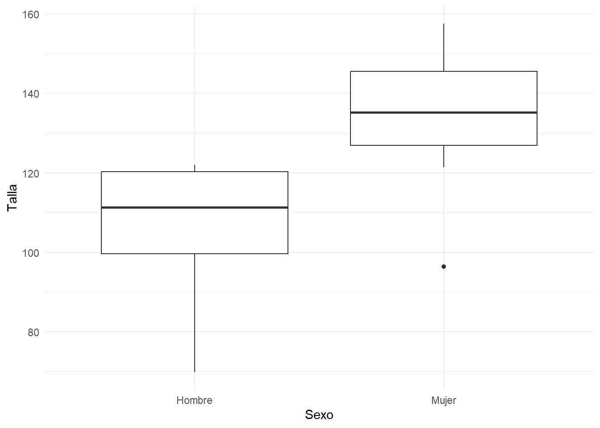
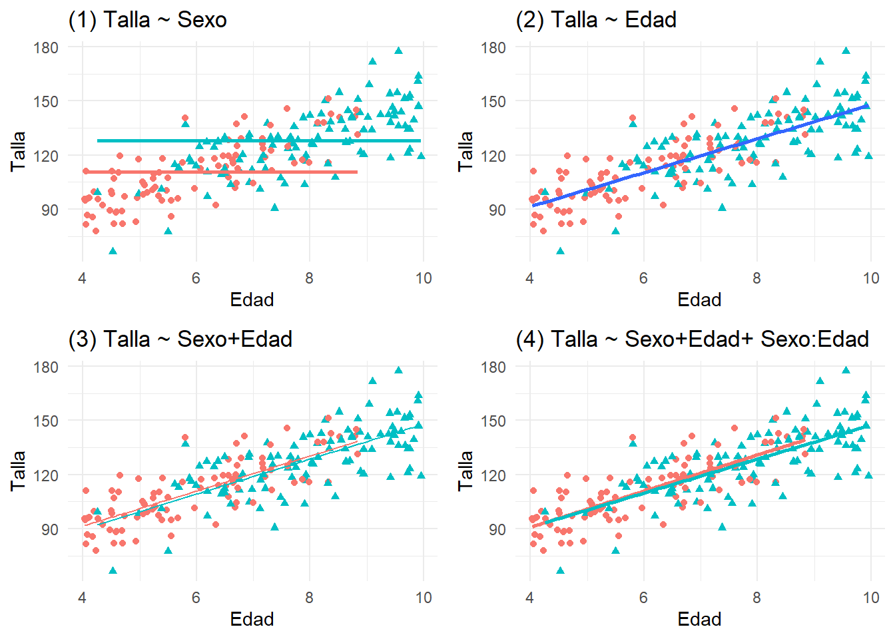
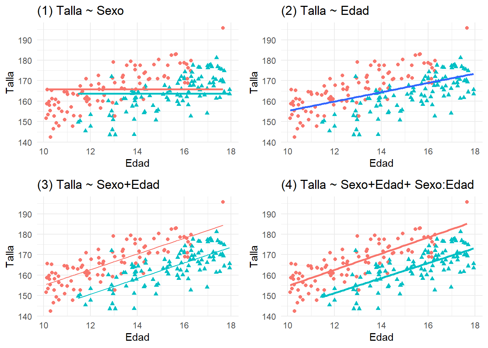

# Taller de regresión lineal {-}

En los siguientes problemas vamos a utilizar unas bases de datos simuladas, donde en cada base ocurre algo especial que debemos intentar visualizar y modelar de forma convenienteusando **regresión lineal múltiple**. En todos los casos suponemos que tenemos una base de datos de niños, donde se ha recogido el sexo con una variable que indica con el valor 1 a las mujeres (0 para los Hombres), *Edad* y *Talla*. Nuestra intención es ver como el sexo y la edad explican la talla.


#### Ejemplo 1 {-}
Descargue la base de datos
[regresion-030-1.sav](datos/regresion-030-1.sav) y exploramos las primeras líneas:


```r
df=read_sav("datos/regresion-030-1.sav", user_na=FALSE) %>% haven::as_factor() %>% 
  mutate(Sexo=Mujer) %>% select(Sexo,Edad,Talla)
```

```r
df %>% head()  %>% knitr::kable(booktabs=T)
```

<table>
 <thead>
  <tr>
   <th style="text-align:left;"> Sexo </th>
   <th style="text-align:right;"> Edad </th>
   <th style="text-align:right;"> Talla </th>
  </tr>
 </thead>
<tbody>
  <tr>
   <td style="text-align:left;"> Mujer </td>
   <td style="text-align:right;"> 7.5 </td>
   <td style="text-align:right;"> 142 </td>
  </tr>
  <tr>
   <td style="text-align:left;"> Mujer </td>
   <td style="text-align:right;"> 8.3 </td>
   <td style="text-align:right;"> 123 </td>
  </tr>
  <tr>
   <td style="text-align:left;"> Hombre </td>
   <td style="text-align:right;"> 5.8 </td>
   <td style="text-align:right;"> 121 </td>
  </tr>
  <tr>
   <td style="text-align:left;"> Mujer </td>
   <td style="text-align:right;"> 5.6 </td>
   <td style="text-align:right;"> 127 </td>
  </tr>
  <tr>
   <td style="text-align:left;"> Hombre </td>
   <td style="text-align:right;"> 6.7 </td>
   <td style="text-align:right;"> 122 </td>
  </tr>
  <tr>
   <td style="text-align:left;"> Mujer </td>
   <td style="text-align:right;"> 7.1 </td>
   <td style="text-align:right;"> 129 </td>
  </tr>
</tbody>
</table>
Antes de comenzar a analizar los datos hacemos una representación gráfica del contenido de la base de datos:

```r
ggplot(df, aes(x=Edad,y=Talla,shape=Sexo,color=Sexo))+geom_point()
```


A simple vista, los individuos parecen tener mas talla con la edad sin importar el sexo, aunque por otro lado se observa que los varones son más jóvenes y pequeños, y las mujeres son de más edad y altas. Tenemos que hay confusión entre el sexo y la edad para explicar la talla. Si estudiamos de forma simple como el sexo explica la talla, tendríamos que las mujeres, sin tener en cuenta otra cosa son más altas que los hombres:


```r
ggplot(df, aes(x=Sexo, y=Talla))+geom_boxplot()
```


La causa de este resultado es no haber tenido en cuenta el ajuste por Edad en el analisis. ¿Cuál de los siguientes modelos le parece más interesante para describir la Altura de los niños?


```r
dfAumentado <- broom::augment(lm(Talla ~ Edad+Sexo,data=df))
plot_SoloSexo=ggplot(df, aes(x=Edad,y=Talla,shape=Sexo,color=Sexo))+geom_point()+
  geom_smooth(method = "lm",se=FALSE,formula = y ~ 1)+ggtitle("(1) Talla ~ Sexo")+ guides(color=FALSE,shape=FALSE)
plot_SoloEdad=ggplot(df, aes(x=Edad,y=Talla))+geom_point(aes(shape=Sexo,color=Sexo))+
  geom_smooth(method = "lm",se=FALSE)+ggtitle("(2) Talla ~ Edad")+ guides(color=FALSE,shape=FALSE)
plot_SexoEdad=ggplot(dfAumentado, aes(x=Edad,y=Talla,shape=Sexo,color=Sexo))+geom_point()+
  geom_line(aes(y = .fitted))+ggtitle("(3) Talla ~ Sexo+Edad")+ guides(color=FALSE,shape=FALSE)
plot_Interaccion=ggplot(df, aes(x=Edad,y=Talla,shape=Sexo,color=Sexo))+geom_point()+
  geom_smooth(method = "lm",se=FALSE) +ggtitle("(4) Talla ~ Sexo+Edad+ Sexo:Edad")+ guides(color=FALSE,shape=FALSE)
grid.arrange(plot_SoloSexo,plot_SoloEdad,plot_SexoEdad,plot_Interaccion)
```


Los cuatro modelos de regresión respectivos son:

- **Modelo 1:** La talla sólo depende del sexo.

- **Modelo 2:** La talla sólo depende de la altura (mi favorito, por su simplicidad).

- **Modelo 3** La talla depende de la altura, y hay un pequeño efecto debido al sexo. las dos líneas son paralelas, siendo la distancia vertical entre ambas el efecto estimado atribuible al sexo.

- **Modelo 4** La talla depende de la altura para cada sexo, con rectas que no tienen por qué ser paralelas. Se ajusta la recta dentro de cada grupo. Esto es equivalente a considerar que hay un término de interacción que permite que cada recta tenga pendientes diferentes. Este modelo parece demasiado complicado.

El análisis de estos modelos lo encontramos en la siguiente tabla:


```r
modeloSexo <- df %>% lm(Talla ~ Sexo, data=.)
modeloEdad <- df %>% lm(Talla ~ Edad, data=.)
modeloSexoEdad <- df %>% lm(Talla ~ Sexo+Edad, data=.)
modeloInteraccion <- df %>% lm(Talla ~ Sexo*Edad, data=.)
tab_model(modeloSexo, modeloEdad,show.se = TRUE,show.ci = FALSE,show.aic = TRUE) %>% .[["knitr"]] %>% 
    asis_output()
```

<table style="border-collapse:collapse; border:none;">
<tr>
<th style="border-top: double; text-align:center; font-style:normal; font-weight:bold; padding:0.2cm;  text-align:left; ">&nbsp;</th>
<th colspan="3" style="border-top: double; text-align:center; font-style:normal; font-weight:bold; padding:0.2cm; ">Talla</th>
<th colspan="3" style="border-top: double; text-align:center; font-style:normal; font-weight:bold; padding:0.2cm; ">Talla</th>
</tr>
<tr>
<td style=" text-align:center; border-bottom:1px solid; font-style:italic; font-weight:normal;  text-align:left; ">Predictors</td>
<td style=" text-align:center; border-bottom:1px solid; font-style:italic; font-weight:normal;  ">Estimates</td>
<td style=" text-align:center; border-bottom:1px solid; font-style:italic; font-weight:normal;  ">std. Error</td>
<td style=" text-align:center; border-bottom:1px solid; font-style:italic; font-weight:normal;  ">p</td>
<td style=" text-align:center; border-bottom:1px solid; font-style:italic; font-weight:normal;  ">Estimates</td>
<td style=" text-align:center; border-bottom:1px solid; font-style:italic; font-weight:normal;  ">std. Error</td>
<td style=" text-align:center; border-bottom:1px solid; font-style:italic; font-weight:normal;  col7">p</td>
</tr>
<tr>
<td style=" padding:0.2cm; text-align:left; vertical-align:top; text-align:left; ">(Intercept)</td>
<td style=" padding:0.2cm; text-align:left; vertical-align:top; text-align:center;  ">107.55</td>
<td style=" padding:0.2cm; text-align:left; vertical-align:top; text-align:center;  ">3.75</td>
<td style=" padding:0.2cm; text-align:left; vertical-align:top; text-align:center;  "><strong>&lt;0.001</strong></td>
<td style=" padding:0.2cm; text-align:left; vertical-align:top; text-align:center;  ">54.88</td>
<td style=" padding:0.2cm; text-align:left; vertical-align:top; text-align:center;  ">9.49</td>
<td style=" padding:0.2cm; text-align:left; vertical-align:top; text-align:center;  col7"><strong>&lt;0.001</strong></td>
</tr>
<tr>
<td style=" padding:0.2cm; text-align:left; vertical-align:top; text-align:left; ">Sexo: Mujer</td>
<td style=" padding:0.2cm; text-align:left; vertical-align:top; text-align:center;  ">26.68</td>
<td style=" padding:0.2cm; text-align:left; vertical-align:top; text-align:center;  ">5.49</td>
<td style=" padding:0.2cm; text-align:left; vertical-align:top; text-align:center;  "><strong>&lt;0.001</strong></td>
<td style=" padding:0.2cm; text-align:left; vertical-align:top; text-align:center;  "></td>
<td style=" padding:0.2cm; text-align:left; vertical-align:top; text-align:center;  "></td>
<td style=" padding:0.2cm; text-align:left; vertical-align:top; text-align:center;  col7"></td>
</tr>
<tr>
<td style=" padding:0.2cm; text-align:left; vertical-align:top; text-align:left; ">Edad</td>
<td style=" padding:0.2cm; text-align:left; vertical-align:top; text-align:center;  "></td>
<td style=" padding:0.2cm; text-align:left; vertical-align:top; text-align:center;  "></td>
<td style=" padding:0.2cm; text-align:left; vertical-align:top; text-align:center;  "></td>
<td style=" padding:0.2cm; text-align:left; vertical-align:top; text-align:center;  ">9.66</td>
<td style=" padding:0.2cm; text-align:left; vertical-align:top; text-align:center;  ">1.37</td>
<td style=" padding:0.2cm; text-align:left; vertical-align:top; text-align:center;  col7"><strong>&lt;0.001</strong></td>
</tr>
<tr>
<td style=" padding:0.2cm; text-align:left; vertical-align:top; text-align:left; padding-top:0.1cm; padding-bottom:0.1cm; border-top:1px solid;">Observations</td>
<td style=" padding:0.2cm; text-align:left; vertical-align:top; padding-top:0.1cm; padding-bottom:0.1cm; text-align:left; border-top:1px solid;" colspan="3">30</td>
<td style=" padding:0.2cm; text-align:left; vertical-align:top; padding-top:0.1cm; padding-bottom:0.1cm; text-align:left; border-top:1px solid;" colspan="3">30</td>
</tr>
<tr>
<td style=" padding:0.2cm; text-align:left; vertical-align:top; text-align:left; padding-top:0.1cm; padding-bottom:0.1cm;">R<sup>2</sup> / R<sup>2</sup> adjusted</td>
<td style=" padding:0.2cm; text-align:left; vertical-align:top; padding-top:0.1cm; padding-bottom:0.1cm; text-align:left;" colspan="3">0.458 / 0.438</td>
<td style=" padding:0.2cm; text-align:left; vertical-align:top; padding-top:0.1cm; padding-bottom:0.1cm; text-align:left;" colspan="3">0.640 / 0.627</td>
</tr>
<tr>
<td style=" padding:0.2cm; text-align:left; vertical-align:top; text-align:left; padding-top:0.1cm; padding-bottom:0.1cm;">AIC</td>
<td style=" padding:0.2cm; text-align:left; vertical-align:top; padding-top:0.1cm; padding-bottom:0.1cm; text-align:left;" colspan="3">251.555</td>
<td style=" padding:0.2cm; text-align:left; vertical-align:top; padding-top:0.1cm; padding-bottom:0.1cm; text-align:left;" colspan="3">239.247</td>
</tr>

</table>


```r
tab_model(modeloSexoEdad,modeloInteraccion,show.se = TRUE,show.ci = FALSE,show.aic = TRUE) %>% .[["knitr"]] %>% 
    asis_output()
```

<table style="border-collapse:collapse; border:none;">
<tr>
<th style="border-top: double; text-align:center; font-style:normal; font-weight:bold; padding:0.2cm;  text-align:left; ">&nbsp;</th>
<th colspan="3" style="border-top: double; text-align:center; font-style:normal; font-weight:bold; padding:0.2cm; ">Talla</th>
<th colspan="3" style="border-top: double; text-align:center; font-style:normal; font-weight:bold; padding:0.2cm; ">Talla</th>
</tr>
<tr>
<td style=" text-align:center; border-bottom:1px solid; font-style:italic; font-weight:normal;  text-align:left; ">Predictors</td>
<td style=" text-align:center; border-bottom:1px solid; font-style:italic; font-weight:normal;  ">Estimates</td>
<td style=" text-align:center; border-bottom:1px solid; font-style:italic; font-weight:normal;  ">std. Error</td>
<td style=" text-align:center; border-bottom:1px solid; font-style:italic; font-weight:normal;  ">p</td>
<td style=" text-align:center; border-bottom:1px solid; font-style:italic; font-weight:normal;  ">Estimates</td>
<td style=" text-align:center; border-bottom:1px solid; font-style:italic; font-weight:normal;  ">std. Error</td>
<td style=" text-align:center; border-bottom:1px solid; font-style:italic; font-weight:normal;  col7">p</td>
</tr>
<tr>
<td style=" padding:0.2cm; text-align:left; vertical-align:top; text-align:left; ">(Intercept)</td>
<td style=" padding:0.2cm; text-align:left; vertical-align:top; text-align:center;  ">63.15</td>
<td style=" padding:0.2cm; text-align:left; vertical-align:top; text-align:center;  ">11.49</td>
<td style=" padding:0.2cm; text-align:left; vertical-align:top; text-align:center;  "><strong>&lt;0.001</strong></td>
<td style=" padding:0.2cm; text-align:left; vertical-align:top; text-align:center;  ">54.73</td>
<td style=" padding:0.2cm; text-align:left; vertical-align:top; text-align:center;  ">16.70</td>
<td style=" padding:0.2cm; text-align:left; vertical-align:top; text-align:center;  col7"><strong>0.003</strong></td>
</tr>
<tr>
<td style=" padding:0.2cm; text-align:left; vertical-align:top; text-align:left; ">Sexo: Mujer</td>
<td style=" padding:0.2cm; text-align:left; vertical-align:top; text-align:center;  ">8.04</td>
<td style=" padding:0.2cm; text-align:left; vertical-align:top; text-align:center;  ">6.42</td>
<td style=" padding:0.2cm; text-align:left; vertical-align:top; text-align:center;  ">0.222</td>
<td style=" padding:0.2cm; text-align:left; vertical-align:top; text-align:center;  ">26.80</td>
<td style=" padding:0.2cm; text-align:left; vertical-align:top; text-align:center;  ">27.58</td>
<td style=" padding:0.2cm; text-align:left; vertical-align:top; text-align:center;  col7">0.340</td>
</tr>
<tr>
<td style=" padding:0.2cm; text-align:left; vertical-align:top; text-align:left; ">Edad</td>
<td style=" padding:0.2cm; text-align:left; vertical-align:top; text-align:center;  ">7.88</td>
<td style=" padding:0.2cm; text-align:left; vertical-align:top; text-align:center;  ">1.97</td>
<td style=" padding:0.2cm; text-align:left; vertical-align:top; text-align:center;  "><strong>&lt;0.001</strong></td>
<td style=" padding:0.2cm; text-align:left; vertical-align:top; text-align:center;  ">9.37</td>
<td style=" padding:0.2cm; text-align:left; vertical-align:top; text-align:center;  ">2.91</td>
<td style=" padding:0.2cm; text-align:left; vertical-align:top; text-align:center;  col7"><strong>0.003</strong></td>
</tr>
<tr>
<td style=" padding:0.2cm; text-align:left; vertical-align:top; text-align:left; ">SexoMujer:Edad</td>
<td style=" padding:0.2cm; text-align:left; vertical-align:top; text-align:center;  "></td>
<td style=" padding:0.2cm; text-align:left; vertical-align:top; text-align:center;  "></td>
<td style=" padding:0.2cm; text-align:left; vertical-align:top; text-align:center;  "></td>
<td style=" padding:0.2cm; text-align:left; vertical-align:top; text-align:center;  ">&#45;2.79</td>
<td style=" padding:0.2cm; text-align:left; vertical-align:top; text-align:center;  ">3.98</td>
<td style=" padding:0.2cm; text-align:left; vertical-align:top; text-align:center;  col7">0.490</td>
</tr>
<tr>
<td style=" padding:0.2cm; text-align:left; vertical-align:top; text-align:left; padding-top:0.1cm; padding-bottom:0.1cm; border-top:1px solid;">Observations</td>
<td style=" padding:0.2cm; text-align:left; vertical-align:top; padding-top:0.1cm; padding-bottom:0.1cm; text-align:left; border-top:1px solid;" colspan="3">30</td>
<td style=" padding:0.2cm; text-align:left; vertical-align:top; padding-top:0.1cm; padding-bottom:0.1cm; text-align:left; border-top:1px solid;" colspan="3">30</td>
</tr>
<tr>
<td style=" padding:0.2cm; text-align:left; vertical-align:top; text-align:left; padding-top:0.1cm; padding-bottom:0.1cm;">R<sup>2</sup> / R<sup>2</sup> adjusted</td>
<td style=" padding:0.2cm; text-align:left; vertical-align:top; padding-top:0.1cm; padding-bottom:0.1cm; text-align:left;" colspan="3">0.660 / 0.635</td>
<td style=" padding:0.2cm; text-align:left; vertical-align:top; padding-top:0.1cm; padding-bottom:0.1cm; text-align:left;" colspan="3">0.666 / 0.628</td>
</tr>
<tr>
<td style=" padding:0.2cm; text-align:left; vertical-align:top; text-align:left; padding-top:0.1cm; padding-bottom:0.1cm;">AIC</td>
<td style=" padding:0.2cm; text-align:left; vertical-align:top; padding-top:0.1cm; padding-bottom:0.1cm; text-align:left;" colspan="3">239.556</td>
<td style=" padding:0.2cm; text-align:left; vertical-align:top; padding-top:0.1cm; padding-bottom:0.1cm; text-align:left;" colspan="3">240.996</td>
</tr>

</table>

El primer modelo, es el menos adecuado. Es el de menor $R^2$, y atribuye un efecto significativo poramente al sexo, cuando en todos los demás modelos en que se incluye la edad, el sexo no tiene efecto significativo. Lo que vemos es debido al efecto confusor de la edad, que no ha sido tenido en cuenta.

El segundo modelo es el que tomaría como más adecuado por su parsimonia. Es simple y parece una buena simplificación de las observaciones. La bondad de ajuste $R^2$ es prácticamente tan buena como se puede conseguir, y tiene el menor AIC. La única variable de la que depende (edad) el modelo tiene un efecto estadísticamente significativo.

El tercer modelo posee el mayor $R2$ ajustado. Nos indica que la edad tiene efecto significativo en la talla, y que el sexo no tiene efecto significativo en la talla. Si queremos estudiar qué efecto tiene la edad en la talla, *descontando/ajustando/teniendo en cuenta* el sexo, es el modelo a utilizar.


El cuarto modelo es demasiado complicado. Atendiendo al criterio de $R^2$, parece el mejor, pero eso es lógico ya que contiene a todas las variables explicativas y además su interacción. La reducción de $R^2$ ajustado con respecto al tercer modelo, así como el aumento en AIC, y la falta de significación del término de interacción de Sexo con Edad, nos invitan a abandonarlo. En caso de querer un modelo complejo, el tercero es lo suficientemente complejo.


#### Ejemplo 2 {-}
Descargue la base de datos
[regresion-200-1.sav](datos/regresion-200-1.sav), que contiene datos similares al anterior, pero ahora la muestra está formada por 200 individuos. ¿No cree que el segundo modelo es el más adecuado?


```r
df=read_sav("datos/regresion-200-1.sav", user_na=FALSE) %>% haven::as_factor() %>% 
  mutate(Sexo=Mujer) %>% select(Sexo,Edad,Talla)
```


```r
dfAumentado <- broom::augment(lm(Talla ~ Edad+Sexo,data=df))
plot_SoloSexo=ggplot(df, aes(x=Edad,y=Talla,shape=Sexo,color=Sexo))+geom_point()+
  geom_smooth(method = "lm",se=FALSE,formula = y ~ 1)+ggtitle("(1) Talla ~ Sexo")+ guides(color=FALSE,shape=FALSE)
plot_SoloEdad=ggplot(df, aes(x=Edad,y=Talla))+geom_point(aes(shape=Sexo,color=Sexo))+
  geom_smooth(method = "lm",se=FALSE)+ggtitle("(2) Talla ~ Edad")+ guides(color=FALSE,shape=FALSE)
plot_SexoEdad=ggplot(dfAumentado, aes(x=Edad,y=Talla,shape=Sexo,color=Sexo))+geom_point()+
  geom_line(aes(y = .fitted))+ggtitle("(3) Talla ~ Sexo+Edad")+ guides(color=FALSE,shape=FALSE)
plot_Interaccion=ggplot(df, aes(x=Edad,y=Talla,shape=Sexo,color=Sexo))+geom_point()+
  geom_smooth(method = "lm",se=FALSE) +ggtitle("(4) Talla ~ Sexo+Edad+ Sexo:Edad")+ guides(color=FALSE,shape=FALSE)
grid.arrange(plot_SoloSexo,plot_SoloEdad,plot_SexoEdad,plot_Interaccion)
```




```r
modeloSexo <- df %>% lm(Talla ~ Sexo, data=.)
modeloEdad <- df %>% lm(Talla ~ Edad, data=.)
modeloSexoEdad <- df %>% lm(Talla ~ Sexo+Edad, data=.)
modeloInteraccion <- df %>% lm(Talla ~ Sexo*Edad, data=.)
tab_model(modeloSexo, modeloEdad,show.se = TRUE,show.ci = FALSE,show.aic = TRUE) %>% .[["knitr"]] %>% 
    asis_output()
```

<table style="border-collapse:collapse; border:none;">
<tr>
<th style="border-top: double; text-align:center; font-style:normal; font-weight:bold; padding:0.2cm;  text-align:left; ">&nbsp;</th>
<th colspan="3" style="border-top: double; text-align:center; font-style:normal; font-weight:bold; padding:0.2cm; ">Talla</th>
<th colspan="3" style="border-top: double; text-align:center; font-style:normal; font-weight:bold; padding:0.2cm; ">Talla</th>
</tr>
<tr>
<td style=" text-align:center; border-bottom:1px solid; font-style:italic; font-weight:normal;  text-align:left; ">Predictors</td>
<td style=" text-align:center; border-bottom:1px solid; font-style:italic; font-weight:normal;  ">Estimates</td>
<td style=" text-align:center; border-bottom:1px solid; font-style:italic; font-weight:normal;  ">std. Error</td>
<td style=" text-align:center; border-bottom:1px solid; font-style:italic; font-weight:normal;  ">p</td>
<td style=" text-align:center; border-bottom:1px solid; font-style:italic; font-weight:normal;  ">Estimates</td>
<td style=" text-align:center; border-bottom:1px solid; font-style:italic; font-weight:normal;  ">std. Error</td>
<td style=" text-align:center; border-bottom:1px solid; font-style:italic; font-weight:normal;  col7">p</td>
</tr>
<tr>
<td style=" padding:0.2cm; text-align:left; vertical-align:top; text-align:left; ">(Intercept)</td>
<td style=" padding:0.2cm; text-align:left; vertical-align:top; text-align:center;  ">110.52</td>
<td style=" padding:0.2cm; text-align:left; vertical-align:top; text-align:center;  ">1.88</td>
<td style=" padding:0.2cm; text-align:left; vertical-align:top; text-align:center;  "><strong>&lt;0.001</strong></td>
<td style=" padding:0.2cm; text-align:left; vertical-align:top; text-align:center;  ">53.76</td>
<td style=" padding:0.2cm; text-align:left; vertical-align:top; text-align:center;  ">3.63</td>
<td style=" padding:0.2cm; text-align:left; vertical-align:top; text-align:center;  col7"><strong>&lt;0.001</strong></td>
</tr>
<tr>
<td style=" padding:0.2cm; text-align:left; vertical-align:top; text-align:left; ">Sexo: Mujer</td>
<td style=" padding:0.2cm; text-align:left; vertical-align:top; text-align:center;  ">17.56</td>
<td style=" padding:0.2cm; text-align:left; vertical-align:top; text-align:center;  ">2.56</td>
<td style=" padding:0.2cm; text-align:left; vertical-align:top; text-align:center;  "><strong>&lt;0.001</strong></td>
<td style=" padding:0.2cm; text-align:left; vertical-align:top; text-align:center;  "></td>
<td style=" padding:0.2cm; text-align:left; vertical-align:top; text-align:center;  "></td>
<td style=" padding:0.2cm; text-align:left; vertical-align:top; text-align:center;  col7"></td>
</tr>
<tr>
<td style=" padding:0.2cm; text-align:left; vertical-align:top; text-align:left; ">Edad</td>
<td style=" padding:0.2cm; text-align:left; vertical-align:top; text-align:center;  "></td>
<td style=" padding:0.2cm; text-align:left; vertical-align:top; text-align:center;  "></td>
<td style=" padding:0.2cm; text-align:left; vertical-align:top; text-align:center;  "></td>
<td style=" padding:0.2cm; text-align:left; vertical-align:top; text-align:center;  ">9.41</td>
<td style=" padding:0.2cm; text-align:left; vertical-align:top; text-align:center;  ">0.50</td>
<td style=" padding:0.2cm; text-align:left; vertical-align:top; text-align:center;  col7"><strong>&lt;0.001</strong></td>
</tr>
<tr>
<td style=" padding:0.2cm; text-align:left; vertical-align:top; text-align:left; padding-top:0.1cm; padding-bottom:0.1cm; border-top:1px solid;">Observations</td>
<td style=" padding:0.2cm; text-align:left; vertical-align:top; padding-top:0.1cm; padding-bottom:0.1cm; text-align:left; border-top:1px solid;" colspan="3">200</td>
<td style=" padding:0.2cm; text-align:left; vertical-align:top; padding-top:0.1cm; padding-bottom:0.1cm; text-align:left; border-top:1px solid;" colspan="3">200</td>
</tr>
<tr>
<td style=" padding:0.2cm; text-align:left; vertical-align:top; text-align:left; padding-top:0.1cm; padding-bottom:0.1cm;">R<sup>2</sup> / R<sup>2</sup> adjusted</td>
<td style=" padding:0.2cm; text-align:left; vertical-align:top; padding-top:0.1cm; padding-bottom:0.1cm; text-align:left;" colspan="3">0.192 / 0.188</td>
<td style=" padding:0.2cm; text-align:left; vertical-align:top; padding-top:0.1cm; padding-bottom:0.1cm; text-align:left;" colspan="3">0.640 / 0.638</td>
</tr>
<tr>
<td style=" padding:0.2cm; text-align:left; vertical-align:top; text-align:left; padding-top:0.1cm; padding-bottom:0.1cm;">AIC</td>
<td style=" padding:0.2cm; text-align:left; vertical-align:top; padding-top:0.1cm; padding-bottom:0.1cm; text-align:left;" colspan="3">1728.169</td>
<td style=" padding:0.2cm; text-align:left; vertical-align:top; padding-top:0.1cm; padding-bottom:0.1cm; text-align:left;" colspan="3">1566.659</td>
</tr>

</table>


```r
tab_model(modeloSexoEdad,modeloInteraccion,show.se = TRUE,show.ci = FALSE,show.aic = TRUE) %>% .[["knitr"]] %>% 
    asis_output()
```

<table style="border-collapse:collapse; border:none;">
<tr>
<th style="border-top: double; text-align:center; font-style:normal; font-weight:bold; padding:0.2cm;  text-align:left; ">&nbsp;</th>
<th colspan="3" style="border-top: double; text-align:center; font-style:normal; font-weight:bold; padding:0.2cm; ">Talla</th>
<th colspan="3" style="border-top: double; text-align:center; font-style:normal; font-weight:bold; padding:0.2cm; ">Talla</th>
</tr>
<tr>
<td style=" text-align:center; border-bottom:1px solid; font-style:italic; font-weight:normal;  text-align:left; ">Predictors</td>
<td style=" text-align:center; border-bottom:1px solid; font-style:italic; font-weight:normal;  ">Estimates</td>
<td style=" text-align:center; border-bottom:1px solid; font-style:italic; font-weight:normal;  ">std. Error</td>
<td style=" text-align:center; border-bottom:1px solid; font-style:italic; font-weight:normal;  ">p</td>
<td style=" text-align:center; border-bottom:1px solid; font-style:italic; font-weight:normal;  ">Estimates</td>
<td style=" text-align:center; border-bottom:1px solid; font-style:italic; font-weight:normal;  ">std. Error</td>
<td style=" text-align:center; border-bottom:1px solid; font-style:italic; font-weight:normal;  col7">p</td>
</tr>
<tr>
<td style=" padding:0.2cm; text-align:left; vertical-align:top; text-align:left; ">(Intercept)</td>
<td style=" padding:0.2cm; text-align:left; vertical-align:top; text-align:center;  ">52.66</td>
<td style=" padding:0.2cm; text-align:left; vertical-align:top; text-align:center;  ">3.90</td>
<td style=" padding:0.2cm; text-align:left; vertical-align:top; text-align:center;  "><strong>&lt;0.001</strong></td>
<td style=" padding:0.2cm; text-align:left; vertical-align:top; text-align:center;  ">50.74</td>
<td style=" padding:0.2cm; text-align:left; vertical-align:top; text-align:center;  ">5.62</td>
<td style=" padding:0.2cm; text-align:left; vertical-align:top; text-align:center;  col7"><strong>&lt;0.001</strong></td>
</tr>
<tr>
<td style=" padding:0.2cm; text-align:left; vertical-align:top; text-align:left; ">Sexo: Mujer</td>
<td style=" padding:0.2cm; text-align:left; vertical-align:top; text-align:center;  ">&#45;1.66</td>
<td style=" padding:0.2cm; text-align:left; vertical-align:top; text-align:center;  ">2.10</td>
<td style=" padding:0.2cm; text-align:left; vertical-align:top; text-align:center;  ">0.431</td>
<td style=" padding:0.2cm; text-align:left; vertical-align:top; text-align:center;  ">2.40</td>
<td style=" padding:0.2cm; text-align:left; vertical-align:top; text-align:center;  ">8.80</td>
<td style=" padding:0.2cm; text-align:left; vertical-align:top; text-align:center;  col7">0.785</td>
</tr>
<tr>
<td style=" padding:0.2cm; text-align:left; vertical-align:top; text-align:left; ">Edad</td>
<td style=" padding:0.2cm; text-align:left; vertical-align:top; text-align:center;  ">9.70</td>
<td style=" padding:0.2cm; text-align:left; vertical-align:top; text-align:center;  ">0.62</td>
<td style=" padding:0.2cm; text-align:left; vertical-align:top; text-align:center;  "><strong>&lt;0.001</strong></td>
<td style=" padding:0.2cm; text-align:left; vertical-align:top; text-align:center;  ">10.02</td>
<td style=" padding:0.2cm; text-align:left; vertical-align:top; text-align:center;  ">0.92</td>
<td style=" padding:0.2cm; text-align:left; vertical-align:top; text-align:center;  col7"><strong>&lt;0.001</strong></td>
</tr>
<tr>
<td style=" padding:0.2cm; text-align:left; vertical-align:top; text-align:left; ">SexoMujer:Edad</td>
<td style=" padding:0.2cm; text-align:left; vertical-align:top; text-align:center;  "></td>
<td style=" padding:0.2cm; text-align:left; vertical-align:top; text-align:center;  "></td>
<td style=" padding:0.2cm; text-align:left; vertical-align:top; text-align:center;  "></td>
<td style=" padding:0.2cm; text-align:left; vertical-align:top; text-align:center;  ">&#45;0.59</td>
<td style=" padding:0.2cm; text-align:left; vertical-align:top; text-align:center;  ">1.24</td>
<td style=" padding:0.2cm; text-align:left; vertical-align:top; text-align:center;  col7">0.635</td>
</tr>
<tr>
<td style=" padding:0.2cm; text-align:left; vertical-align:top; text-align:left; padding-top:0.1cm; padding-bottom:0.1cm; border-top:1px solid;">Observations</td>
<td style=" padding:0.2cm; text-align:left; vertical-align:top; padding-top:0.1cm; padding-bottom:0.1cm; text-align:left; border-top:1px solid;" colspan="3">200</td>
<td style=" padding:0.2cm; text-align:left; vertical-align:top; padding-top:0.1cm; padding-bottom:0.1cm; text-align:left; border-top:1px solid;" colspan="3">200</td>
</tr>
<tr>
<td style=" padding:0.2cm; text-align:left; vertical-align:top; text-align:left; padding-top:0.1cm; padding-bottom:0.1cm;">R<sup>2</sup> / R<sup>2</sup> adjusted</td>
<td style=" padding:0.2cm; text-align:left; vertical-align:top; padding-top:0.1cm; padding-bottom:0.1cm; text-align:left;" colspan="3">0.641 / 0.637</td>
<td style=" padding:0.2cm; text-align:left; vertical-align:top; padding-top:0.1cm; padding-bottom:0.1cm; text-align:left;" colspan="3">0.641 / 0.636</td>
</tr>
<tr>
<td style=" padding:0.2cm; text-align:left; vertical-align:top; text-align:left; padding-top:0.1cm; padding-bottom:0.1cm;">AIC</td>
<td style=" padding:0.2cm; text-align:left; vertical-align:top; padding-top:0.1cm; padding-bottom:0.1cm; text-align:left;" colspan="3">1568.027</td>
<td style=" padding:0.2cm; text-align:left; vertical-align:top; padding-top:0.1cm; padding-bottom:0.1cm; text-align:left;" colspan="3">1569.797</td>
</tr>

</table>

#### Ejemplo 3 {-}
Descargue la base de datos
[regresion-030-2.sav](datos/regresion-030-2.sav). En este caso tenemos niños que a igualdad de edad suelen ser más altos que las niñas. En ambos sexos, se crece con la edad a un ritmo similar. ¿Qué modelo cree que es más adecuado utilizar?


```r
df=read_sav("datos/regresion-030-2.sav", user_na=FALSE) %>% haven::as_factor() %>% 
  mutate(Sexo=Mujer) %>% select(Sexo,Edad,Talla)
```


```r
dfAumentado <- broom::augment(lm(Talla ~ Edad+Sexo,data=df))
plot_SoloSexo=ggplot(df, aes(x=Edad,y=Talla,shape=Sexo,color=Sexo))+geom_point()+
  geom_smooth(method = "lm",se=FALSE,formula = y ~ 1)+ggtitle("(1) Talla ~ Sexo")+ guides(color=FALSE,shape=FALSE)
plot_SoloEdad=ggplot(df, aes(x=Edad,y=Talla))+geom_point(aes(shape=Sexo,color=Sexo))+
  geom_smooth(method = "lm",se=FALSE)+ggtitle("(2) Talla ~ Edad")+ guides(color=FALSE,shape=FALSE)
plot_SexoEdad=ggplot(dfAumentado, aes(x=Edad,y=Talla,shape=Sexo,color=Sexo))+geom_point()+
  geom_line(aes(y = .fitted))+ggtitle("(3) Talla ~ Sexo+Edad")+ guides(color=FALSE,shape=FALSE)
plot_Interaccion=ggplot(df, aes(x=Edad,y=Talla,shape=Sexo,color=Sexo))+geom_point()+
  geom_smooth(method = "lm",se=FALSE) +ggtitle("(4) Talla ~ Sexo+Edad+ Sexo:Edad")+ guides(color=FALSE,shape=FALSE)
grid.arrange(plot_SoloSexo,plot_SoloEdad,plot_SexoEdad,plot_Interaccion)
```


```r
modeloSexo <- df %>% lm(Talla ~ Sexo, data=.)
modeloEdad <- df %>% lm(Talla ~ Edad, data=.)
modeloSexoEdad <- df %>% lm(Talla ~ Sexo+Edad, data=.)
modeloInteraccion <- df %>% lm(Talla ~ Sexo*Edad, data=.)
tab_model(modeloSexo, modeloEdad,show.se = TRUE,show.ci = FALSE,show.aic = TRUE)%>% .[["knitr"]] %>% 
    asis_output()
```

<table style="border-collapse:collapse; border:none;">
<tr>
<th style="border-top: double; text-align:center; font-style:normal; font-weight:bold; padding:0.2cm;  text-align:left; ">&nbsp;</th>
<th colspan="3" style="border-top: double; text-align:center; font-style:normal; font-weight:bold; padding:0.2cm; ">Talla</th>
<th colspan="3" style="border-top: double; text-align:center; font-style:normal; font-weight:bold; padding:0.2cm; ">Talla</th>
</tr>
<tr>
<td style=" text-align:center; border-bottom:1px solid; font-style:italic; font-weight:normal;  text-align:left; ">Predictors</td>
<td style=" text-align:center; border-bottom:1px solid; font-style:italic; font-weight:normal;  ">Estimates</td>
<td style=" text-align:center; border-bottom:1px solid; font-style:italic; font-weight:normal;  ">std. Error</td>
<td style=" text-align:center; border-bottom:1px solid; font-style:italic; font-weight:normal;  ">p</td>
<td style=" text-align:center; border-bottom:1px solid; font-style:italic; font-weight:normal;  ">Estimates</td>
<td style=" text-align:center; border-bottom:1px solid; font-style:italic; font-weight:normal;  ">std. Error</td>
<td style=" text-align:center; border-bottom:1px solid; font-style:italic; font-weight:normal;  col7">p</td>
</tr>
<tr>
<td style=" padding:0.2cm; text-align:left; vertical-align:top; text-align:left; ">(Intercept)</td>
<td style=" padding:0.2cm; text-align:left; vertical-align:top; text-align:center;  ">161.98</td>
<td style=" padding:0.2cm; text-align:left; vertical-align:top; text-align:center;  ">2.15</td>
<td style=" padding:0.2cm; text-align:left; vertical-align:top; text-align:center;  "><strong>&lt;0.001</strong></td>
<td style=" padding:0.2cm; text-align:left; vertical-align:top; text-align:center;  ">130.31</td>
<td style=" padding:0.2cm; text-align:left; vertical-align:top; text-align:center;  ">6.99</td>
<td style=" padding:0.2cm; text-align:left; vertical-align:top; text-align:center;  col7"><strong>&lt;0.001</strong></td>
</tr>
<tr>
<td style=" padding:0.2cm; text-align:left; vertical-align:top; text-align:left; ">Sexo: Mujer</td>
<td style=" padding:0.2cm; text-align:left; vertical-align:top; text-align:center;  ">0.99</td>
<td style=" padding:0.2cm; text-align:left; vertical-align:top; text-align:center;  ">3.04</td>
<td style=" padding:0.2cm; text-align:left; vertical-align:top; text-align:center;  ">0.746</td>
<td style=" padding:0.2cm; text-align:left; vertical-align:top; text-align:center;  "></td>
<td style=" padding:0.2cm; text-align:left; vertical-align:top; text-align:center;  "></td>
<td style=" padding:0.2cm; text-align:left; vertical-align:top; text-align:center;  col7"></td>
</tr>
<tr>
<td style=" padding:0.2cm; text-align:left; vertical-align:top; text-align:left; ">Edad</td>
<td style=" padding:0.2cm; text-align:left; vertical-align:top; text-align:center;  "></td>
<td style=" padding:0.2cm; text-align:left; vertical-align:top; text-align:center;  "></td>
<td style=" padding:0.2cm; text-align:left; vertical-align:top; text-align:center;  "></td>
<td style=" padding:0.2cm; text-align:left; vertical-align:top; text-align:center;  ">2.36</td>
<td style=" padding:0.2cm; text-align:left; vertical-align:top; text-align:center;  ">0.51</td>
<td style=" padding:0.2cm; text-align:left; vertical-align:top; text-align:center;  col7"><strong>&lt;0.001</strong></td>
</tr>
<tr>
<td style=" padding:0.2cm; text-align:left; vertical-align:top; text-align:left; padding-top:0.1cm; padding-bottom:0.1cm; border-top:1px solid;">Observations</td>
<td style=" padding:0.2cm; text-align:left; vertical-align:top; padding-top:0.1cm; padding-bottom:0.1cm; text-align:left; border-top:1px solid;" colspan="3">30</td>
<td style=" padding:0.2cm; text-align:left; vertical-align:top; padding-top:0.1cm; padding-bottom:0.1cm; text-align:left; border-top:1px solid;" colspan="3">30</td>
</tr>
<tr>
<td style=" padding:0.2cm; text-align:left; vertical-align:top; text-align:left; padding-top:0.1cm; padding-bottom:0.1cm;">R<sup>2</sup> / R<sup>2</sup> adjusted</td>
<td style=" padding:0.2cm; text-align:left; vertical-align:top; padding-top:0.1cm; padding-bottom:0.1cm; text-align:left;" colspan="3">0.004 / -0.032</td>
<td style=" padding:0.2cm; text-align:left; vertical-align:top; padding-top:0.1cm; padding-bottom:0.1cm; text-align:left;" colspan="3">0.437 / 0.417</td>
</tr>
<tr>
<td style=" padding:0.2cm; text-align:left; vertical-align:top; text-align:left; padding-top:0.1cm; padding-bottom:0.1cm;">AIC</td>
<td style=" padding:0.2cm; text-align:left; vertical-align:top; padding-top:0.1cm; padding-bottom:0.1cm; text-align:left;" colspan="3">216.149</td>
<td style=" padding:0.2cm; text-align:left; vertical-align:top; padding-top:0.1cm; padding-bottom:0.1cm; text-align:left;" colspan="3">199.024</td>
</tr>

</table>


```r
tab_model(modeloSexoEdad,modeloInteraccion,show.se = TRUE,show.ci = FALSE,show.aic = TRUE) %>% .[["knitr"]] %>% 
    asis_output()
```

<table style="border-collapse:collapse; border:none;">
<tr>
<th style="border-top: double; text-align:center; font-style:normal; font-weight:bold; padding:0.2cm;  text-align:left; ">&nbsp;</th>
<th colspan="3" style="border-top: double; text-align:center; font-style:normal; font-weight:bold; padding:0.2cm; ">Talla</th>
<th colspan="3" style="border-top: double; text-align:center; font-style:normal; font-weight:bold; padding:0.2cm; ">Talla</th>
</tr>
<tr>
<td style=" text-align:center; border-bottom:1px solid; font-style:italic; font-weight:normal;  text-align:left; ">Predictors</td>
<td style=" text-align:center; border-bottom:1px solid; font-style:italic; font-weight:normal;  ">Estimates</td>
<td style=" text-align:center; border-bottom:1px solid; font-style:italic; font-weight:normal;  ">std. Error</td>
<td style=" text-align:center; border-bottom:1px solid; font-style:italic; font-weight:normal;  ">p</td>
<td style=" text-align:center; border-bottom:1px solid; font-style:italic; font-weight:normal;  ">Estimates</td>
<td style=" text-align:center; border-bottom:1px solid; font-style:italic; font-weight:normal;  ">std. Error</td>
<td style=" text-align:center; border-bottom:1px solid; font-style:italic; font-weight:normal;  col7">p</td>
</tr>
<tr>
<td style=" padding:0.2cm; text-align:left; vertical-align:top; text-align:left; ">(Intercept)</td>
<td style=" padding:0.2cm; text-align:left; vertical-align:top; text-align:center;  ">119.32</td>
<td style=" padding:0.2cm; text-align:left; vertical-align:top; text-align:center;  ">6.71</td>
<td style=" padding:0.2cm; text-align:left; vertical-align:top; text-align:center;  "><strong>&lt;0.001</strong></td>
<td style=" padding:0.2cm; text-align:left; vertical-align:top; text-align:center;  ">114.55</td>
<td style=" padding:0.2cm; text-align:left; vertical-align:top; text-align:center;  ">9.31</td>
<td style=" padding:0.2cm; text-align:left; vertical-align:top; text-align:center;  col7"><strong>&lt;0.001</strong></td>
</tr>
<tr>
<td style=" padding:0.2cm; text-align:left; vertical-align:top; text-align:left; ">Sexo: Mujer</td>
<td style=" padding:0.2cm; text-align:left; vertical-align:top; text-align:center;  ">&#45;8.39</td>
<td style=" padding:0.2cm; text-align:left; vertical-align:top; text-align:center;  ">2.41</td>
<td style=" padding:0.2cm; text-align:left; vertical-align:top; text-align:center;  "><strong>0.002</strong></td>
<td style=" padding:0.2cm; text-align:left; vertical-align:top; text-align:center;  ">2.63</td>
<td style=" padding:0.2cm; text-align:left; vertical-align:top; text-align:center;  ">14.96</td>
<td style=" padding:0.2cm; text-align:left; vertical-align:top; text-align:center;  col7">0.862</td>
</tr>
<tr>
<td style=" padding:0.2cm; text-align:left; vertical-align:top; text-align:left; ">Edad</td>
<td style=" padding:0.2cm; text-align:left; vertical-align:top; text-align:center;  ">3.47</td>
<td style=" padding:0.2cm; text-align:left; vertical-align:top; text-align:center;  ">0.53</td>
<td style=" padding:0.2cm; text-align:left; vertical-align:top; text-align:center;  "><strong>&lt;0.001</strong></td>
<td style=" padding:0.2cm; text-align:left; vertical-align:top; text-align:center;  ">3.86</td>
<td style=" padding:0.2cm; text-align:left; vertical-align:top; text-align:center;  ">0.75</td>
<td style=" padding:0.2cm; text-align:left; vertical-align:top; text-align:center;  col7"><strong>&lt;0.001</strong></td>
</tr>
<tr>
<td style=" padding:0.2cm; text-align:left; vertical-align:top; text-align:left; ">SexoMujer:Edad</td>
<td style=" padding:0.2cm; text-align:left; vertical-align:top; text-align:center;  "></td>
<td style=" padding:0.2cm; text-align:left; vertical-align:top; text-align:center;  "></td>
<td style=" padding:0.2cm; text-align:left; vertical-align:top; text-align:center;  "></td>
<td style=" padding:0.2cm; text-align:left; vertical-align:top; text-align:center;  ">&#45;0.80</td>
<td style=" padding:0.2cm; text-align:left; vertical-align:top; text-align:center;  ">1.08</td>
<td style=" padding:0.2cm; text-align:left; vertical-align:top; text-align:center;  col7">0.462</td>
</tr>
<tr>
<td style=" padding:0.2cm; text-align:left; vertical-align:top; text-align:left; padding-top:0.1cm; padding-bottom:0.1cm; border-top:1px solid;">Observations</td>
<td style=" padding:0.2cm; text-align:left; vertical-align:top; padding-top:0.1cm; padding-bottom:0.1cm; text-align:left; border-top:1px solid;" colspan="3">30</td>
<td style=" padding:0.2cm; text-align:left; vertical-align:top; padding-top:0.1cm; padding-bottom:0.1cm; text-align:left; border-top:1px solid;" colspan="3">30</td>
</tr>
<tr>
<td style=" padding:0.2cm; text-align:left; vertical-align:top; text-align:left; padding-top:0.1cm; padding-bottom:0.1cm;">R<sup>2</sup> / R<sup>2</sup> adjusted</td>
<td style=" padding:0.2cm; text-align:left; vertical-align:top; padding-top:0.1cm; padding-bottom:0.1cm; text-align:left;" colspan="3">0.611 / 0.582</td>
<td style=" padding:0.2cm; text-align:left; vertical-align:top; padding-top:0.1cm; padding-bottom:0.1cm; text-align:left;" colspan="3">0.619 / 0.575</td>
</tr>
<tr>
<td style=" padding:0.2cm; text-align:left; vertical-align:top; text-align:left; padding-top:0.1cm; padding-bottom:0.1cm;">AIC</td>
<td style=" padding:0.2cm; text-align:left; vertical-align:top; padding-top:0.1cm; padding-bottom:0.1cm; text-align:left;" colspan="3">189.919</td>
<td style=" padding:0.2cm; text-align:left; vertical-align:top; padding-top:0.1cm; padding-bottom:0.1cm; text-align:left;" colspan="3">191.283</td>
</tr>

</table>


#### Ejemplo 4 {-}
Descargue la base de datos
[regresion-200-2.sav](datos/regresion-200-2.sav). Es como el anterior, pero con una muestra mucho mayor. Observe como con el aumento del tamaño de muestra se reducen los errores estándar/típicos de estimación de los parámetros, lo que puede ofrecer unos *p* más pequeños eventualmente, pero nada más cambia notablemente.


```r
df=read_sav("datos/regresion-200-2.sav", user_na=FALSE) %>% haven::as_factor() %>% 
  mutate(Sexo=Mujer) %>% select(Sexo,Edad,Talla)
```


```r
dfAumentado <- broom::augment(lm(Talla ~ Edad+Sexo,data=df))
plot_SoloSexo=ggplot(df, aes(x=Edad,y=Talla,shape=Sexo,color=Sexo))+geom_point()+
  geom_smooth(method = "lm",se=FALSE,formula = y ~ 1)+ggtitle("(1) Talla ~ Sexo")+ guides(color=FALSE,shape=FALSE)
plot_SoloEdad=ggplot(df, aes(x=Edad,y=Talla))+geom_point(aes(shape=Sexo,color=Sexo))+
  geom_smooth(method = "lm",se=FALSE)+ggtitle("(2) Talla ~ Edad")+ guides(color=FALSE,shape=FALSE)
plot_SexoEdad=ggplot(dfAumentado, aes(x=Edad,y=Talla,shape=Sexo,color=Sexo))+geom_point()+
  geom_line(aes(y = .fitted))+ggtitle("(3) Talla ~ Sexo+Edad")+ guides(color=FALSE,shape=FALSE)
plot_Interaccion=ggplot(df, aes(x=Edad,y=Talla,shape=Sexo,color=Sexo))+geom_point()+
  geom_smooth(method = "lm",se=FALSE) +ggtitle("(4) Talla ~ Sexo+Edad+ Sexo:Edad")+ guides(color=FALSE,shape=FALSE)
grid.arrange(plot_SoloSexo,plot_SoloEdad,plot_SexoEdad,plot_Interaccion)
```




```r
modeloSexo <- df %>% lm(Talla ~ Sexo, data=.)
modeloEdad <- df %>% lm(Talla ~ Edad, data=.)
modeloSexoEdad <- df %>% lm(Talla ~ Sexo+Edad, data=.)
modeloInteraccion <- df %>% lm(Talla ~ Sexo*Edad, data=.)
tab_model(modeloSexo, modeloEdad,show.se = TRUE,show.ci = FALSE,show.aic = TRUE) %>% .[["knitr"]] %>% 
    asis_output()
```

<table style="border-collapse:collapse; border:none;">
<tr>
<th style="border-top: double; text-align:center; font-style:normal; font-weight:bold; padding:0.2cm;  text-align:left; ">&nbsp;</th>
<th colspan="3" style="border-top: double; text-align:center; font-style:normal; font-weight:bold; padding:0.2cm; ">Talla</th>
<th colspan="3" style="border-top: double; text-align:center; font-style:normal; font-weight:bold; padding:0.2cm; ">Talla</th>
</tr>
<tr>
<td style=" text-align:center; border-bottom:1px solid; font-style:italic; font-weight:normal;  text-align:left; ">Predictors</td>
<td style=" text-align:center; border-bottom:1px solid; font-style:italic; font-weight:normal;  ">Estimates</td>
<td style=" text-align:center; border-bottom:1px solid; font-style:italic; font-weight:normal;  ">std. Error</td>
<td style=" text-align:center; border-bottom:1px solid; font-style:italic; font-weight:normal;  ">p</td>
<td style=" text-align:center; border-bottom:1px solid; font-style:italic; font-weight:normal;  ">Estimates</td>
<td style=" text-align:center; border-bottom:1px solid; font-style:italic; font-weight:normal;  ">std. Error</td>
<td style=" text-align:center; border-bottom:1px solid; font-style:italic; font-weight:normal;  col7">p</td>
</tr>
<tr>
<td style=" padding:0.2cm; text-align:left; vertical-align:top; text-align:left; ">(Intercept)</td>
<td style=" padding:0.2cm; text-align:left; vertical-align:top; text-align:center;  ">165.89</td>
<td style=" padding:0.2cm; text-align:left; vertical-align:top; text-align:center;  ">0.94</td>
<td style=" padding:0.2cm; text-align:left; vertical-align:top; text-align:center;  "><strong>&lt;0.001</strong></td>
<td style=" padding:0.2cm; text-align:left; vertical-align:top; text-align:center;  ">132.61</td>
<td style=" padding:0.2cm; text-align:left; vertical-align:top; text-align:center;  ">3.50</td>
<td style=" padding:0.2cm; text-align:left; vertical-align:top; text-align:center;  col7"><strong>&lt;0.001</strong></td>
</tr>
<tr>
<td style=" padding:0.2cm; text-align:left; vertical-align:top; text-align:left; ">Sexo: Mujer</td>
<td style=" padding:0.2cm; text-align:left; vertical-align:top; text-align:center;  ">&#45;2.10</td>
<td style=" padding:0.2cm; text-align:left; vertical-align:top; text-align:center;  ">1.30</td>
<td style=" padding:0.2cm; text-align:left; vertical-align:top; text-align:center;  ">0.109</td>
<td style=" padding:0.2cm; text-align:left; vertical-align:top; text-align:center;  "></td>
<td style=" padding:0.2cm; text-align:left; vertical-align:top; text-align:center;  "></td>
<td style=" padding:0.2cm; text-align:left; vertical-align:top; text-align:center;  col7"></td>
</tr>
<tr>
<td style=" padding:0.2cm; text-align:left; vertical-align:top; text-align:left; ">Edad</td>
<td style=" padding:0.2cm; text-align:left; vertical-align:top; text-align:center;  "></td>
<td style=" padding:0.2cm; text-align:left; vertical-align:top; text-align:center;  "></td>
<td style=" padding:0.2cm; text-align:left; vertical-align:top; text-align:center;  "></td>
<td style=" padding:0.2cm; text-align:left; vertical-align:top; text-align:center;  ">2.27</td>
<td style=" padding:0.2cm; text-align:left; vertical-align:top; text-align:center;  ">0.24</td>
<td style=" padding:0.2cm; text-align:left; vertical-align:top; text-align:center;  col7"><strong>&lt;0.001</strong></td>
</tr>
<tr>
<td style=" padding:0.2cm; text-align:left; vertical-align:top; text-align:left; padding-top:0.1cm; padding-bottom:0.1cm; border-top:1px solid;">Observations</td>
<td style=" padding:0.2cm; text-align:left; vertical-align:top; padding-top:0.1cm; padding-bottom:0.1cm; text-align:left; border-top:1px solid;" colspan="3">200</td>
<td style=" padding:0.2cm; text-align:left; vertical-align:top; padding-top:0.1cm; padding-bottom:0.1cm; text-align:left; border-top:1px solid;" colspan="3">200</td>
</tr>
<tr>
<td style=" padding:0.2cm; text-align:left; vertical-align:top; text-align:left; padding-top:0.1cm; padding-bottom:0.1cm;">R<sup>2</sup> / R<sup>2</sup> adjusted</td>
<td style=" padding:0.2cm; text-align:left; vertical-align:top; padding-top:0.1cm; padding-bottom:0.1cm; text-align:left;" colspan="3">0.013 / 0.008</td>
<td style=" padding:0.2cm; text-align:left; vertical-align:top; padding-top:0.1cm; padding-bottom:0.1cm; text-align:left;" colspan="3">0.304 / 0.301</td>
</tr>
<tr>
<td style=" padding:0.2cm; text-align:left; vertical-align:top; text-align:left; padding-top:0.1cm; padding-bottom:0.1cm;">AIC</td>
<td style=" padding:0.2cm; text-align:left; vertical-align:top; padding-top:0.1cm; padding-bottom:0.1cm; text-align:left;" colspan="3">1459.562</td>
<td style=" padding:0.2cm; text-align:left; vertical-align:top; padding-top:0.1cm; padding-bottom:0.1cm; text-align:left;" colspan="3">1389.670</td>
</tr>

</table>


```r
tab_model(modeloSexoEdad,modeloInteraccion,show.se = TRUE,show.ci = FALSE,show.aic = TRUE) %>% .[["knitr"]] %>% 
    asis_output()
```

<table style="border-collapse:collapse; border:none;">
<tr>
<th style="border-top: double; text-align:center; font-style:normal; font-weight:bold; padding:0.2cm;  text-align:left; ">&nbsp;</th>
<th colspan="3" style="border-top: double; text-align:center; font-style:normal; font-weight:bold; padding:0.2cm; ">Talla</th>
<th colspan="3" style="border-top: double; text-align:center; font-style:normal; font-weight:bold; padding:0.2cm; ">Talla</th>
</tr>
<tr>
<td style=" text-align:center; border-bottom:1px solid; font-style:italic; font-weight:normal;  text-align:left; ">Predictors</td>
<td style=" text-align:center; border-bottom:1px solid; font-style:italic; font-weight:normal;  ">Estimates</td>
<td style=" text-align:center; border-bottom:1px solid; font-style:italic; font-weight:normal;  ">std. Error</td>
<td style=" text-align:center; border-bottom:1px solid; font-style:italic; font-weight:normal;  ">p</td>
<td style=" text-align:center; border-bottom:1px solid; font-style:italic; font-weight:normal;  ">Estimates</td>
<td style=" text-align:center; border-bottom:1px solid; font-style:italic; font-weight:normal;  ">std. Error</td>
<td style=" text-align:center; border-bottom:1px solid; font-style:italic; font-weight:normal;  col7">p</td>
</tr>
<tr>
<td style=" padding:0.2cm; text-align:left; vertical-align:top; text-align:left; ">(Intercept)</td>
<td style=" padding:0.2cm; text-align:left; vertical-align:top; text-align:center;  ">116.80</td>
<td style=" padding:0.2cm; text-align:left; vertical-align:top; text-align:center;  ">3.03</td>
<td style=" padding:0.2cm; text-align:left; vertical-align:top; text-align:center;  "><strong>&lt;0.001</strong></td>
<td style=" padding:0.2cm; text-align:left; vertical-align:top; text-align:center;  ">115.06</td>
<td style=" padding:0.2cm; text-align:left; vertical-align:top; text-align:center;  ">4.06</td>
<td style=" padding:0.2cm; text-align:left; vertical-align:top; text-align:center;  col7"><strong>&lt;0.001</strong></td>
</tr>
<tr>
<td style=" padding:0.2cm; text-align:left; vertical-align:top; text-align:left; ">Sexo: Mujer</td>
<td style=" padding:0.2cm; text-align:left; vertical-align:top; text-align:center;  ">&#45;12.04</td>
<td style=" padding:0.2cm; text-align:left; vertical-align:top; text-align:center;  ">1.04</td>
<td style=" padding:0.2cm; text-align:left; vertical-align:top; text-align:center;  "><strong>&lt;0.001</strong></td>
<td style=" padding:0.2cm; text-align:left; vertical-align:top; text-align:center;  ">&#45;7.76</td>
<td style=" padding:0.2cm; text-align:left; vertical-align:top; text-align:center;  ">6.72</td>
<td style=" padding:0.2cm; text-align:left; vertical-align:top; text-align:center;  col7">0.249</td>
</tr>
<tr>
<td style=" padding:0.2cm; text-align:left; vertical-align:top; text-align:left; ">Edad</td>
<td style=" padding:0.2cm; text-align:left; vertical-align:top; text-align:center;  ">3.83</td>
<td style=" padding:0.2cm; text-align:left; vertical-align:top; text-align:center;  ">0.23</td>
<td style=" padding:0.2cm; text-align:left; vertical-align:top; text-align:center;  "><strong>&lt;0.001</strong></td>
<td style=" padding:0.2cm; text-align:left; vertical-align:top; text-align:center;  ">3.97</td>
<td style=" padding:0.2cm; text-align:left; vertical-align:top; text-align:center;  ">0.31</td>
<td style=" padding:0.2cm; text-align:left; vertical-align:top; text-align:center;  col7"><strong>&lt;0.001</strong></td>
</tr>
<tr>
<td style=" padding:0.2cm; text-align:left; vertical-align:top; text-align:left; ">SexoMujer:Edad</td>
<td style=" padding:0.2cm; text-align:left; vertical-align:top; text-align:center;  "></td>
<td style=" padding:0.2cm; text-align:left; vertical-align:top; text-align:center;  "></td>
<td style=" padding:0.2cm; text-align:left; vertical-align:top; text-align:center;  "></td>
<td style=" padding:0.2cm; text-align:left; vertical-align:top; text-align:center;  ">&#45;0.30</td>
<td style=" padding:0.2cm; text-align:left; vertical-align:top; text-align:center;  ">0.47</td>
<td style=" padding:0.2cm; text-align:left; vertical-align:top; text-align:center;  col7">0.520</td>
</tr>
<tr>
<td style=" padding:0.2cm; text-align:left; vertical-align:top; text-align:left; padding-top:0.1cm; padding-bottom:0.1cm; border-top:1px solid;">Observations</td>
<td style=" padding:0.2cm; text-align:left; vertical-align:top; padding-top:0.1cm; padding-bottom:0.1cm; text-align:left; border-top:1px solid;" colspan="3">200</td>
<td style=" padding:0.2cm; text-align:left; vertical-align:top; padding-top:0.1cm; padding-bottom:0.1cm; text-align:left; border-top:1px solid;" colspan="3">200</td>
</tr>
<tr>
<td style=" padding:0.2cm; text-align:left; vertical-align:top; text-align:left; padding-top:0.1cm; padding-bottom:0.1cm;">R<sup>2</sup> / R<sup>2</sup> adjusted</td>
<td style=" padding:0.2cm; text-align:left; vertical-align:top; padding-top:0.1cm; padding-bottom:0.1cm; text-align:left;" colspan="3">0.587 / 0.582</td>
<td style=" padding:0.2cm; text-align:left; vertical-align:top; padding-top:0.1cm; padding-bottom:0.1cm; text-align:left;" colspan="3">0.587 / 0.581</td>
</tr>
<tr>
<td style=" padding:0.2cm; text-align:left; vertical-align:top; text-align:left; padding-top:0.1cm; padding-bottom:0.1cm;">AIC</td>
<td style=" padding:0.2cm; text-align:left; vertical-align:top; padding-top:0.1cm; padding-bottom:0.1cm; text-align:left;" colspan="3">1287.533</td>
<td style=" padding:0.2cm; text-align:left; vertical-align:top; padding-top:0.1cm; padding-bottom:0.1cm; text-align:left;" colspan="3">1289.111</td>
</tr>

</table>


#### Ejemplo 5 {-}
Descargue la base de datos
[regresion-020-3.sav](datos/regresion-020-3.sav). En este caso tenemos niños y niñas que hacia los 10 años tienen la misma talla, pero de ahí en adelante, los niños crecen a un ritmo mayor que las niñas (aunque es dificil apreciar dicho efecto con muestras pequeñas) ¿Qué modelo cree que lo refleja mejor?


```r
df=read_sav("datos/regresion-020-3.sav", user_na=FALSE) %>% haven::as_factor() %>% 
  mutate(Sexo=Mujer) %>% select(Sexo,Edad,Talla)
```


```r
dfAumentado <- broom::augment(lm(Talla ~ Edad+Sexo,data=df))
plot_SoloSexo=ggplot(df, aes(x=Edad,y=Talla,shape=Sexo,color=Sexo))+geom_point()+
  geom_smooth(method = "lm",se=FALSE,formula = y ~ 1)+ggtitle("(1) Talla ~ Sexo")+ guides(color=FALSE,shape=FALSE)
plot_SoloEdad=ggplot(df, aes(x=Edad,y=Talla))+geom_point(aes(shape=Sexo,color=Sexo))+
  geom_smooth(method = "lm",se=FALSE)+ggtitle("(2) Talla ~ Edad")+ guides(color=FALSE,shape=FALSE)
plot_SexoEdad=ggplot(dfAumentado, aes(x=Edad,y=Talla,shape=Sexo,color=Sexo))+geom_point()+
  geom_line(aes(y = .fitted))+ggtitle("(3) Talla ~ Sexo+Edad")+ guides(color=FALSE,shape=FALSE)
plot_Interaccion=ggplot(df, aes(x=Edad,y=Talla,shape=Sexo,color=Sexo))+geom_point()+
  geom_smooth(method = "lm",se=FALSE) +ggtitle("(4) Talla ~ Sexo+Edad+ Sexo:Edad")+ guides(color=FALSE,shape=FALSE)
grid.arrange(plot_SoloSexo,plot_SoloEdad,plot_SexoEdad,plot_Interaccion)
```


```r
modeloSexo <- df %>% lm(Talla ~ Sexo, data=.)
modeloEdad <- df %>% lm(Talla ~ Edad, data=.)
modeloSexoEdad <- df %>% lm(Talla ~ Sexo+Edad, data=.)
modeloInteraccion <- df %>% lm(Talla ~ Sexo*Edad, data=.)
tab_model(modeloSexo, modeloEdad,show.se = TRUE,show.ci = FALSE,show.aic = TRUE) %>% .[["knitr"]] %>% 
    asis_output()
```

<table style="border-collapse:collapse; border:none;">
<tr>
<th style="border-top: double; text-align:center; font-style:normal; font-weight:bold; padding:0.2cm;  text-align:left; ">&nbsp;</th>
<th colspan="3" style="border-top: double; text-align:center; font-style:normal; font-weight:bold; padding:0.2cm; ">Talla</th>
<th colspan="3" style="border-top: double; text-align:center; font-style:normal; font-weight:bold; padding:0.2cm; ">Talla</th>
</tr>
<tr>
<td style=" text-align:center; border-bottom:1px solid; font-style:italic; font-weight:normal;  text-align:left; ">Predictors</td>
<td style=" text-align:center; border-bottom:1px solid; font-style:italic; font-weight:normal;  ">Estimates</td>
<td style=" text-align:center; border-bottom:1px solid; font-style:italic; font-weight:normal;  ">std. Error</td>
<td style=" text-align:center; border-bottom:1px solid; font-style:italic; font-weight:normal;  ">p</td>
<td style=" text-align:center; border-bottom:1px solid; font-style:italic; font-weight:normal;  ">Estimates</td>
<td style=" text-align:center; border-bottom:1px solid; font-style:italic; font-weight:normal;  ">std. Error</td>
<td style=" text-align:center; border-bottom:1px solid; font-style:italic; font-weight:normal;  col7">p</td>
</tr>
<tr>
<td style=" padding:0.2cm; text-align:left; vertical-align:top; text-align:left; ">(Intercept)</td>
<td style=" padding:0.2cm; text-align:left; vertical-align:top; text-align:center;  ">156.33</td>
<td style=" padding:0.2cm; text-align:left; vertical-align:top; text-align:center;  ">3.01</td>
<td style=" padding:0.2cm; text-align:left; vertical-align:top; text-align:center;  "><strong>&lt;0.001</strong></td>
<td style=" padding:0.2cm; text-align:left; vertical-align:top; text-align:center;  ">107.74</td>
<td style=" padding:0.2cm; text-align:left; vertical-align:top; text-align:center;  ">2.21</td>
<td style=" padding:0.2cm; text-align:left; vertical-align:top; text-align:center;  col7"><strong>&lt;0.001</strong></td>
</tr>
<tr>
<td style=" padding:0.2cm; text-align:left; vertical-align:top; text-align:left; ">Sexo: Mujer</td>
<td style=" padding:0.2cm; text-align:left; vertical-align:top; text-align:center;  ">8.96</td>
<td style=" padding:0.2cm; text-align:left; vertical-align:top; text-align:center;  ">3.89</td>
<td style=" padding:0.2cm; text-align:left; vertical-align:top; text-align:center;  "><strong>0.033</strong></td>
<td style=" padding:0.2cm; text-align:left; vertical-align:top; text-align:center;  "></td>
<td style=" padding:0.2cm; text-align:left; vertical-align:top; text-align:center;  "></td>
<td style=" padding:0.2cm; text-align:left; vertical-align:top; text-align:center;  col7"></td>
</tr>
<tr>
<td style=" padding:0.2cm; text-align:left; vertical-align:top; text-align:left; ">Edad</td>
<td style=" padding:0.2cm; text-align:left; vertical-align:top; text-align:center;  "></td>
<td style=" padding:0.2cm; text-align:left; vertical-align:top; text-align:center;  "></td>
<td style=" padding:0.2cm; text-align:left; vertical-align:top; text-align:center;  "></td>
<td style=" padding:0.2cm; text-align:left; vertical-align:top; text-align:center;  ">3.96</td>
<td style=" padding:0.2cm; text-align:left; vertical-align:top; text-align:center;  ">0.16</td>
<td style=" padding:0.2cm; text-align:left; vertical-align:top; text-align:center;  col7"><strong>&lt;0.001</strong></td>
</tr>
<tr>
<td style=" padding:0.2cm; text-align:left; vertical-align:top; text-align:left; padding-top:0.1cm; padding-bottom:0.1cm; border-top:1px solid;">Observations</td>
<td style=" padding:0.2cm; text-align:left; vertical-align:top; padding-top:0.1cm; padding-bottom:0.1cm; text-align:left; border-top:1px solid;" colspan="3">20</td>
<td style=" padding:0.2cm; text-align:left; vertical-align:top; padding-top:0.1cm; padding-bottom:0.1cm; text-align:left; border-top:1px solid;" colspan="3">20</td>
</tr>
<tr>
<td style=" padding:0.2cm; text-align:left; vertical-align:top; text-align:left; padding-top:0.1cm; padding-bottom:0.1cm;">R<sup>2</sup> / R<sup>2</sup> adjusted</td>
<td style=" padding:0.2cm; text-align:left; vertical-align:top; padding-top:0.1cm; padding-bottom:0.1cm; text-align:left;" colspan="3">0.227 / 0.185</td>
<td style=" padding:0.2cm; text-align:left; vertical-align:top; padding-top:0.1cm; padding-bottom:0.1cm; text-align:left;" colspan="3">0.971 / 0.970</td>
</tr>
<tr>
<td style=" padding:0.2cm; text-align:left; vertical-align:top; text-align:left; padding-top:0.1cm; padding-bottom:0.1cm;">AIC</td>
<td style=" padding:0.2cm; text-align:left; vertical-align:top; padding-top:0.1cm; padding-bottom:0.1cm; text-align:left;" colspan="3">146.374</td>
<td style=" padding:0.2cm; text-align:left; vertical-align:top; padding-top:0.1cm; padding-bottom:0.1cm; text-align:left;" colspan="3">80.389</td>
</tr>

</table>


```r
tab_model(modeloSexoEdad,modeloInteraccion,show.se = TRUE,show.ci = FALSE,show.aic = TRUE) %>% .[["knitr"]] %>% 
    asis_output()
```

<table style="border-collapse:collapse; border:none;">
<tr>
<th style="border-top: double; text-align:center; font-style:normal; font-weight:bold; padding:0.2cm;  text-align:left; ">&nbsp;</th>
<th colspan="3" style="border-top: double; text-align:center; font-style:normal; font-weight:bold; padding:0.2cm; ">Talla</th>
<th colspan="3" style="border-top: double; text-align:center; font-style:normal; font-weight:bold; padding:0.2cm; ">Talla</th>
</tr>
<tr>
<td style=" text-align:center; border-bottom:1px solid; font-style:italic; font-weight:normal;  text-align:left; ">Predictors</td>
<td style=" text-align:center; border-bottom:1px solid; font-style:italic; font-weight:normal;  ">Estimates</td>
<td style=" text-align:center; border-bottom:1px solid; font-style:italic; font-weight:normal;  ">std. Error</td>
<td style=" text-align:center; border-bottom:1px solid; font-style:italic; font-weight:normal;  ">p</td>
<td style=" text-align:center; border-bottom:1px solid; font-style:italic; font-weight:normal;  ">Estimates</td>
<td style=" text-align:center; border-bottom:1px solid; font-style:italic; font-weight:normal;  ">std. Error</td>
<td style=" text-align:center; border-bottom:1px solid; font-style:italic; font-weight:normal;  col7">p</td>
</tr>
<tr>
<td style=" padding:0.2cm; text-align:left; vertical-align:top; text-align:left; ">(Intercept)</td>
<td style=" padding:0.2cm; text-align:left; vertical-align:top; text-align:center;  ">106.26</td>
<td style=" padding:0.2cm; text-align:left; vertical-align:top; text-align:center;  ">2.24</td>
<td style=" padding:0.2cm; text-align:left; vertical-align:top; text-align:center;  "><strong>&lt;0.001</strong></td>
<td style=" padding:0.2cm; text-align:left; vertical-align:top; text-align:center;  ">101.63</td>
<td style=" padding:0.2cm; text-align:left; vertical-align:top; text-align:center;  ">3.05</td>
<td style=" padding:0.2cm; text-align:left; vertical-align:top; text-align:center;  col7"><strong>&lt;0.001</strong></td>
</tr>
<tr>
<td style=" padding:0.2cm; text-align:left; vertical-align:top; text-align:left; ">Sexo: Mujer</td>
<td style=" padding:0.2cm; text-align:left; vertical-align:top; text-align:center;  ">&#45;1.51</td>
<td style=" padding:0.2cm; text-align:left; vertical-align:top; text-align:center;  ">0.84</td>
<td style=" padding:0.2cm; text-align:left; vertical-align:top; text-align:center;  ">0.089</td>
<td style=" padding:0.2cm; text-align:left; vertical-align:top; text-align:center;  ">7.47</td>
<td style=" padding:0.2cm; text-align:left; vertical-align:top; text-align:center;  ">4.45</td>
<td style=" padding:0.2cm; text-align:left; vertical-align:top; text-align:center;  col7">0.113</td>
</tr>
<tr>
<td style=" padding:0.2cm; text-align:left; vertical-align:top; text-align:left; ">Edad</td>
<td style=" padding:0.2cm; text-align:left; vertical-align:top; text-align:center;  ">4.13</td>
<td style=" padding:0.2cm; text-align:left; vertical-align:top; text-align:center;  ">0.18</td>
<td style=" padding:0.2cm; text-align:left; vertical-align:top; text-align:center;  "><strong>&lt;0.001</strong></td>
<td style=" padding:0.2cm; text-align:left; vertical-align:top; text-align:center;  ">4.51</td>
<td style=" padding:0.2cm; text-align:left; vertical-align:top; text-align:center;  ">0.25</td>
<td style=" padding:0.2cm; text-align:left; vertical-align:top; text-align:center;  col7"><strong>&lt;0.001</strong></td>
</tr>
<tr>
<td style=" padding:0.2cm; text-align:left; vertical-align:top; text-align:left; ">SexoMujer:Edad</td>
<td style=" padding:0.2cm; text-align:left; vertical-align:top; text-align:center;  "></td>
<td style=" padding:0.2cm; text-align:left; vertical-align:top; text-align:center;  "></td>
<td style=" padding:0.2cm; text-align:left; vertical-align:top; text-align:center;  "></td>
<td style=" padding:0.2cm; text-align:left; vertical-align:top; text-align:center;  ">&#45;0.68</td>
<td style=" padding:0.2cm; text-align:left; vertical-align:top; text-align:center;  ">0.33</td>
<td style=" padding:0.2cm; text-align:left; vertical-align:top; text-align:center;  col7">0.057</td>
</tr>
<tr>
<td style=" padding:0.2cm; text-align:left; vertical-align:top; text-align:left; padding-top:0.1cm; padding-bottom:0.1cm; border-top:1px solid;">Observations</td>
<td style=" padding:0.2cm; text-align:left; vertical-align:top; padding-top:0.1cm; padding-bottom:0.1cm; text-align:left; border-top:1px solid;" colspan="3">20</td>
<td style=" padding:0.2cm; text-align:left; vertical-align:top; padding-top:0.1cm; padding-bottom:0.1cm; text-align:left; border-top:1px solid;" colspan="3">20</td>
</tr>
<tr>
<td style=" padding:0.2cm; text-align:left; vertical-align:top; text-align:left; padding-top:0.1cm; padding-bottom:0.1cm;">R<sup>2</sup> / R<sup>2</sup> adjusted</td>
<td style=" padding:0.2cm; text-align:left; vertical-align:top; padding-top:0.1cm; padding-bottom:0.1cm; text-align:left;" colspan="3">0.976 / 0.973</td>
<td style=" padding:0.2cm; text-align:left; vertical-align:top; padding-top:0.1cm; padding-bottom:0.1cm; text-align:left;" colspan="3">0.981 / 0.977</td>
</tr>
<tr>
<td style=" padding:0.2cm; text-align:left; vertical-align:top; text-align:left; padding-top:0.1cm; padding-bottom:0.1cm;">AIC</td>
<td style=" padding:0.2cm; text-align:left; vertical-align:top; padding-top:0.1cm; padding-bottom:0.1cm; text-align:left;" colspan="3">78.882</td>
<td style=" padding:0.2cm; text-align:left; vertical-align:top; padding-top:0.1cm; padding-bottom:0.1cm; text-align:left;" colspan="3">76.218</td>
</tr>

</table>


#### Ejemplo 6{-}
Descargue la base de datos
[regresion-200-3.sav](datos/regresion-200-3.sav). Como el ejemplo anterior, pero usando muestras grandes, donde es más fácil apreciar las interacciones. ¿Que ve que haya cambiado con respecto al ejemplo anterior?


```r
df=read_sav("datos/regresion-200-3.sav", user_na=FALSE) %>% haven::as_factor() %>% 
  mutate(Sexo=Mujer) %>% select(Sexo,Edad,Talla)
```


```r
dfAumentado <- broom::augment(lm(Talla ~ Edad+Sexo,data=df))
plot_SoloSexo=ggplot(df, aes(x=Edad,y=Talla,shape=Sexo,color=Sexo))+geom_point()+
  geom_smooth(method = "lm",se=FALSE,formula = y ~ 1)+ggtitle("(1) Talla ~ Sexo")+ guides(color=FALSE,shape=FALSE)
plot_SoloEdad=ggplot(df, aes(x=Edad,y=Talla))+geom_point(aes(shape=Sexo,color=Sexo))+
  geom_smooth(method = "lm",se=FALSE)+ggtitle("(2) Talla ~ Edad")+ guides(color=FALSE,shape=FALSE)
plot_SexoEdad=ggplot(dfAumentado, aes(x=Edad,y=Talla,shape=Sexo,color=Sexo))+geom_point()+
  geom_line(aes(y = .fitted))+ggtitle("(3) Talla ~ Sexo+Edad")+ guides(color=FALSE,shape=FALSE)
plot_Interaccion=ggplot(df, aes(x=Edad,y=Talla,shape=Sexo,color=Sexo))+geom_point()+
  geom_smooth(method = "lm",se=FALSE) +ggtitle("(4) Talla ~ Sexo+Edad+ Sexo:Edad")+ guides(color=FALSE,shape=FALSE)
grid.arrange(plot_SoloSexo,plot_SoloEdad,plot_SexoEdad,plot_Interaccion)
```


```r
modeloSexo <- df %>% lm(Talla ~ Sexo, data=.)
modeloEdad <- df %>% lm(Talla ~ Edad, data=.)
modeloSexoEdad <- df %>% lm(Talla ~ Sexo+Edad, data=.)
modeloInteraccion <- df %>% lm(Talla ~ Sexo*Edad, data=.)
tab_model(modeloSexo, modeloEdad,show.se = TRUE,show.ci = FALSE,show.aic = TRUE) %>% .[["knitr"]] %>% 
    asis_output()
```

<table style="border-collapse:collapse; border:none;">
<tr>
<th style="border-top: double; text-align:center; font-style:normal; font-weight:bold; padding:0.2cm;  text-align:left; ">&nbsp;</th>
<th colspan="3" style="border-top: double; text-align:center; font-style:normal; font-weight:bold; padding:0.2cm; ">Talla</th>
<th colspan="3" style="border-top: double; text-align:center; font-style:normal; font-weight:bold; padding:0.2cm; ">Talla</th>
</tr>
<tr>
<td style=" text-align:center; border-bottom:1px solid; font-style:italic; font-weight:normal;  text-align:left; ">Predictors</td>
<td style=" text-align:center; border-bottom:1px solid; font-style:italic; font-weight:normal;  ">Estimates</td>
<td style=" text-align:center; border-bottom:1px solid; font-style:italic; font-weight:normal;  ">std. Error</td>
<td style=" text-align:center; border-bottom:1px solid; font-style:italic; font-weight:normal;  ">p</td>
<td style=" text-align:center; border-bottom:1px solid; font-style:italic; font-weight:normal;  ">Estimates</td>
<td style=" text-align:center; border-bottom:1px solid; font-style:italic; font-weight:normal;  ">std. Error</td>
<td style=" text-align:center; border-bottom:1px solid; font-style:italic; font-weight:normal;  col7">p</td>
</tr>
<tr>
<td style=" padding:0.2cm; text-align:left; vertical-align:top; text-align:left; ">(Intercept)</td>
<td style=" padding:0.2cm; text-align:left; vertical-align:top; text-align:center;  ">157.72</td>
<td style=" padding:0.2cm; text-align:left; vertical-align:top; text-align:center;  ">0.90</td>
<td style=" padding:0.2cm; text-align:left; vertical-align:top; text-align:center;  "><strong>&lt;0.001</strong></td>
<td style=" padding:0.2cm; text-align:left; vertical-align:top; text-align:center;  ">101.57</td>
<td style=" padding:0.2cm; text-align:left; vertical-align:top; text-align:center;  ">1.00</td>
<td style=" padding:0.2cm; text-align:left; vertical-align:top; text-align:center;  col7"><strong>&lt;0.001</strong></td>
</tr>
<tr>
<td style=" padding:0.2cm; text-align:left; vertical-align:top; text-align:left; ">Sexo: Mujer</td>
<td style=" padding:0.2cm; text-align:left; vertical-align:top; text-align:center;  ">8.32</td>
<td style=" padding:0.2cm; text-align:left; vertical-align:top; text-align:center;  ">1.35</td>
<td style=" padding:0.2cm; text-align:left; vertical-align:top; text-align:center;  "><strong>&lt;0.001</strong></td>
<td style=" padding:0.2cm; text-align:left; vertical-align:top; text-align:center;  "></td>
<td style=" padding:0.2cm; text-align:left; vertical-align:top; text-align:center;  "></td>
<td style=" padding:0.2cm; text-align:left; vertical-align:top; text-align:center;  col7"></td>
</tr>
<tr>
<td style=" padding:0.2cm; text-align:left; vertical-align:top; text-align:left; ">Edad</td>
<td style=" padding:0.2cm; text-align:left; vertical-align:top; text-align:center;  "></td>
<td style=" padding:0.2cm; text-align:left; vertical-align:top; text-align:center;  "></td>
<td style=" padding:0.2cm; text-align:left; vertical-align:top; text-align:center;  "></td>
<td style=" padding:0.2cm; text-align:left; vertical-align:top; text-align:center;  ">4.37</td>
<td style=" padding:0.2cm; text-align:left; vertical-align:top; text-align:center;  ">0.07</td>
<td style=" padding:0.2cm; text-align:left; vertical-align:top; text-align:center;  col7"><strong>&lt;0.001</strong></td>
</tr>
<tr>
<td style=" padding:0.2cm; text-align:left; vertical-align:top; text-align:left; padding-top:0.1cm; padding-bottom:0.1cm; border-top:1px solid;">Observations</td>
<td style=" padding:0.2cm; text-align:left; vertical-align:top; padding-top:0.1cm; padding-bottom:0.1cm; text-align:left; border-top:1px solid;" colspan="3">200</td>
<td style=" padding:0.2cm; text-align:left; vertical-align:top; padding-top:0.1cm; padding-bottom:0.1cm; text-align:left; border-top:1px solid;" colspan="3">200</td>
</tr>
<tr>
<td style=" padding:0.2cm; text-align:left; vertical-align:top; text-align:left; padding-top:0.1cm; padding-bottom:0.1cm;">R<sup>2</sup> / R<sup>2</sup> adjusted</td>
<td style=" padding:0.2cm; text-align:left; vertical-align:top; padding-top:0.1cm; padding-bottom:0.1cm; text-align:left;" colspan="3">0.160 / 0.156</td>
<td style=" padding:0.2cm; text-align:left; vertical-align:top; padding-top:0.1cm; padding-bottom:0.1cm; text-align:left;" colspan="3">0.949 / 0.948</td>
</tr>
<tr>
<td style=" padding:0.2cm; text-align:left; vertical-align:top; text-align:left; padding-top:0.1cm; padding-bottom:0.1cm;">AIC</td>
<td style=" padding:0.2cm; text-align:left; vertical-align:top; padding-top:0.1cm; padding-bottom:0.1cm; text-align:left;" colspan="3">1472.594</td>
<td style=" padding:0.2cm; text-align:left; vertical-align:top; padding-top:0.1cm; padding-bottom:0.1cm; text-align:left;" colspan="3">913.558</td>
</tr>

</table>


```r
tab_model(modeloSexoEdad,modeloInteraccion,show.se = TRUE,show.ci = FALSE,show.aic = TRUE)%>% .[["knitr"]] %>% 
    asis_output()
```

<table style="border-collapse:collapse; border:none;">
<tr>
<th style="border-top: double; text-align:center; font-style:normal; font-weight:bold; padding:0.2cm;  text-align:left; ">&nbsp;</th>
<th colspan="3" style="border-top: double; text-align:center; font-style:normal; font-weight:bold; padding:0.2cm; ">Talla</th>
<th colspan="3" style="border-top: double; text-align:center; font-style:normal; font-weight:bold; padding:0.2cm; ">Talla</th>
</tr>
<tr>
<td style=" text-align:center; border-bottom:1px solid; font-style:italic; font-weight:normal;  text-align:left; ">Predictors</td>
<td style=" text-align:center; border-bottom:1px solid; font-style:italic; font-weight:normal;  ">Estimates</td>
<td style=" text-align:center; border-bottom:1px solid; font-style:italic; font-weight:normal;  ">std. Error</td>
<td style=" text-align:center; border-bottom:1px solid; font-style:italic; font-weight:normal;  ">p</td>
<td style=" text-align:center; border-bottom:1px solid; font-style:italic; font-weight:normal;  ">Estimates</td>
<td style=" text-align:center; border-bottom:1px solid; font-style:italic; font-weight:normal;  ">std. Error</td>
<td style=" text-align:center; border-bottom:1px solid; font-style:italic; font-weight:normal;  col7">p</td>
</tr>
<tr>
<td style=" padding:0.2cm; text-align:left; vertical-align:top; text-align:left; ">(Intercept)</td>
<td style=" padding:0.2cm; text-align:left; vertical-align:top; text-align:center;  ">97.15</td>
<td style=" padding:0.2cm; text-align:left; vertical-align:top; text-align:center;  ">0.81</td>
<td style=" padding:0.2cm; text-align:left; vertical-align:top; text-align:center;  "><strong>&lt;0.001</strong></td>
<td style=" padding:0.2cm; text-align:left; vertical-align:top; text-align:center;  ">91.26</td>
<td style=" padding:0.2cm; text-align:left; vertical-align:top; text-align:center;  ">0.90</td>
<td style=" padding:0.2cm; text-align:left; vertical-align:top; text-align:center;  col7"><strong>&lt;0.001</strong></td>
</tr>
<tr>
<td style=" padding:0.2cm; text-align:left; vertical-align:top; text-align:left; ">Sexo: Mujer</td>
<td style=" padding:0.2cm; text-align:left; vertical-align:top; text-align:center;  ">&#45;3.81</td>
<td style=" padding:0.2cm; text-align:left; vertical-align:top; text-align:center;  ">0.29</td>
<td style=" padding:0.2cm; text-align:left; vertical-align:top; text-align:center;  "><strong>&lt;0.001</strong></td>
<td style=" padding:0.2cm; text-align:left; vertical-align:top; text-align:center;  ">10.46</td>
<td style=" padding:0.2cm; text-align:left; vertical-align:top; text-align:center;  ">1.48</td>
<td style=" padding:0.2cm; text-align:left; vertical-align:top; text-align:center;  col7"><strong>&lt;0.001</strong></td>
</tr>
<tr>
<td style=" padding:0.2cm; text-align:left; vertical-align:top; text-align:left; ">Edad</td>
<td style=" padding:0.2cm; text-align:left; vertical-align:top; text-align:center;  ">4.82</td>
<td style=" padding:0.2cm; text-align:left; vertical-align:top; text-align:center;  ">0.06</td>
<td style=" padding:0.2cm; text-align:left; vertical-align:top; text-align:center;  "><strong>&lt;0.001</strong></td>
<td style=" padding:0.2cm; text-align:left; vertical-align:top; text-align:center;  ">5.29</td>
<td style=" padding:0.2cm; text-align:left; vertical-align:top; text-align:center;  ">0.07</td>
<td style=" padding:0.2cm; text-align:left; vertical-align:top; text-align:center;  col7"><strong>&lt;0.001</strong></td>
</tr>
<tr>
<td style=" padding:0.2cm; text-align:left; vertical-align:top; text-align:left; ">SexoMujer:Edad</td>
<td style=" padding:0.2cm; text-align:left; vertical-align:top; text-align:center;  "></td>
<td style=" padding:0.2cm; text-align:left; vertical-align:top; text-align:center;  "></td>
<td style=" padding:0.2cm; text-align:left; vertical-align:top; text-align:center;  "></td>
<td style=" padding:0.2cm; text-align:left; vertical-align:top; text-align:center;  ">&#45;1.02</td>
<td style=" padding:0.2cm; text-align:left; vertical-align:top; text-align:center;  ">0.10</td>
<td style=" padding:0.2cm; text-align:left; vertical-align:top; text-align:center;  col7"><strong>&lt;0.001</strong></td>
</tr>
<tr>
<td style=" padding:0.2cm; text-align:left; vertical-align:top; text-align:left; padding-top:0.1cm; padding-bottom:0.1cm; border-top:1px solid;">Observations</td>
<td style=" padding:0.2cm; text-align:left; vertical-align:top; padding-top:0.1cm; padding-bottom:0.1cm; text-align:left; border-top:1px solid;" colspan="3">200</td>
<td style=" padding:0.2cm; text-align:left; vertical-align:top; padding-top:0.1cm; padding-bottom:0.1cm; text-align:left; border-top:1px solid;" colspan="3">200</td>
</tr>
<tr>
<td style=" padding:0.2cm; text-align:left; vertical-align:top; text-align:left; padding-top:0.1cm; padding-bottom:0.1cm;">R<sup>2</sup> / R<sup>2</sup> adjusted</td>
<td style=" padding:0.2cm; text-align:left; vertical-align:top; padding-top:0.1cm; padding-bottom:0.1cm; text-align:left;" colspan="3">0.972 / 0.972</td>
<td style=" padding:0.2cm; text-align:left; vertical-align:top; padding-top:0.1cm; padding-bottom:0.1cm; text-align:left;" colspan="3">0.981 / 0.981</td>
</tr>
<tr>
<td style=" padding:0.2cm; text-align:left; vertical-align:top; text-align:left; padding-top:0.1cm; padding-bottom:0.1cm;">AIC</td>
<td style=" padding:0.2cm; text-align:left; vertical-align:top; padding-top:0.1cm; padding-bottom:0.1cm; text-align:left;" colspan="3">792.170</td>
<td style=" padding:0.2cm; text-align:left; vertical-align:top; padding-top:0.1cm; padding-bottom:0.1cm; text-align:left;" colspan="3">714.491</td>
</tr>

</table>
