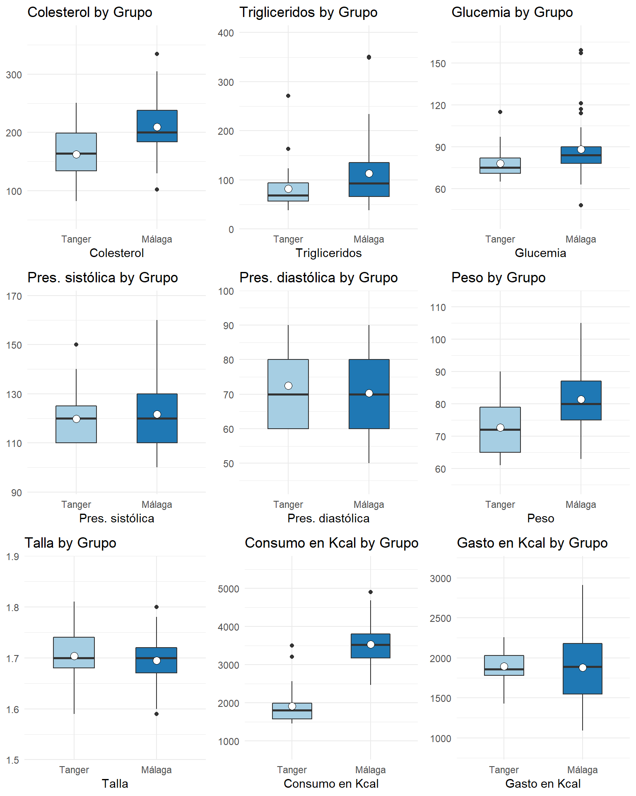
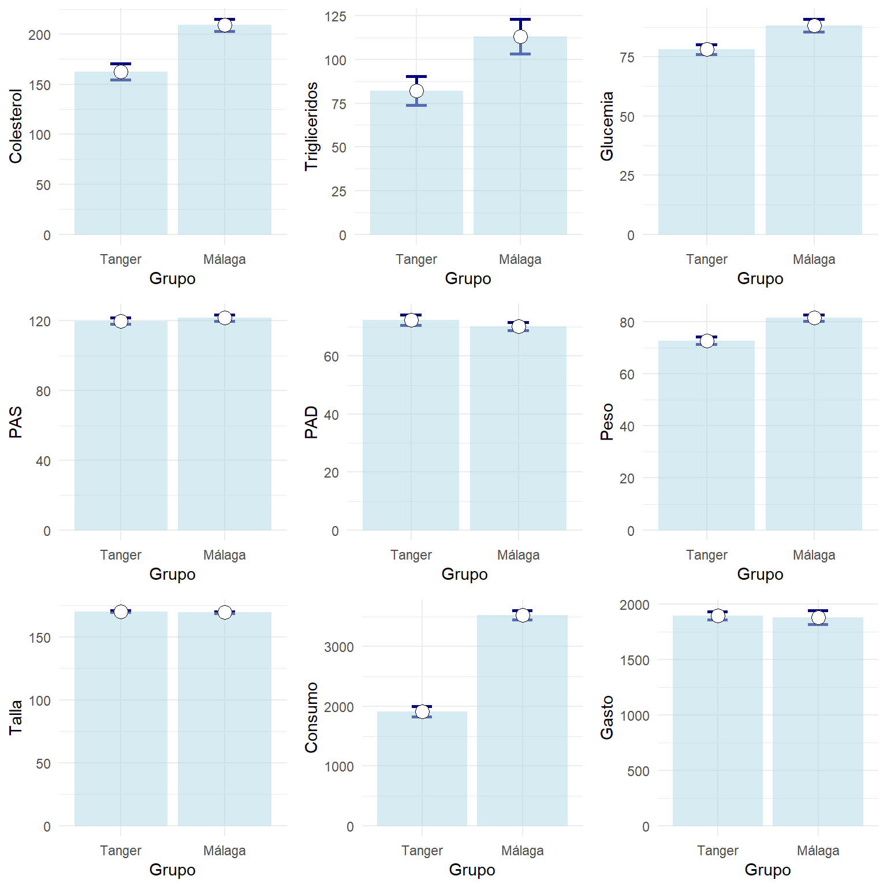
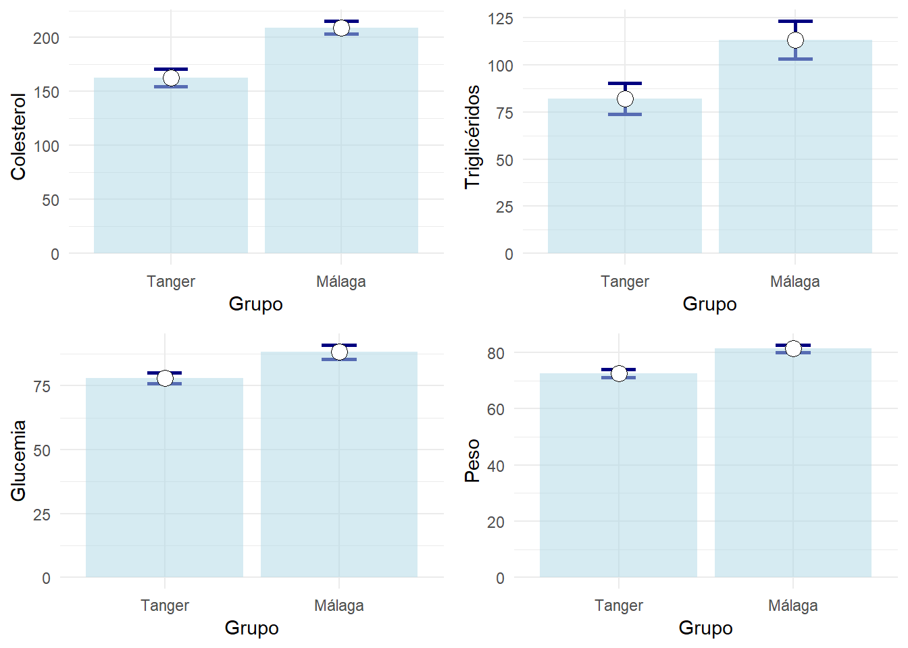

#Estimación

En esta capítulo trataremos sobre como usar una muestra para obtener información sobre la población de la que se ha extraído. Esto nos conducirá a introducir los conceptos de **intervalo de confianza** y de **error típico** de estimación.


##Intervalos de confianza

Un problema habitual es el de estimar parámetros que ayuden a caracterizar una variable. Por ejemplo el porcentaje de individuos que mejora ante un cierto tratamiento, o el tiempo medio que tarda un anestésico en hacer efecto. 

Podríamos decir, tras realizar un estudio, “el 75% de los pacientes tratados experimentó una mejoría”. Una respuesta más sofisticada usando intervalos de confianza podría ser: “Nuestro estudio muestra que en el 75% de los casos se experimenta una mejoría, siendo el margen de error del 6%. El nivel de confianza es del 95%”.

El cálculo de intervalos de confianza para la estimación de parámetros son técnicas que nos permiten hacer declaraciones sobre qué valores podemos esperar para un parámetro. El intervalo calculado dependerá de:

-	Lo estimado en la muestra (porcentaje, media,…) El intervalo de confianza esta formado por valores ligeramente menores y mayores que la aproximación ofrecida por la muestra.

-	El tamaño muestral. Cuantos más datos hayan participado en el cálculo, más pequeño esperamos que sea la diferencia entre el valor estimado y el valor real desconocido.

-	La probabilidad (nivel de confianza) con la que el método dará una respuesta correcta. Un nivel de confianza habitual para los intervalos de confianza es el 95%.

Puede parecer sorprendente que no busquemos respuestas con una confianza del 100%, pero ocurre que en ese caso, los intervalos serían tan grandes que no serían de gran provecho. La elección de un nivel de confianza como el 95% es un compromiso entre hacer declaraciones con una razonable probabilidad de acertar, y que además el intervalo declarado, sea lo suficientemente pequeño como para suscitar algún interés. El nivel de confianza hay que interpretarlo como que disponemos de un método de calcular intervalos que seguido con rigor, en cierto porcentaje de casos acierta (nivel de confianza) y en el resto falla.


## Error típico o estándar
En multitud de ocasiones al utilizar un programa estadístico encontramos junto a las más diversas estimaciones como una media, una proporción, un coeficiente de regresión, un coeficiente de asimetría, etc.,  una cantidad denominada error estándar  o también error típico.

El error estándar tiene mucho que ver con los intervalos de confianza. Para muchos parámetros, su intervalo de confianza es habitualmente la estimación obtenida sobre la muestra (proporción, media,…), y un margen de error que nos es más que un múltiplo del error estándar. Un ejemplo muy común, consiste en elegir niveles de confianza del 95%. Para ello un margen de error de dos errores estándar es habitualmente la respuesta. 

Cuando un programa estadístico nos ofrece una estimación de una cantidad, junto a su error estándar, podemos estar seguros de que si se dan ciertas condiciones de validez, el estimador del parámetro tiene comportamiento normal cuya desviación típica es el error estándar, y por tanto una declaración como: 

>“La proporción de pacientes que mejoraron con el tratamiento es del 0.75, con un error estándar del 0.03” 

puede enunciarse de forma más clara en forma de intervalo de confianza:

>	La proporción de pacientes que mejoró fue del 0.75, siendo el intervalo de confianza al 95% 0.69---0.81 .


Es fácil confundir desviación típica con error típico. Ambos hablan de la dispersión en torno a un valor central y se usan en distribuciones aproximadamente normales. Peo el segundo se utiliza  solo en el contexto de estimar un valor a partir de una muestra.

>[Practique con la diferencia entre desviación típica y error típico](https://www.bioestadistica.uma.es/analisis/teoremacentral/)


###Ejemplo de intervalos de confianza y errores estándar {-}

Se consideran dos grupos de individuos que desmpeñan un trabajo similar, pero que siguen una forma de alimentación muy diferente. Están formados por albañiles de Málaga y Tánger. Descargue la base de datos [2poblaciones-Mismotrabajo-DiferenteNutricion.sav](datos/2poblaciones-Mismotrabajo-DiferenteNutricion.sav). Las primeras líneas tienen el siguiente aspecto:


```r
df=read_sav("datos/2poblaciones-Mismotrabajo-DiferenteNutricion.sav", user_na=FALSE) %>% haven::as_factor() %>% mutate(Talla=Talla*100)
```


```r
df %>% head()  %>% knitr::kable(booktabs=T)
```

<table>
 <thead>
  <tr>
   <th style="text-align:left;"> Grupo </th>
   <th style="text-align:right;"> Colesterol </th>
   <th style="text-align:right;"> Trigliceridos </th>
   <th style="text-align:right;"> Glucemia </th>
   <th style="text-align:right;"> PAS </th>
   <th style="text-align:right;"> PAD </th>
   <th style="text-align:right;"> Peso </th>
   <th style="text-align:right;"> Talla </th>
   <th style="text-align:right;"> Consumo </th>
   <th style="text-align:right;"> Gasto </th>
  </tr>
 </thead>
<tbody>
  <tr>
   <td style="text-align:left;"> Málaga </td>
   <td style="text-align:right;"> 238 </td>
   <td style="text-align:right;"> 107 </td>
   <td style="text-align:right;"> 89 </td>
   <td style="text-align:right;"> 130 </td>
   <td style="text-align:right;"> 70 </td>
   <td style="text-align:right;"> 81 </td>
   <td style="text-align:right;"> 167 </td>
   <td style="text-align:right;"> 3521 </td>
   <td style="text-align:right;"> 1400 </td>
  </tr>
  <tr>
   <td style="text-align:left;"> Tanger </td>
   <td style="text-align:right;"> 251 </td>
   <td style="text-align:right;"> 163 </td>
   <td style="text-align:right;"> 90 </td>
   <td style="text-align:right;"> 130 </td>
   <td style="text-align:right;"> 90 </td>
   <td style="text-align:right;"> 85 </td>
   <td style="text-align:right;"> 167 </td>
   <td style="text-align:right;"> 1490 </td>
   <td style="text-align:right;"> 1730 </td>
  </tr>
  <tr>
   <td style="text-align:left;"> Málaga </td>
   <td style="text-align:right;"> 194 </td>
   <td style="text-align:right;"> 73 </td>
   <td style="text-align:right;"> 89 </td>
   <td style="text-align:right;"> 120 </td>
   <td style="text-align:right;"> 60 </td>
   <td style="text-align:right;"> 79 </td>
   <td style="text-align:right;"> 170 </td>
   <td style="text-align:right;"> 3701 </td>
   <td style="text-align:right;"> 2180 </td>
  </tr>
  <tr>
   <td style="text-align:left;"> Tanger </td>
   <td style="text-align:right;"> 169 </td>
   <td style="text-align:right;"> 71 </td>
   <td style="text-align:right;"> 65 </td>
   <td style="text-align:right;"> 110 </td>
   <td style="text-align:right;"> 60 </td>
   <td style="text-align:right;"> 86 </td>
   <td style="text-align:right;"> 181 </td>
   <td style="text-align:right;"> 3200 </td>
   <td style="text-align:right;"> 2150 </td>
  </tr>
  <tr>
   <td style="text-align:left;"> Málaga </td>
   <td style="text-align:right;"> 227 </td>
   <td style="text-align:right;"> 114 </td>
   <td style="text-align:right;"> 121 </td>
   <td style="text-align:right;"> 130 </td>
   <td style="text-align:right;"> 90 </td>
   <td style="text-align:right;"> 91 </td>
   <td style="text-align:right;"> 173 </td>
   <td style="text-align:right;"> 4124 </td>
   <td style="text-align:right;"> 1700 </td>
  </tr>
  <tr>
   <td style="text-align:left;"> Málaga </td>
   <td style="text-align:right;"> 214 </td>
   <td style="text-align:right;"> 84 </td>
   <td style="text-align:right;"> 80 </td>
   <td style="text-align:right;"> 120 </td>
   <td style="text-align:right;"> 60 </td>
   <td style="text-align:right;"> 87 </td>
   <td style="text-align:right;"> 178 </td>
   <td style="text-align:right;"> 4209 </td>
   <td style="text-align:right;"> 1845 </td>
  </tr>
</tbody>
</table>


Si usa SPSS en el menú "_Analizar - Estadística discriptiva - Explorar_", colocando las variables numéricas en el campo _Dependientes_ y el Grupo en el campo _Factor_ puede obtener información para construir estos resultados:


```r
vNumericas=names(df) %>% setdiff("Grupo")
listaGraficos=vNumericas %>% map( ~ ggplot(df %>% mutate(Respuesta=df[[.x]]) ,aes(x=Grupo,y=Respuesta))+geom_boxplot(fill="lightblue")+xlab(.x)+ylab(""))
do.call("grid.arrange", c(listaGraficos, ncol=3))
```




Visualmente se aprecia que los individuos de _Grupo==Málaga_ siendo de _Talla_ similar, presentan mayor _Consumo de energía_ y similar _Gasto_. Se observa en ellos mayores valores de _Colesterol, Trigliceridos, Glucemia y Peso_, y valores similares de _Presión arterial_.

Los intervalos de confianza y errores estándar podrían mostrarse en una tabla como sigue:


```r
vNumericas=names(df) %>% setdiff("Grupo")
df %>% generaTablatTestPorGrupo("Grupo", vNumericas,
                                columnas = c("media","dt","et","ic1","ic2")) %>% 
  knitr::kable( booktabs = T, 
                col.names=c("Variable",
                        "media","dt","et","ic(min)","ic(max)",
                        "media","dt","et","ic(min)","ic(max)")) %>%
  add_header_above(c(" " = 1, "Tanger" = 5, "Málaga" = 5)) %>%
  kable_styling(font_size = 9)
```

<table class="table" style="font-size: 9px; margin-left: auto; margin-right: auto;">
 <thead>
<tr>
<th style="border-bottom:hidden" colspan="1"></th>
<th style="border-bottom:hidden; padding-bottom:0; padding-left:3px;padding-right:3px;text-align: center; " colspan="5"><div style="border-bottom: 1px solid #ddd; padding-bottom: 5px;">Tanger</div></th>
<th style="border-bottom:hidden; padding-bottom:0; padding-left:3px;padding-right:3px;text-align: center; " colspan="5"><div style="border-bottom: 1px solid #ddd; padding-bottom: 5px;">Málaga</div></th>
</tr>
  <tr>
   <th style="text-align:left;"> Variable </th>
   <th style="text-align:right;"> media </th>
   <th style="text-align:right;"> dt </th>
   <th style="text-align:right;"> et </th>
   <th style="text-align:right;"> ic(min) </th>
   <th style="text-align:right;"> ic(max) </th>
   <th style="text-align:right;"> media </th>
   <th style="text-align:right;"> dt </th>
   <th style="text-align:right;"> et </th>
   <th style="text-align:right;"> ic(min) </th>
   <th style="text-align:right;"> ic(max) </th>
  </tr>
 </thead>
<tbody>
  <tr>
   <td style="text-align:left;"> Colesterol </td>
   <td style="text-align:right;"> 163 </td>
   <td style="text-align:right;"> 44.8 </td>
   <td style="text-align:right;"> 8.32 </td>
   <td style="text-align:right;"> 146 </td>
   <td style="text-align:right;"> 180 </td>
   <td style="text-align:right;"> 209 </td>
   <td style="text-align:right;"> 42.4 </td>
   <td style="text-align:right;"> 6.06 </td>
   <td style="text-align:right;"> 197 </td>
   <td style="text-align:right;"> 221 </td>
  </tr>
  <tr>
   <td style="text-align:left;"> Trigliceridos </td>
   <td style="text-align:right;"> 82 </td>
   <td style="text-align:right;"> 45.2 </td>
   <td style="text-align:right;"> 8.39 </td>
   <td style="text-align:right;"> 65 </td>
   <td style="text-align:right;"> 99 </td>
   <td style="text-align:right;"> 113 </td>
   <td style="text-align:right;"> 69.9 </td>
   <td style="text-align:right;"> 9.98 </td>
   <td style="text-align:right;"> 93 </td>
   <td style="text-align:right;"> 133 </td>
  </tr>
  <tr>
   <td style="text-align:left;"> Glucemia </td>
   <td style="text-align:right;"> 78 </td>
   <td style="text-align:right;"> 11.3 </td>
   <td style="text-align:right;"> 2.09 </td>
   <td style="text-align:right;"> 74 </td>
   <td style="text-align:right;"> 82 </td>
   <td style="text-align:right;"> 88 </td>
   <td style="text-align:right;"> 19.0 </td>
   <td style="text-align:right;"> 2.72 </td>
   <td style="text-align:right;"> 83 </td>
   <td style="text-align:right;"> 94 </td>
  </tr>
  <tr>
   <td style="text-align:left;"> PAS </td>
   <td style="text-align:right;"> 120 </td>
   <td style="text-align:right;"> 10.0 </td>
   <td style="text-align:right;"> 1.86 </td>
   <td style="text-align:right;"> 116 </td>
   <td style="text-align:right;"> 124 </td>
   <td style="text-align:right;"> 122 </td>
   <td style="text-align:right;"> 12.8 </td>
   <td style="text-align:right;"> 1.83 </td>
   <td style="text-align:right;"> 118 </td>
   <td style="text-align:right;"> 125 </td>
  </tr>
  <tr>
   <td style="text-align:left;"> PAD </td>
   <td style="text-align:right;"> 72 </td>
   <td style="text-align:right;"> 9.7 </td>
   <td style="text-align:right;"> 1.80 </td>
   <td style="text-align:right;"> 69 </td>
   <td style="text-align:right;"> 76 </td>
   <td style="text-align:right;"> 70 </td>
   <td style="text-align:right;"> 9.6 </td>
   <td style="text-align:right;"> 1.37 </td>
   <td style="text-align:right;"> 68 </td>
   <td style="text-align:right;"> 73 </td>
  </tr>
  <tr>
   <td style="text-align:left;"> Peso </td>
   <td style="text-align:right;"> 73 </td>
   <td style="text-align:right;"> 7.8 </td>
   <td style="text-align:right;"> 1.46 </td>
   <td style="text-align:right;"> 70 </td>
   <td style="text-align:right;"> 76 </td>
   <td style="text-align:right;"> 81 </td>
   <td style="text-align:right;"> 8.7 </td>
   <td style="text-align:right;"> 1.25 </td>
   <td style="text-align:right;"> 79 </td>
   <td style="text-align:right;"> 84 </td>
  </tr>
  <tr>
   <td style="text-align:left;"> Talla </td>
   <td style="text-align:right;"> 170 </td>
   <td style="text-align:right;"> 4.6 </td>
   <td style="text-align:right;"> 0.86 </td>
   <td style="text-align:right;"> 169 </td>
   <td style="text-align:right;"> 172 </td>
   <td style="text-align:right;"> 169 </td>
   <td style="text-align:right;"> 4.7 </td>
   <td style="text-align:right;"> 0.67 </td>
   <td style="text-align:right;"> 168 </td>
   <td style="text-align:right;"> 171 </td>
  </tr>
  <tr>
   <td style="text-align:left;"> Consumo </td>
   <td style="text-align:right;"> 1909 </td>
   <td style="text-align:right;"> 469.8 </td>
   <td style="text-align:right;"> 87.23 </td>
   <td style="text-align:right;"> 1731 </td>
   <td style="text-align:right;"> 2088 </td>
   <td style="text-align:right;"> 3528 </td>
   <td style="text-align:right;"> 550.9 </td>
   <td style="text-align:right;"> 78.71 </td>
   <td style="text-align:right;"> 3370 </td>
   <td style="text-align:right;"> 3686 </td>
  </tr>
  <tr>
   <td style="text-align:left;"> Gasto </td>
   <td style="text-align:right;"> 1894 </td>
   <td style="text-align:right;"> 185.9 </td>
   <td style="text-align:right;"> 34.52 </td>
   <td style="text-align:right;"> 1824 </td>
   <td style="text-align:right;"> 1965 </td>
   <td style="text-align:right;"> 1880 </td>
   <td style="text-align:right;"> 438.1 </td>
   <td style="text-align:right;"> 62.59 </td>
   <td style="text-align:right;"> 1755 </td>
   <td style="text-align:right;"> 2006 </td>
  </tr>
</tbody>
</table>

En la tabla anterior vemos para cada grupo no solo la media y desviación típica de cada grupo (que nos da una idea de donde se sitúan los individuos de cada grupo), sino un la precisión con la que se ha estimado la media de cada grupo (en forma de error estándar e intervalo de confianza al 95%). 

Realmente no es esta la forma habitual de presentar los resultados en una publicación científica. Normalmente queremos mostrar como es la precisión de nuestras estimaciones, y el intervalo de confianza se muestra más bien para la diferencia que hay entre los dos grupos. Hay que esperar a ver la **prueba t-student** para ver como construir la tabla habitual:


```r
df %>% generaTablatTestPorGrupo("Grupo", vNumericas,
                                columnas = c("n","mediaet","p.t","ci95")) %>% 
  knitr::kable( booktabs = T, 
                col.names=c("Variable",
                        "n","media±et", 
                        "n","media±et",
                        "p dif.","ic95% dif.")) %>%
  add_header_above(c(" " = 1, "Tanger" = 2, "Málaga" = 2," "=2))
```

<table>
 <thead>
<tr>
<th style="border-bottom:hidden" colspan="1"></th>
<th style="border-bottom:hidden; padding-bottom:0; padding-left:3px;padding-right:3px;text-align: center; " colspan="2"><div style="border-bottom: 1px solid #ddd; padding-bottom: 5px;">Tanger</div></th>
<th style="border-bottom:hidden; padding-bottom:0; padding-left:3px;padding-right:3px;text-align: center; " colspan="2"><div style="border-bottom: 1px solid #ddd; padding-bottom: 5px;">Málaga</div></th>
<th style="border-bottom:hidden" colspan="2"></th>
</tr>
  <tr>
   <th style="text-align:left;"> Variable </th>
   <th style="text-align:right;"> n </th>
   <th style="text-align:left;"> media±et </th>
   <th style="text-align:right;"> n </th>
   <th style="text-align:left;"> media±et </th>
   <th style="text-align:left;"> p dif. </th>
   <th style="text-align:left;"> ic95% dif. </th>
  </tr>
 </thead>
<tbody>
  <tr>
   <td style="text-align:left;"> Colesterol </td>
   <td style="text-align:right;"> 30 </td>
   <td style="text-align:left;"> 162.67±8.32 </td>
   <td style="text-align:right;"> 50 </td>
   <td style="text-align:left;"> 209.12±6.06 </td>
   <td style="text-align:left;"> &lt;0.001* </td>
   <td style="text-align:left;"> 46.45[26.15,66.76] </td>
  </tr>
  <tr>
   <td style="text-align:left;"> Trigliceridos </td>
   <td style="text-align:right;"> 30 </td>
   <td style="text-align:left;"> 82.13±8.39 </td>
   <td style="text-align:right;"> 50 </td>
   <td style="text-align:left;"> 113.22±9.98 </td>
   <td style="text-align:left;"> 0.018* </td>
   <td style="text-align:left;"> 31.09[5.45,56.72] </td>
  </tr>
  <tr>
   <td style="text-align:left;"> Glucemia </td>
   <td style="text-align:right;"> 30 </td>
   <td style="text-align:left;"> 78.03±2.09 </td>
   <td style="text-align:right;"> 50 </td>
   <td style="text-align:left;"> 88.18±2.72 </td>
   <td style="text-align:left;"> 0.004* </td>
   <td style="text-align:left;"> 10.15[3.40,16.89] </td>
  </tr>
  <tr>
   <td style="text-align:left;"> PAS </td>
   <td style="text-align:right;"> 30 </td>
   <td style="text-align:left;"> 119.83±1.86 </td>
   <td style="text-align:right;"> 50 </td>
   <td style="text-align:left;"> 121.70±1.83 </td>
   <td style="text-align:left;"> 0.472 </td>
   <td style="text-align:left;"> 1.87[-3.28,7.01] </td>
  </tr>
  <tr>
   <td style="text-align:left;"> PAD </td>
   <td style="text-align:right;"> 30 </td>
   <td style="text-align:left;"> 72.50±1.80 </td>
   <td style="text-align:right;"> 50 </td>
   <td style="text-align:left;"> 70.30±1.37 </td>
   <td style="text-align:left;"> 0.329 </td>
   <td style="text-align:left;"> -2.20[-6.67,2.27] </td>
  </tr>
  <tr>
   <td style="text-align:left;"> Peso </td>
   <td style="text-align:right;"> 30 </td>
   <td style="text-align:left;"> 72.67±1.46 </td>
   <td style="text-align:right;"> 50 </td>
   <td style="text-align:left;"> 81.38±1.25 </td>
   <td style="text-align:left;"> &lt;0.001* </td>
   <td style="text-align:left;"> 8.71[4.94,12.49] </td>
  </tr>
  <tr>
   <td style="text-align:left;"> Talla </td>
   <td style="text-align:right;"> 30 </td>
   <td style="text-align:left;"> 170.33±0.86 </td>
   <td style="text-align:right;"> 50 </td>
   <td style="text-align:left;"> 169.48±0.67 </td>
   <td style="text-align:left;"> 0.431 </td>
   <td style="text-align:left;"> -0.85[-3.01,1.30] </td>
  </tr>
  <tr>
   <td style="text-align:left;"> Consumo </td>
   <td style="text-align:right;"> 30 </td>
   <td style="text-align:left;"> 1909.17±87.23 </td>
   <td style="text-align:right;"> 50 </td>
   <td style="text-align:left;"> 3528.04±78.71 </td>
   <td style="text-align:left;"> &lt;0.001* </td>
   <td style="text-align:left;"> 1618.87[1387.71,1850.04] </td>
  </tr>
  <tr>
   <td style="text-align:left;"> Gasto </td>
   <td style="text-align:right;"> 30 </td>
   <td style="text-align:left;"> 1894.20±34.52 </td>
   <td style="text-align:right;"> 50 </td>
   <td style="text-align:left;"> 1880.30±62.59 </td>
   <td style="text-align:left;"> 0.845 </td>
   <td style="text-align:left;"> -13.90[-154.73,126.93] </td>
  </tr>
</tbody>
</table>


```r
resumen=df %>% gather(Variable,Valor,-Grupo) %>% 
  group_by(Grupo,Variable) %>% 
  summarise(Media=mean(Valor),
                n=length(Valor),
               ET=sd(Valor)/sqrt(n),
               IC=ET*qt(0.975,n-1))

listaGraficos=vNumericas %>% map( ~ ggplot(resumen %>% filter(Variable==.x), aes(x=Grupo,y=Media)) +
  geom_errorbar(aes(ymin=Media-ET,ymax=Media+ET),width=0.2, size=1, color="navyblue")+
  geom_bar(stat="identity", fill="lightblue", alpha=0.5)+
  geom_point( size=4, shape=21, fill="white")+ylab(.x))
do.call("grid.arrange", c(listaGraficos, ncol=3))
```




Las barras ocupan mucho espacio y no permiten apreciar bien las diferencias. Personalmente pienso que es mejor mostrar solo los intervalos formados por las medias y el error típico como sigue:


```r
listaGraficos=vNumericas %>% map( ~ ggplot(resumen %>% filter(Variable==.x), aes(x=Grupo,y=Media)) +
  geom_errorbar(aes(ymin=Media-ET,ymax=Media+ET),width=0.2, size=1, color="navyblue")+
  geom_point( size=4, shape=21, fill="white")+ylab(.x))
do.call("grid.arrange", c(listaGraficos, ncol=3))
```



