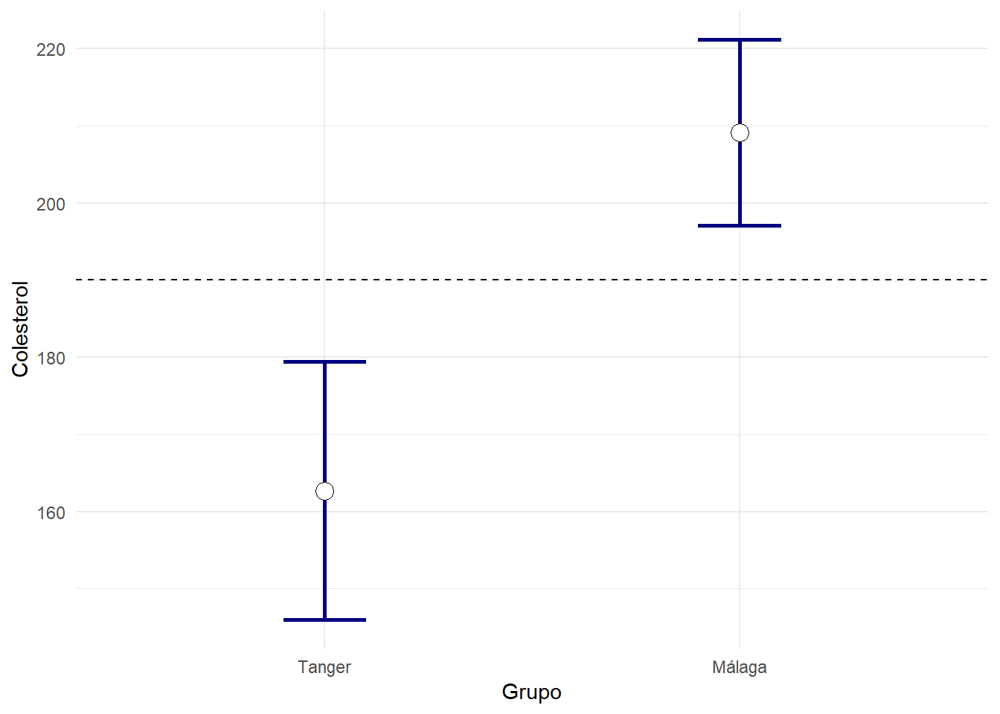

#Contrastes de hipótesis

Aunque gran parte de la investigación médica esta relacionada con la recogida de datos con propósito descriptivo, otra buena parte lo está con la recolección de información con el plan de responder a cuestiones puntuales, es decir, contrastes de hipótesis.

Las técnicas de contrastes de hipótesis están muy vinculadas a las de cálculo de intervalos de confianza, como mencionábamos al hablar de estos últimos. Aunque la aproximación es diferente:

-	Al hacer un intervalo de confianza establecemos una región donde esperamos que esté el valor del parámetro.

-	Al hacer un contraste de hipótesis establecemos posibles valores para unos parámetros y calculamos la probabilidad de que se obtengan muestras tan discrepantes o más que la obtenida, bajo la suposición de que la hipótesis es cierta. Si dicha probabilidad es muy baja (por debajo de una cantidad denominada nivel de significación) la hipótesis es rechazada.

Vamos a ilustrarlo retomando el ejemplo del tema anterior de intervalos de confianza. Descargue la base de datos [2poblaciones-Mismotrabajo-DiferenteNutricion.sav](datos/2poblaciones-Mismotrabajo-DiferenteNutricion.sav) y observemos las primeras líneas:


```r
df=read_sav("datos/2poblaciones-Mismotrabajo-DiferenteNutricion.sav", user_na=FALSE) %>% haven::as_factor()
```


```r
df %>% head()  %>% knitr::kable(booktabs=T)
```

<table>
 <thead>
  <tr>
   <th style="text-align:left;"> Grupo </th>
   <th style="text-align:right;"> Colesterol </th>
   <th style="text-align:right;"> Trigliceridos </th>
   <th style="text-align:right;"> Glucemia </th>
   <th style="text-align:right;"> PAS </th>
   <th style="text-align:right;"> PAD </th>
   <th style="text-align:right;"> Peso </th>
   <th style="text-align:right;"> Talla </th>
   <th style="text-align:right;"> Consumo </th>
   <th style="text-align:right;"> Gasto </th>
  </tr>
 </thead>
<tbody>
  <tr>
   <td style="text-align:left;"> Málaga </td>
   <td style="text-align:right;"> 238 </td>
   <td style="text-align:right;"> 107 </td>
   <td style="text-align:right;"> 89 </td>
   <td style="text-align:right;"> 130 </td>
   <td style="text-align:right;"> 70 </td>
   <td style="text-align:right;"> 81 </td>
   <td style="text-align:right;"> 1.7 </td>
   <td style="text-align:right;"> 3521 </td>
   <td style="text-align:right;"> 1400 </td>
  </tr>
  <tr>
   <td style="text-align:left;"> Tanger </td>
   <td style="text-align:right;"> 251 </td>
   <td style="text-align:right;"> 163 </td>
   <td style="text-align:right;"> 90 </td>
   <td style="text-align:right;"> 130 </td>
   <td style="text-align:right;"> 90 </td>
   <td style="text-align:right;"> 85 </td>
   <td style="text-align:right;"> 1.7 </td>
   <td style="text-align:right;"> 1490 </td>
   <td style="text-align:right;"> 1730 </td>
  </tr>
  <tr>
   <td style="text-align:left;"> Málaga </td>
   <td style="text-align:right;"> 194 </td>
   <td style="text-align:right;"> 73 </td>
   <td style="text-align:right;"> 89 </td>
   <td style="text-align:right;"> 120 </td>
   <td style="text-align:right;"> 60 </td>
   <td style="text-align:right;"> 79 </td>
   <td style="text-align:right;"> 1.7 </td>
   <td style="text-align:right;"> 3701 </td>
   <td style="text-align:right;"> 2180 </td>
  </tr>
  <tr>
   <td style="text-align:left;"> Tanger </td>
   <td style="text-align:right;"> 169 </td>
   <td style="text-align:right;"> 71 </td>
   <td style="text-align:right;"> 65 </td>
   <td style="text-align:right;"> 110 </td>
   <td style="text-align:right;"> 60 </td>
   <td style="text-align:right;"> 86 </td>
   <td style="text-align:right;"> 1.8 </td>
   <td style="text-align:right;"> 3200 </td>
   <td style="text-align:right;"> 2150 </td>
  </tr>
  <tr>
   <td style="text-align:left;"> Málaga </td>
   <td style="text-align:right;"> 227 </td>
   <td style="text-align:right;"> 114 </td>
   <td style="text-align:right;"> 121 </td>
   <td style="text-align:right;"> 130 </td>
   <td style="text-align:right;"> 90 </td>
   <td style="text-align:right;"> 91 </td>
   <td style="text-align:right;"> 1.7 </td>
   <td style="text-align:right;"> 4124 </td>
   <td style="text-align:right;"> 1700 </td>
  </tr>
  <tr>
   <td style="text-align:left;"> Málaga </td>
   <td style="text-align:right;"> 214 </td>
   <td style="text-align:right;"> 84 </td>
   <td style="text-align:right;"> 80 </td>
   <td style="text-align:right;"> 120 </td>
   <td style="text-align:right;"> 60 </td>
   <td style="text-align:right;"> 87 </td>
   <td style="text-align:right;"> 1.8 </td>
   <td style="text-align:right;"> 4209 </td>
   <td style="text-align:right;"> 1845 </td>
  </tr>
</tbody>
</table>

Exploremos los intervalos de confianza de las medias de cada grupo. En *SPSS* recordamos que se obtenían en el menú "_Analizar - Estadística discriptiva - Explorar_", colocando las variables numéricas en el campo _Dependientes_ y el Grupo en el campo _Factor_. Los valores que nos interesan son:


```r
vNumericas=names(df) %>% setdiff("Grupo")
df %>% generaTablatTestPorGrupo("Grupo", vNumericas,
                                columnas = c("ic1","ic2")) %>% 
  knitr::kable( booktabs = T, 
                col.names=c("Variable",
                        "ic(min)","ic(max)",
                        "ic(min)","ic(max)")) %>%
  add_header_above(c(" " = 1, "Tanger" = 2, "Málaga" = 2))
```

<table>
 <thead>
<tr>
<th style="border-bottom:hidden" colspan="1"></th>
<th style="border-bottom:hidden; padding-bottom:0; padding-left:3px;padding-right:3px;text-align: center; " colspan="2"><div style="border-bottom: 1px solid #ddd; padding-bottom: 5px;">Tanger</div></th>
<th style="border-bottom:hidden; padding-bottom:0; padding-left:3px;padding-right:3px;text-align: center; " colspan="2"><div style="border-bottom: 1px solid #ddd; padding-bottom: 5px;">Málaga</div></th>
</tr>
  <tr>
   <th style="text-align:left;"> Variable </th>
   <th style="text-align:right;"> ic(min) </th>
   <th style="text-align:right;"> ic(max) </th>
   <th style="text-align:right;"> ic(min) </th>
   <th style="text-align:right;"> ic(max) </th>
  </tr>
 </thead>
<tbody>
  <tr>
   <td style="text-align:left;"> Colesterol </td>
   <td style="text-align:right;"> 145.7 </td>
   <td style="text-align:right;"> 179.7 </td>
   <td style="text-align:right;"> 196.9 </td>
   <td style="text-align:right;"> 221.3 </td>
  </tr>
  <tr>
   <td style="text-align:left;"> Trigliceridos </td>
   <td style="text-align:right;"> 65.0 </td>
   <td style="text-align:right;"> 99.3 </td>
   <td style="text-align:right;"> 93.2 </td>
   <td style="text-align:right;"> 133.3 </td>
  </tr>
  <tr>
   <td style="text-align:left;"> Glucemia </td>
   <td style="text-align:right;"> 73.8 </td>
   <td style="text-align:right;"> 82.3 </td>
   <td style="text-align:right;"> 82.7 </td>
   <td style="text-align:right;"> 93.6 </td>
  </tr>
  <tr>
   <td style="text-align:left;"> PAS </td>
   <td style="text-align:right;"> 116.0 </td>
   <td style="text-align:right;"> 123.7 </td>
   <td style="text-align:right;"> 118.0 </td>
   <td style="text-align:right;"> 125.4 </td>
  </tr>
  <tr>
   <td style="text-align:left;"> PAD </td>
   <td style="text-align:right;"> 68.8 </td>
   <td style="text-align:right;"> 76.2 </td>
   <td style="text-align:right;"> 67.5 </td>
   <td style="text-align:right;"> 73.1 </td>
  </tr>
  <tr>
   <td style="text-align:left;"> Peso </td>
   <td style="text-align:right;"> 69.7 </td>
   <td style="text-align:right;"> 75.7 </td>
   <td style="text-align:right;"> 78.9 </td>
   <td style="text-align:right;"> 83.9 </td>
  </tr>
  <tr>
   <td style="text-align:left;"> Talla </td>
   <td style="text-align:right;"> 1.7 </td>
   <td style="text-align:right;"> 1.7 </td>
   <td style="text-align:right;"> 1.7 </td>
   <td style="text-align:right;"> 1.7 </td>
  </tr>
  <tr>
   <td style="text-align:left;"> Consumo </td>
   <td style="text-align:right;"> 1730.8 </td>
   <td style="text-align:right;"> 2087.6 </td>
   <td style="text-align:right;"> 3369.9 </td>
   <td style="text-align:right;"> 3686.2 </td>
  </tr>
  <tr>
   <td style="text-align:left;"> Gasto </td>
   <td style="text-align:right;"> 1823.6 </td>
   <td style="text-align:right;"> 1964.8 </td>
   <td style="text-align:right;"> 1754.5 </td>
   <td style="text-align:right;"> 2006.1 </td>
  </tr>
</tbody>
</table>

Si pretendemos contrastar la hipótesis (no muy interesante) de si el Colesterol medio en la población de la que se han obtenidos las muestras en Tánger es 190, la respuesta que elegiríamos es **NO**, dado que 190 no forma parte del intervalo dende _casi seguro_ esperamos encontrar la media. Los datos indican que la media allí es inferior.

Análogamente, en Málaga podríamos decir que la media de la población _casi seguro_ que no es 190. Los datos apuntan a que la media es superior.


```r
resumen=df %>% gather(Variable,Valor,-Grupo) %>% 
  group_by(Grupo,Variable) %>% 
  summarise(Media=mean(Valor),
                n=length(Valor),
               IC=sd(Valor)/sqrt(n)*qt(0.975,n-1))
ggplot(resumen %>% filter(Variable=="Colesterol"), aes(x=Grupo,y=Media)) +
  geom_errorbar(aes(ymin=Media-IC,ymax=Media+IC),width=0.2, size=1, color="navyblue")+
  geom_point( size=4, shape=21, fill="white")+ylab("Colesterol")+
  geom_hline(yintercept=190,lty=2)
```




En término de contrastes de hipótesis diríamos que *tenemos evidencia estadísticamente significativa* de que tanto en Málaga como en Tanger la media de colesterol de las poblaciones donde se han extraído las muestras no es 190, con un *nivel de significación* del 5%. Este nivel de significación hace el papel de probabilidad de observar unas muestras tan extañas como las observadas si la media fuese 190.


## ¿Qué es una hipótesis?
Las hipótesis que se contrastan hay que entenderlas como una declaración, no como una pregunta a responder. No se formulan como la cuestión “¿El tratamiento tiene efecto?”. Se formulan bien como “El tratamiento no tiene efecto” o como “el tratamiento sí tiene efecto”. 

- A una hipótesis que traduce las ideas de “no hay efecto”, “no hay relación”, “los resultados en los grupos son similares”, se la denomina **hipótesis nula**. 

- La hipótesis alternativa es la que se aceptará cuando los datos nos inviten a rechazar la nula.

Las hipótesis se formularán normalmente como una declaración sobre una o más poblaciones, especialmente sobre sus parámetros. Ejemplos de hipótesis pueden ser:

-	La edad media de los individuos con la enfermedad X es 50 años.

-	El tratamiento X tiene el mismo efecto que un placebo (por tanto no tiene valor terapéutico). Se podría traducir como que el efecto medio del placebo es igual al efecto medio del tratamiento.

-	Para determinar la cantidad de anestésico a aplicar a un paciente, se utiliza un modelo de regresión lineal, siendo el peso y la edad del mismo variables independientes. Alguna hipótesis podría ser que no deberíamos tener en cuenta la edad, por ejemplo. Esto se traduciría en que el coeficiente asociado en el modelo de regresión es cero.

-	 Al tratar de identificar factores de riesgo para el desarrollo de una enfermedad podríamos estar interesados en saber si fumar es uno de ellos. Para ello podríamos realizar una regresión logística y contrastar si la “odds ratio” es igual a uno, lo que equivale a decir que no es un factor de riesgo.


En todo contraste de hipótesis se enfrenta la denominada **hipótesis nula** (“no efecto”), frente a la **hipótesis alternativa**, que la niega. La hipótesis nula puede interpretarse como aquella que normalmente sería aceptada mientras los datos no indiquen otra cosa. Cuando los datos se muestran contrarios a la hipótesis nula a la vez que favorables a la hipótesis alternativa, se rechaza la nula y se acepta la alternativa. El mecanismo no puede ser más simple, pero hay que tener cuidado con interpretarlo bien, pues pueden esconderse trampas de no emplearse con atención.

Un contraste se declara como **estadísticamente significativo**, cuando a partir de los resultados muestrales concluimos que se *rechaza la hipótesis nula*.

En los capítulos siguientes trataremos contrastes de hipótesis de frecuente uso en la ciencia médica, indicando en cada caso la hipótesis nula y la alternativa.

## Tipos de error

Al realizar un contraste de hipótesis hay dos tipos de errores posibles:

-	Rechazar la hipótesis nula, cuando esta es cierta. A esto se le denomina error de tipo I. 

-	No rechazar la hipótesis nula, cuando esta es falsa. Lo denominamos error de tipo II, y a la probabilidad de que ocurra se la denomina β. 

## Nivel de significación

Se denomina nivel de significación de un contraste, a la probabilidad de cometer un error de tipo I. La probabilidad de que este evento ocurra, es una cantidad que se fija de antemano (antes incluso de extraer las muestras) en un número pequeño denominado nivel de significación, y se representa con la letra α. Típicamente se elige un valor pequeño, 5% o 1%. Todo experimento, en su definición y antes de elegir las muestras, debe llevar descrito cuál es el criterio con el que rechazaremos una hipótesis. Esto se traduce en prefijar el nivel de significación del contraste.

Al leer un artículo, en la sección “material y métodos”, es frecuente encontrárselo referenciado en frases del estilo: 

> “Se declararán significativos los contrastes cuando la significación sea inferior al 5%”. 

Esta frase debe entenderse como que se rechazará la hipótesis nula del contraste si, al examinar la muestra, se observa que discrepa tanto de la hipótesis nula que, si esta fuese realmente cierta, la probabilidad de obtener una muestra como la obtenida (o aún peor), es inferior al 5%. Dicho con otros términos, 

> “Declaramos que no hay efecto, hasta que los datos nos indique otra cosa más allá de una duda razonable”.

## Significación
Se denomina **significación de un contraste**, y se suele representar con la letra **p**, al valor calculado _tras observar la muestra_, y que debería tomar el nivel de significación para estar en una situación donde dudemos entre rechazar o no una hipótesis.

Visto así, podemos considerar la significación como un _indicador de la discrepancia entre una hipótesis nula y los datos muestrales_. Cuanto más cercano sea a cero, más evidencia tenemos en contra de la hipótesis nula; Hasta el punto que cuando la significación es inferior al nivel de significación fijado de antemano (por ejemplo el 5%), directamente se rechaza la hipótesis nula (se ha superado el umbral de los que se había fijado de antemano como una “duda razonable a favor de que no hay efecto”)

## Potencia
La probabilidad de que no ocurra el error de tipo II, cuando esta puede calcularse, se la denomina potencia del contraste. Es decir, _la potencia del contraste es una medida de la habilidad de un contraste para detectar un efecto que está presente_.

En los casos en que es posible fijar la potencia del contraste suele tomarse valores como 85% o 90%. Aparece normalmente en contrastes donde la hipótesis alternativa afirma que no solo un tratamiento es mejor que un placebo, sino que además es mejor en, al menos, cierta cantidad que se considera _clínicamente significativa_ (no confundir con _estadísticamente significativa_).

Normalmente los programas estadísticos solamente hacen referencia a la significación de un contraste, y no a la potencia. Ello se debe a que para determinar la potencia es necesario que la hipótesis alternativa no sea simplemente una negación de la hipótesis nula, sino que debe especificar explícitamente una diferencia cuantitativa con ella. Esta diferencia es algo que depende del investigador, no de lo los datos.

### Ejemplo simple {-}
Se espera que un tratamiento produzca un efecto beneficioso en la reducción del colesterol de al menos 10 unidades. Para ello se eligen dos grupos de pacientes de características similares y se prueba con un grupo un placebo y con el otro el tratamiento en cuestión. 

- Mientras los datos no indiquen lo contrario pensaremos que el tratamiento no tiene efecto (no consigue reducir de media las 10 unidades). Esta es la _hipótesis nula_.

- La _hipótesis alternativa_ es que el tratamiento sí tiene efecto (bajará el colesterol esas 10 unidades, o más).

- Un _nivel de significación del 5%_ se interpreta como que a menos que los resultados del experimento discrepen suficientemente de que el tratamiento no tiene efecto, consideraremos que el tratamiento no sirve. Si el tratamiento muestra resultados muy buenos con respecto al placebo decidiremos que sí sirve, y rechazaremos la hipótesis nula. Por supuesto, excepcionalmente puede ocurrir que un tratamiento que no tiene ninguna utilidad muestre resultados buenos sobre una muestra, y acabemos concluyendo por error que es bueno. La probabilidad de que esto ocurra evidentemente esperamos que sea baja y es lo que hemos denominado _nivel de significación_. 

- Supongamos que tras estudiar los resultados del experimento con algún contraste obtenemos que la significación es _p=0.001=0.1%_. Esto quiere decir que los resultados de la muestra son _incoherentes con la hipótesis nula_ (son más improbables que el valor límite que fue fijado en 5%). Concluimos que _hay evidencia estadísticamente significativa_ en contra de que el tratamiento no reduce el colesterol en al menos 10 unidades.

- ¿Cómo se interpreta la potencia en este ejemplo? Supongamos que el tratamiento realmente es efectivo (reduce al menos 10 unidades el colesterol). ¿Cuál sería la probabilidad de que una prueba estadística lo detecte (rechace la hipótesis nula)? Esta probabilidad sería _la potencia_.
 
 
 
> [Para practicar con estos conceptos puede trabajar con esta simulación](https://www.bioestadistica.uma.es/analisis/contrastes/) 


### Ejemplo real: Lectura de un artículo

Siga este enlace para consultar como se ha redactado la publicación de [un artículo científico concreto](https://doi.org/10.1161/JAHA.118.009331). Vamos a destacar de él agunos pasajes y vamos a traducir algunas frases a los conceptos anteriores:


> We measured biventricular strains in 1824 randomly selected patients (973 men, aged 70±14 years) from a strain registry. 

En primer lugar, 70±14 nos indica que la media es 70 años. No todos tenían la misma edad, 14 se utiliza en este contecto como medida de dispersión, y es de esperar que la edad no se separase mucho de una distribución normal de desviación típica 14 años. Seguramente no había muchos individuos que se alejasen 2*14=28 años de la media.


> A total of 799 patients (43.8%) died during the median follow‐up duration of 31.7 months.

Cada paciente fue seguido una cantidad de tiempo diferente. La mediana o percentil 50, fue de 31.7 meses, es decir, la mitad de ellos fue seguido un tiempo inferior o igual. El resto fue medido un tiempo superior. La evolución de los pacientes es tal que a esos 31.7 meses ya habían fallecidol 43.8% de ellos.


> In univariate analysis, LVGLS and RVGLS were significantly associated with all‐cause mortality. We classified them into 4 strain groups according to LVGLS (≥9%) and RVGLS (≥12%). On Cox proportional hazards analysis, group 4 (<9% LVGLS and <12% RVGLS) had the worst prognosis, with a hazard ratio (HR) of 1.755 (95% confidence interval [CI], 1.473–2.091; P<0.001) compared with that of group 1 (≥9% LVGLS and ≥12% RVGLS). 

Dividieron a los pacientes en 2x2=4 grupos dependiendo de que los pacientes superasen o no en dos variables ciertos puntos de corte elegidos por los investigadores y con algún significado clínico. Eligen a un grupo de referencia que tiene el mejor pronóstico: 

> "group 1 (≥9% LVGLS and ≥12% RVGLS)"


Con respecto a él, miden cuánto más peligroso es estar en el resto de grupos.Es habitual hacerlo con conceptos que son _razones_, de forma que:

- una razón igual *1* refleja que algo es igual de peligroso;

- valores *mayores que 1* indican aumento del riesgo;

- *valores menores que 1* indican disminución del riesgo

En este caso utilizan como medida de riesgo el  _Hazard Ratio (HR)._ 


En concreto, para el grupo que tenía peor pronóstico, 

> group 4 (<9% LVGLS and <12% RVGLS) 

un intervalo de confianza al 95% les indica que _HR_ es un valor comprendido en _1.473–2.091_. Es decir, no saben seguro cual es el valor real, pero responden a su calculo usando un mecanismo que acierta en el 95% de las ocasiones, y que en este caso indica que sea cual sea el valor real, este debe ser claramente mayor que 1.


En términos de _contrastes de hipótesis_ podríamos decirlo de este modo: 

- Si no hubiese datos que nos indicasen otra cosa, en principio asumiríamos la **hipótesis nula** de que los _grupos 1 y 4_ presentan mortalidad similar (_HR=1_)

- Si los datos mostrasen otra cosa con evidencia suficiente podríamos decir que tenemos pruebas en contra de la nula, y a favor de una **Hipótesis alternativa:** Los grupos 1 y 4 presentan mortalidad diferente (_HR≠1_).

Pues bien, la evidencia que ellos encuentran en contra de la hipótesis nula es:

> 95% confidence interval [CI], 1.473–2.091; *P<0.001*

Es decir, si fuese cierta la nula y ambos grupos fuesen en realidad de riesgo similar, ellos han obtenido una muestra tan extraña que es dificil de explicar a menos que el azar haya jugado en su contra de tal modo que les ha ocurrido algo que no se vería ni en 1 de cada 1000 estudios similares. 

Más adelante en el artículo indican:

> On the basis of previously reported data, we calculated the sample
size to obtain a hazard ratio (HR) of 1.3 in both groups. A 2-sided log-rank test with an overall sample size of 1600 participants (800 in group 1 and 800 in group 2) achieved
99.1% power at a 0.05 significance level to detect an HR of
1.30 when the control group had an HR of 1. 

Se podría traducir de este modo. Tenemos como hipótesis alternativa la de que ciertos grupos de pacientes deben tener un HR>1.3, que es un valor que el investigador considera clínicamente relevante. No ha sido observado (aún) en los datos ya que cuando diseñaron el estudio, no habían empezado a recoger datos de los pacientes). Es un valor que el investigador, por su experiencia en el tema, sospecha que debe ser así de grande o aún mayor. Es, en la fase de diseño del estudio, solo una creencia del investigador, basada en lo que sabe o ha leído del tema.

Eligieron una muestra de 1600 pacientes, que es lo bastante grande como para que si su hipótesis alternativa fuese cierta con HR>1.3, pudieran declarar significativo el resultado con una probabilidad del 99.1%. Esto era algo conocido *antes* de realizar el estudio. Como observa, la potencia se utiliza para diseñar el estudio. Nadie quiere empezar a trabajar en un tema donde si tu hipótesis alternativa es correcta, por haber elegido la muestra muy pequeña, tienes pocas probabilidades de encontrar evidencia contra la _hipótesis nula_.


