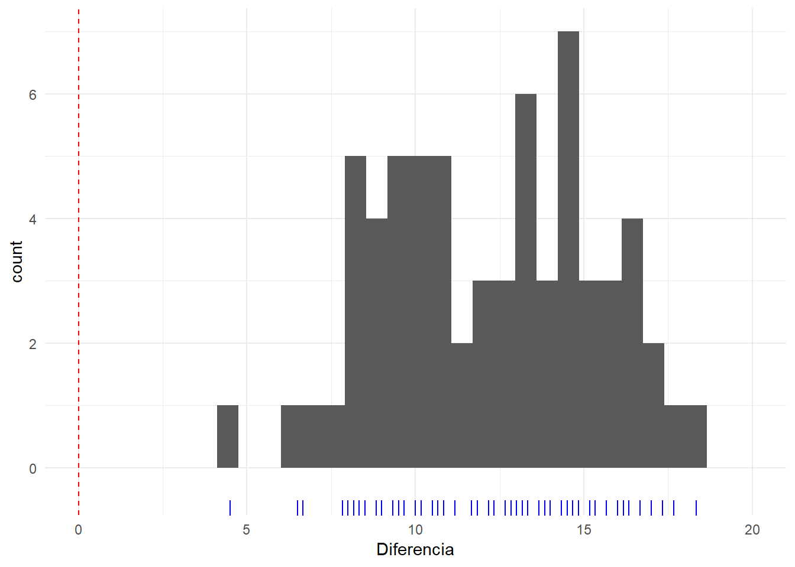
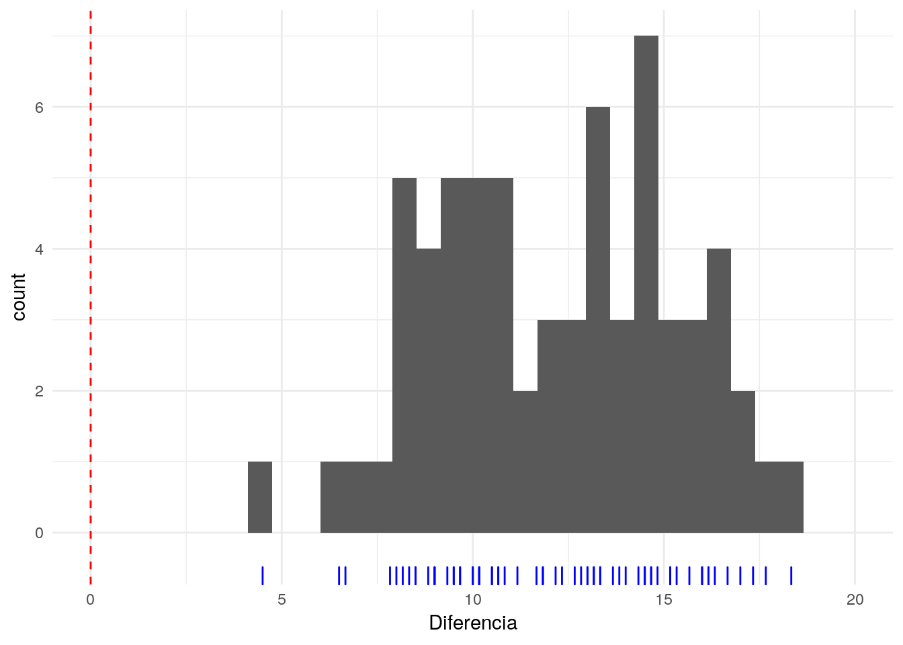
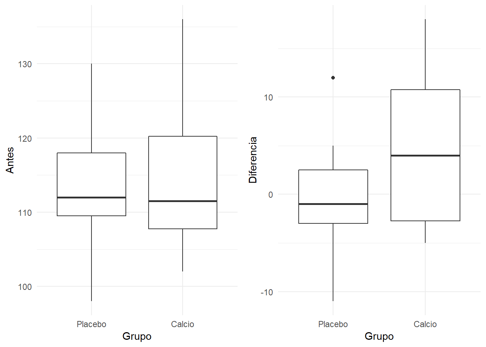
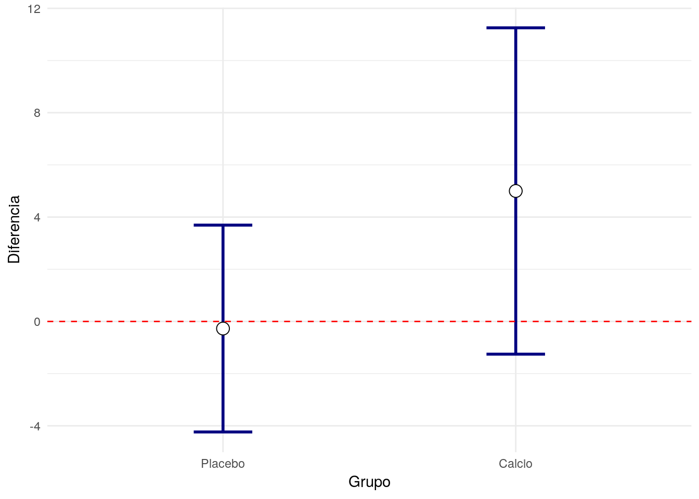
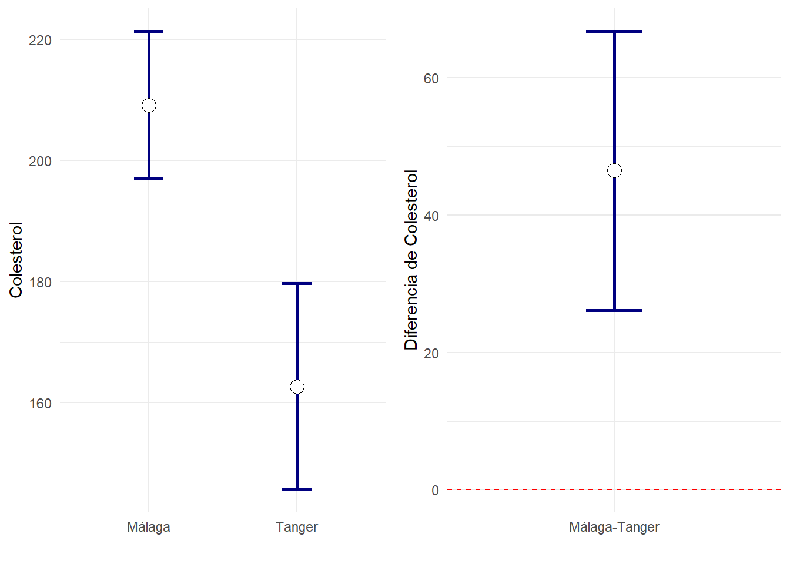
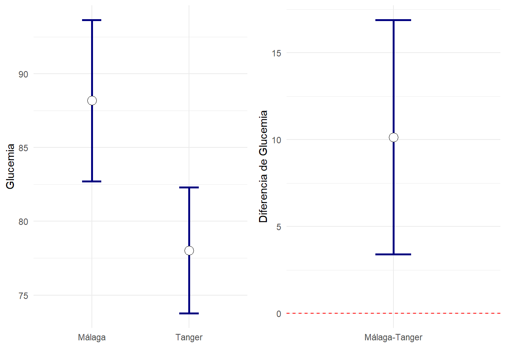
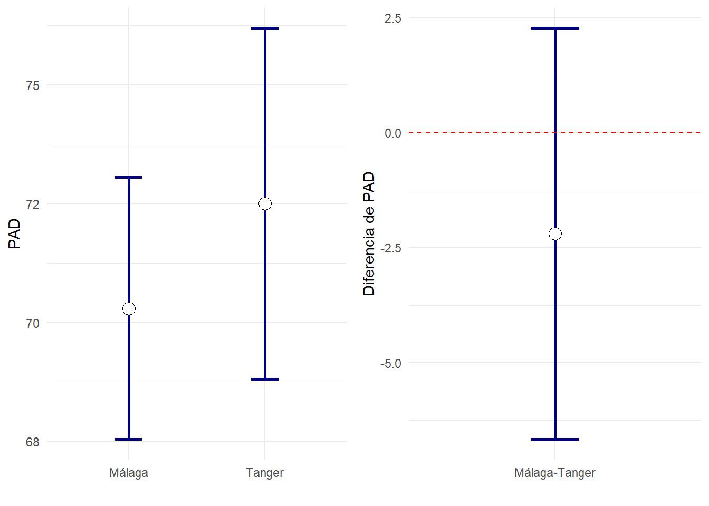
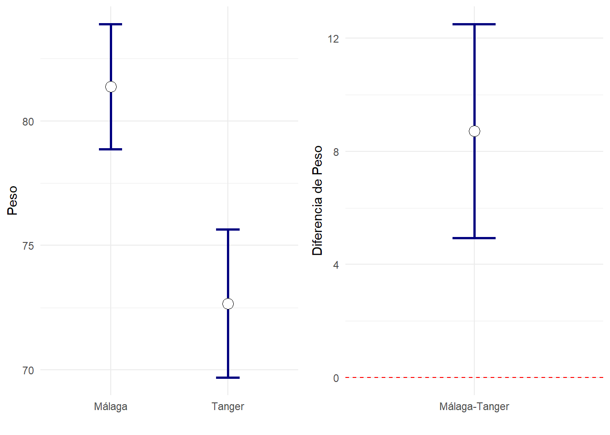
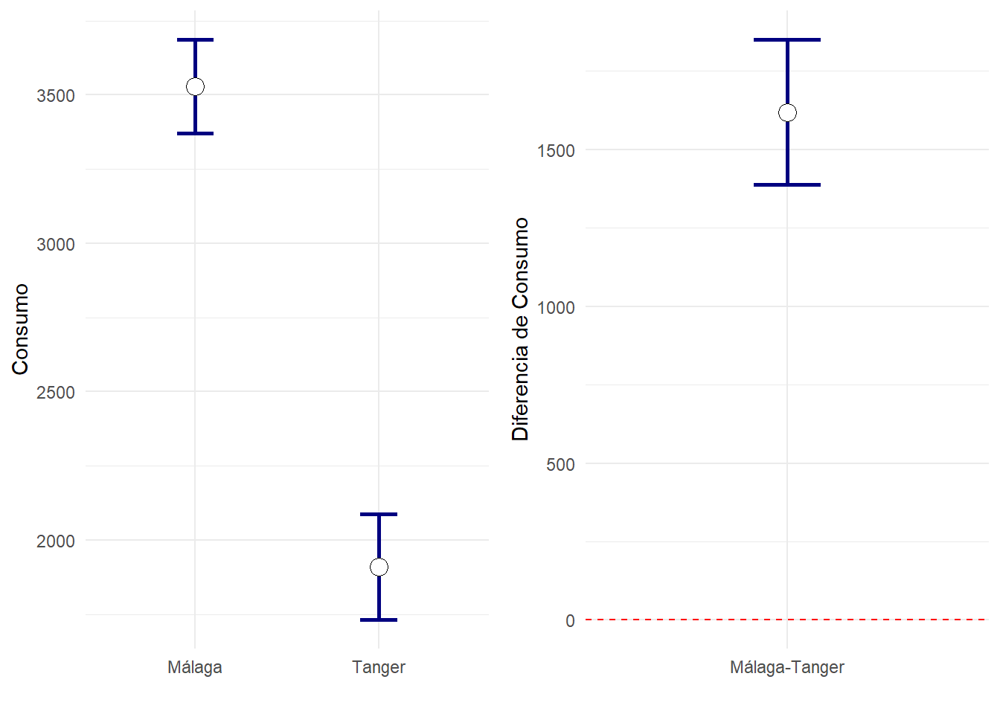
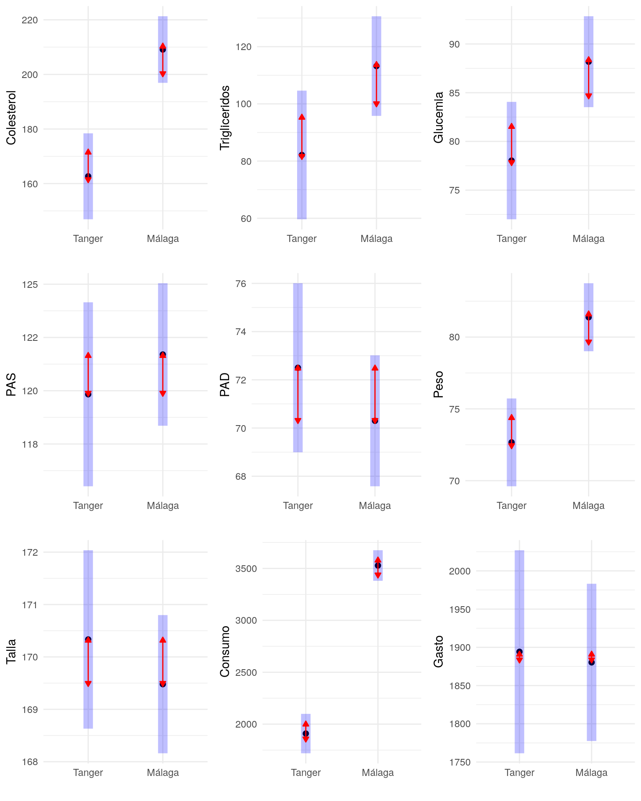

#Diferencias que presenta una variable numérica entre dos grupos
En este capítulo veremos procedimientos para contrastar si las diferencias numéricas obtenidas al comparar dos tratamientos (o dos poblaciones) son lo suficientemente grandes como para que su única causa sea atribuible al azar.

Este tipo de pruebas se suelen usar cuando se elige una muestra de individuos que han seguido cierto tratamiento (por ejemplo, un placebo), y otra muestra que ha recibido otro tratamiento (por ejemplo, un fármaco de pruebas).

Dependiendo de cómo se construyan ambas muestras, clasificamos el experimento en dos clases:

- Muestras apareadas: Cuando en realidad no hay dos grupos de pacientes, si no que solo hay un grupo de ellos, pero de cada individuo se tienen dos medidas. Esto puede ser debido por ejemplo a que se ha medido cada uno en dos oacasiones (antes y después de un tratamiento) o se ha medido al pacientes con dos aparatos que deberían haber dado un resultado similar.


- Muestras independientes: Este es el caso más común, en el que realmente si hay dos grupos diferentes de individuos, cada uno con una medición numérica. Se supone que los individuos de un grupo de tratamiento han sido extraídos independientemente de los del otro.

## Muestras apareadas o relacionadas
Aparecen por ejemplo en los estudios de pacientes “antes y después”, es decir, cuando en un una base de datos de de pacientes tenemos dos columnas de datos numéricos, una correspondientes a los valores antes del tratamiento y otra correspondientes al valor después. En este caso también decimos que _cada individuo es su propio control_.

####Hay otros ejemplos de estudios con apareamiento {-}
Se deben realizar de modo apareados los estudios en que al medir una variable sospechamos de más fuentes de variabilidad además del tratamiento. Por ejemplo, si creemos que el sexo de los individuos puede influir notablemente en la variable que medimos y queremos anular el efecto tenemos varias posibilidades:

-	Hacer un estudio con todos los individuos del mismo sexo en cada muestra, y otro con todos los individuos del otro sexo. A esto se le denomina estratificar por sexos. En este caso lo que tenemos son dos estudios con muestras independientes.

-	Asociar a cada individuo del primer grupo, un individuo “que se parezca” del segundo. Por ejemplo, si pensamos que conjuntamente el sexo y la edad pueden influir en el resultado, podemos hacer que por cada individuo del primer grupo, se elija un individuo del segundo, del mismo sexo y de edad similar. A pesar de las dificultades que comporta hacer un estudio con esas características, habremos reducido la posibilidad de que las variables sexo y edad hayan influido mucho en las diferencias observadas entre tratamientos.


###Hipótesis nula en estudios apareados
En los contrastes con muestras apareadas, la hipótesis nula es que no la distribución de los valores en una y otra medición son similares. Como en todo contraste de hipótesis, se declara que el efecto es estadísticamente significativo si la significación calculada es inferior a cierta cantidad pequeña (5% o 1% típicamente).

Los contrastes se realizan calculando las diferencias existentes entre cada observación de un grupo y la observación asociada en el segundo. Si las mencionadas diferencias tienen una distribución aproximadamente normal o bien la muestra es grande, la prueba que se suele usar es la **t-student para muestras apareadas**. Esta prueba funciona del siguiente modo. Si se dan las condiciones de validez (_las diferencias son normales_), las diferencias deberían ser aproximadamente normales de media cero. Si al calcular la media de las diferencias, el valor obtenido en la muestra no es consistente con una posible media de cero, se rechaza la hipótesis nula. Es decir, si la diferencia entre lo observado y la hipótesis nula no es atribuible al puro azar, aceptamos que hay diferencias entre los grupos.

Una prueba menos exigente es el contraste no paramétrico de Wilcoxon. Este último considera las diferencias entre cada observación y su control. Si la hipótesis nula fuese cierta, las diferencias negativas serían similares en cantidad y tamaño a las diferencias positivas. La prueba de Wilcoxon examina la discrepancia existente entre los resultados observados y la predicción de la hipótesis nula.


### Ejemplo {-}
Se estudia si mejoran unos niños su velocidad de lectura en palabras por minuto. Para ellos se les mide al inicio de un estudio, se les vuelve a medir tras una intervención. Se toma nota de la diferencia entre la velocidad final y la inicial. Puede descargar los datos del experimento en la base de datos [lectura-anova.sav](datos/lectura-anova.sav). La exploración de los primeros casos, ordenados de menor a mayor diferencia nos ofrece:


```r
df=read_sav("datos/lectura-anova.sav", user_na=FALSE) %>% haven::as_factor()
```


```r
df %>% head()  %>% knitr::kable(booktabs=T)
```

<table>
 <thead>
  <tr>
   <th style="text-align:left;"> Grupo </th>
   <th style="text-align:right;"> Antes </th>
   <th style="text-align:right;"> Despues </th>
   <th style="text-align:right;"> Diferencia </th>
   <th style="text-align:right;"> gr1 </th>
   <th style="text-align:right;"> gr2 </th>
  </tr>
 </thead>
<tbody>
  <tr>
   <td style="text-align:left;"> Control </td>
   <td style="text-align:right;"> 9.5 </td>
   <td style="text-align:right;"> 14 </td>
   <td style="text-align:right;"> 4.5 </td>
   <td style="text-align:right;"> 0 </td>
   <td style="text-align:right;"> 0 </td>
  </tr>
  <tr>
   <td style="text-align:left;"> Control </td>
   <td style="text-align:right;"> 8.5 </td>
   <td style="text-align:right;"> 15 </td>
   <td style="text-align:right;"> 6.5 </td>
   <td style="text-align:right;"> 0 </td>
   <td style="text-align:right;"> 0 </td>
  </tr>
  <tr>
   <td style="text-align:left;"> Control </td>
   <td style="text-align:right;"> 14.0 </td>
   <td style="text-align:right;"> 21 </td>
   <td style="text-align:right;"> 6.7 </td>
   <td style="text-align:right;"> 0 </td>
   <td style="text-align:right;"> 0 </td>
  </tr>
  <tr>
   <td style="text-align:left;"> Control </td>
   <td style="text-align:right;"> 8.5 </td>
   <td style="text-align:right;"> 16 </td>
   <td style="text-align:right;"> 7.8 </td>
   <td style="text-align:right;"> 0 </td>
   <td style="text-align:right;"> 0 </td>
  </tr>
  <tr>
   <td style="text-align:left;"> Control </td>
   <td style="text-align:right;"> 7.0 </td>
   <td style="text-align:right;"> 15 </td>
   <td style="text-align:right;"> 8.0 </td>
   <td style="text-align:right;"> 0 </td>
   <td style="text-align:right;"> 0 </td>
  </tr>
  <tr>
   <td style="text-align:left;"> Control </td>
   <td style="text-align:right;"> 7.5 </td>
   <td style="text-align:right;"> 16 </td>
   <td style="text-align:right;"> 8.2 </td>
   <td style="text-align:right;"> 0 </td>
   <td style="text-align:right;"> 0 </td>
  </tr>
</tbody>
</table>

Ya que los datos están ordenados de forma que los peores resultados se muestran primero, y estos han experimentado mejoría, parece que evidentemente vamos a encontrar gran diferencia en contra de la hipótesis nula. Veamos qué distribución presentan las diferencias:


```r
ggplot(df, aes(x=Diferencia))+geom_histogram()+ geom_rug(sides = "b", aes(y = 0), position = "jitter", colour = "blue")+coord_cartesian(xlim=c(0,20))+geom_vline(xintercept = 0,lty=2,col="red")
```



Se ve que todos los individuos han mejorado. la evidencia contra la hipótesis nula la encontramos en esta tabla


```r
df %>% desc1vn(vNum = "Diferencia",columnas = c("mediaet","p.intra","ic1","ic2")) %>%
  mutate(Variable="Diferencia") %>% select(Variable,everything()) %>%
  knitr::kable(booktabs=T,
                col.names=c("Variable","media±et", "p (signif.)", "ic95%(min)", "ic95%(max)"))
```

<table>
 <thead>
  <tr>
   <th style="text-align:left;"> Variable </th>
   <th style="text-align:left;"> media±et </th>
   <th style="text-align:left;"> p (signif.) </th>
   <th style="text-align:right;"> ic95%(min) </th>
   <th style="text-align:right;"> ic95%(max) </th>
  </tr>
 </thead>
<tbody>
  <tr>
   <td style="text-align:left;"> Diferencia </td>
   <td style="text-align:left;"> 12.15±0.39 </td>
   <td style="text-align:left;"> &lt;0.001* </td>
   <td style="text-align:right;"> 11 </td>
   <td style="text-align:right;"> 13 </td>
  </tr>
</tbody>
</table>


```r
ggplot(df, aes(x=Diferencia))+geom_histogram()+ geom_rug(sides = "b", aes(y = 0), position = "jitter", colour = "blue")+coord_cartesian(xlim=c(0,20))+geom_vline(xintercept = 0,lty=2,col="red")
```



La diferencia observada en los niños representa una mejoría de más de 12 palabras por minuto. Sea cual sea la mejoría media si se aplicase en toda la población de niños similares a estos, los datos observados están _en contra de la hipótesis nula_ de no mejoría (p<0.001). Tenemos una confianza del 95% de que sea cual sea la mejoría media, el valor real está en algún lugar entre 11 y 13 palabras por minuto (redondeando).

En SPSS podemos realizar este calculo seleccionando el menú: "_Analizar - Comparar medias - prueba T para muestras apareadas". Allí marcamos el par de variables _Antes y Después_. También podríamos haber elegido el menú"_Analizar - Comparar medias - prueba T para una muestra" y haber trabajado con la variable _Dferencia_. El resultado es el mismo.


## Dos Muestras independientes
Sirven para tratar problemas como el de si el nivel de hierro es similar en los individuos que padecen determinada enfermedad frente a los individuos sanos. Para ello podríamos elegir una muestra de individuos enfermos y otra de sanos, y comparar si los valores de una muestra tienen tendencia a ser mayores que los de la otra.

En los contrastes con muestras independientes, la hipótesis nula es que los valores obtenidos en una y otra muestra son similares, frente a la hipótesis alternativa de que son diferentes. El valor obtenido en la significación nos permite decidir si se rechaza o no la hipótesis nula.

Hay varias maneras de realizar este tipo de contrastes:

-	Prueba t-student para dos medias: Se basa en contrastar si las medias de cada grupo son similares. Este tipo de contrastes es válido cuando se da alguna de las siguientes condiciones:
  -	Las desviaciones típicas/varianzas son similares y las observaciones de cada muestra son normales.
  -	Las desviaciones típicas/varianzas son similares y los tamaños muestrales son grandes.
  -	Hay diferencia notable entre las varianzas de cada grupo, pero los tamaños de cada muestra son similares y además las muestras son grandes o aproximadamente normales. 
  
-	Pruebas no paramétricas para muestras independientes: No requieren ningún tipo de suposición sobre la distribución de las muestras. Esto permite que se puedan usar con variables discretas u ordinales. Pruebas populares son las de **Mann-Whitney**, **Wilcoxon** o la prueba de **Kolmogorov-Smirnov** de dos muestras. 


En el caso de que queramos aplicar la prueba **t-student**, debemos tener en cuenta que esta se ve muy afectada en caso de que las muestras no estén similarmente dispersas, y es necesario hacer una corrección. Debemos comprobar que no existan observaciones anómalas. Disponemos del contraste de Levene para la igualdad de varianzas. De hecho, SPSS lo realiza automáticamente siempre que se desea realizar la prueba t-student, y muestra los resultados para la prueba t-student, tanto en el caso de que el usuario desee admitir la igualdad de varianzas, como rechazarla. Se suele recomendar al usuario elegir un nivel de significación alto para esta prueba (hasta el 15%).


### Ejemplo{-} 
Se cree que la ingesta de calcio reduce la presión sanguínea. Para contrastarlo se decidió elegir a 21 individuos de características similares para participar en un estudio. A 10 de ellos elegidos al azar, se les asignó un tratamiento consistente en un suplemento de calcio durante 3 meses y se observó la diferencia producida en la presión arterial (la que había “antes” menos la que había “después”). A los 11 individuos restantes se les suministró un placebo y se midió también la diferencia. Los datos podemos encontrarlos en la base de datos [calcio.sav]{datos/calcio.sav}, de la que exploramos las primeras líneas:


```r
df=read_sav("datos/calcio.sav", user_na=FALSE) %>% haven::as_factor()
df %>% head()  %>% knitr::kable(booktabs=T)
```

<table>
 <thead>
  <tr>
   <th style="text-align:left;"> Grupo </th>
   <th style="text-align:right;"> Antes </th>
   <th style="text-align:right;"> Despues </th>
   <th style="text-align:right;"> Diferencia </th>
  </tr>
 </thead>
<tbody>
  <tr>
   <td style="text-align:left;"> Placebo </td>
   <td style="text-align:right;"> 110 </td>
   <td style="text-align:right;"> 121 </td>
   <td style="text-align:right;"> -11 </td>
  </tr>
  <tr>
   <td style="text-align:left;"> Calcio </td>
   <td style="text-align:right;"> 111 </td>
   <td style="text-align:right;"> 116 </td>
   <td style="text-align:right;"> -5 </td>
  </tr>
  <tr>
   <td style="text-align:left;"> Placebo </td>
   <td style="text-align:right;"> 114 </td>
   <td style="text-align:right;"> 119 </td>
   <td style="text-align:right;"> -5 </td>
  </tr>
  <tr>
   <td style="text-align:left;"> Calcio </td>
   <td style="text-align:right;"> 110 </td>
   <td style="text-align:right;"> 114 </td>
   <td style="text-align:right;"> -4 </td>
  </tr>
  <tr>
   <td style="text-align:left;"> Calcio </td>
   <td style="text-align:right;"> 112 </td>
   <td style="text-align:right;"> 115 </td>
   <td style="text-align:right;"> -3 </td>
  </tr>
  <tr>
   <td style="text-align:left;"> Placebo </td>
   <td style="text-align:right;"> 102 </td>
   <td style="text-align:right;"> 105 </td>
   <td style="text-align:right;"> -3 </td>
  </tr>
</tbody>
</table>

solo nos interesa la variable _Diferencia_ comprarada entre ambos grupos, pero de todas formas vamos a examinar las mediciones _Antes_. La razón es que al realizar un experimento, repartimos a los individuos en dos grupos, y estamos muy interesados en que los dos grupos sean muy similares en el punto de partida (medición _basal_):


```r
grid.arrange(
ggplot(df,aes(x=Grupo,y=Antes))+geom_boxplot(),
ggplot(df,aes(x=Grupo,y=Diferencia))+geom_boxplot(),
ncol=2)
```


Se aprecia que los dos grupos eran similares al iniciarse el experimento. Sin embargo el grupo de que tomo el Placebo practicamente se quedó igual, y el que tomó _Calcio_ experimentó una mejoría. Nos queda por saber si esta mejoría es explicable por el azar o va más allá (diferencia estadísticamente significativa entre grupos).


```r
df %>% generaTablatTestPorGrupo("Grupo", c("Antes","Diferencia"),
                                columnas = c("n","mediaet","p.t","ci95", "p.w")) %>% 
  knitr::kable( booktabs = T, 
                col.names=c("Variable",
                        "n","media±et", 
                        "n","media±et",
                        "p (parám.)","ic95% dif.", "P (no parám).")) %>%
  add_header_above(c(" " = 1, "Placebo" = 2, "Calcio" = 2, " "=3))
```

<table>
 <thead>
<tr>
<th style="border-bottom:hidden" colspan="1"></th>
<th style="border-bottom:hidden; padding-bottom:0; padding-left:3px;padding-right:3px;text-align: center; " colspan="2"><div style="border-bottom: 1px solid #ddd; padding-bottom: 5px;">Placebo</div></th>
<th style="border-bottom:hidden; padding-bottom:0; padding-left:3px;padding-right:3px;text-align: center; " colspan="2"><div style="border-bottom: 1px solid #ddd; padding-bottom: 5px;">Calcio</div></th>
<th style="border-bottom:hidden" colspan="3"></th>
</tr>
  <tr>
   <th style="text-align:left;"> Variable </th>
   <th style="text-align:right;"> n </th>
   <th style="text-align:left;"> media±et </th>
   <th style="text-align:right;"> n </th>
   <th style="text-align:left;"> media±et </th>
   <th style="text-align:left;"> p (parám.) </th>
   <th style="text-align:left;"> ic95% dif. </th>
   <th style="text-align:left;"> P (no parám). </th>
  </tr>
 </thead>
<tbody>
  <tr>
   <td style="text-align:left;"> Antes </td>
   <td style="text-align:right;"> 11 </td>
   <td style="text-align:left;"> 113.27±2.85 </td>
   <td style="text-align:right;"> 10 </td>
   <td style="text-align:left;"> 114.90±3.61 </td>
   <td style="text-align:left;"> 0.714 </td>
   <td style="text-align:left;"> 1.63[-7.58,10.83] </td>
   <td style="text-align:left;"> 0.944 </td>
  </tr>
  <tr>
   <td style="text-align:left;"> Diferencia </td>
   <td style="text-align:right;"> 11 </td>
   <td style="text-align:left;"> -0.27±1.87 </td>
   <td style="text-align:right;"> 10 </td>
   <td style="text-align:left;"> 5.00±2.91 </td>
   <td style="text-align:left;"> 0.129 </td>
   <td style="text-align:left;"> 5.27[-1.71,12.26] </td>
   <td style="text-align:left;"> 0.323 </td>
  </tr>
</tbody>
</table>

A la vista de los resultados, entre el grupo _Calcio_ y el _Placebo_ no hay diferencias estadísticamente significativas, no solo al inicio del experimento, si no que el cambio producido en los individuos también es compatible con la hipótesis nula de que obtienen resultados similares. Las significaciones obtenidas se han realizado tanto con la prueba paramétrica de la t-student como con una prueba no paramétrica. Ambas obtienen conclusiones similares.

Podemos realizar la prueba paramétrica en SPSS en el menú: "_Analizar - Comparar medias -Prueba t para muestras independientes_". En la variable Grupo hemos de indicar que comparamos los grupos 0 (Placebo), con el grupo 1 (Calcio), pues así es como se han codificado numéricamente las variables. El el campo de _Variables de prueba_ situamos las variables _Antes_ y _Diferencia_.

La prueba no paramétrica está en un diálogo análogo que obtenemos en el menú "_Analizar - Pruebas no paramétricas - Cuadros de dialogo antiguos - 2 muestras independientes"

Una representación gráfica de los intervalos de confianza nos dejan claro que son demasiado amplios como para que las diferencia que se observa entre ambos grupos sea estadísticamente significativa. Ni siquiera queda claro que el Calcio, con un intervalo de confianza tan amplio presente un efecto mayor que cero.


```r
resumen=df %>% gather(Variable,Valor,-Grupo) %>% 
  group_by(Grupo,Variable) %>% 
  summarise(Media=mean(Valor),
                n=length(Valor),
               IC=sd(Valor)/sqrt(n)*qt(0.975,n-1))
ggplot(resumen %>% filter(Variable=="Diferencia"), aes(x=Grupo,y=Media)) +
  geom_errorbar(aes(ymin=Media-IC,ymax=Media+IC),width=0.2, size=1, color="navyblue")+
  geom_point( size=4, shape=21, fill="white")+ylab("Diferencia")+
  geom_hline(yintercept=0,lty=2,color="red")
```




###¿Es lo mismo que la diferencia entre dos grupos sea significativa que el que sus respectivos intervalos de confianza para la media no se toquen? {-}
Parecería que es lo mismo, pero no es así. La realidad es que si hay diferencia significativa entre la media de dos grupos, entonces los intervalos de confianza se tocan nada o _muy poco._ Vamos a ilustrarlo retomando la base de datos [2poblaciones-Mismotrabajo-DiferenteNutricion.sav](datos/2poblaciones-Mismotrabajo-DiferenteNutricion.sav). 


Vamos a usar tanto las pruebas t-student como las no paramétricas para estudiar las diferencias entre los individuos de _Málaga_ y _Tanger_ en todas las variables numéricas.


Normalmente en una publicación científica pondríamos como tabla de resultados algo similar a esto:


```r
vNumericas=names(df) %>% setdiff("Grupo")
df %>% generaTablatTestPorGrupo("Grupo", vNumericas,
                                columnas = c("n","mediaet","p.t","ci95","p.w")) %>% 
  knitr::kable( booktabs = T, 
                col.names=c("Variable",
                        "n","media±et", 
                        "n","media±et",
                        "p dif.","IC95% dif.", "p")) %>%
  add_header_above(c(" " = 1, "Tanger" = 2, "Málaga" = 2,"t-test"=2, "No normal"=1)) %>%
  kable_styling(font_size=12)
```

<table class="table" style="font-size: 12px; margin-left: auto; margin-right: auto;">
 <thead>
<tr>
<th style="border-bottom:hidden" colspan="1"></th>
<th style="border-bottom:hidden; padding-bottom:0; padding-left:3px;padding-right:3px;text-align: center; " colspan="2"><div style="border-bottom: 1px solid #ddd; padding-bottom: 5px;">Tanger</div></th>
<th style="border-bottom:hidden; padding-bottom:0; padding-left:3px;padding-right:3px;text-align: center; " colspan="2"><div style="border-bottom: 1px solid #ddd; padding-bottom: 5px;">Málaga</div></th>
<th style="border-bottom:hidden; padding-bottom:0; padding-left:3px;padding-right:3px;text-align: center; " colspan="2"><div style="border-bottom: 1px solid #ddd; padding-bottom: 5px;">t-test</div></th>
<th style="border-bottom:hidden; padding-bottom:0; padding-left:3px;padding-right:3px;text-align: center; " colspan="1"><div style="border-bottom: 1px solid #ddd; padding-bottom: 5px;">No normal</div></th>
</tr>
  <tr>
   <th style="text-align:left;"> Variable </th>
   <th style="text-align:right;"> n </th>
   <th style="text-align:left;"> media±et </th>
   <th style="text-align:right;"> n </th>
   <th style="text-align:left;"> media±et </th>
   <th style="text-align:left;"> p dif. </th>
   <th style="text-align:left;"> IC95% dif. </th>
   <th style="text-align:left;"> p </th>
  </tr>
 </thead>
<tbody>
  <tr>
   <td style="text-align:left;"> Colesterol </td>
   <td style="text-align:right;"> 30 </td>
   <td style="text-align:left;"> 162.67±8.32 </td>
   <td style="text-align:right;"> 50 </td>
   <td style="text-align:left;"> 209.12±6.06 </td>
   <td style="text-align:left;"> &lt;0.001* </td>
   <td style="text-align:left;"> 46.45[26.15,66.76] </td>
   <td style="text-align:left;"> &lt;0.001* </td>
  </tr>
  <tr>
   <td style="text-align:left;"> Trigliceridos </td>
   <td style="text-align:right;"> 30 </td>
   <td style="text-align:left;"> 82.13±8.39 </td>
   <td style="text-align:right;"> 50 </td>
   <td style="text-align:left;"> 113.22±9.98 </td>
   <td style="text-align:left;"> 0.018* </td>
   <td style="text-align:left;"> 31.09[5.45,56.72] </td>
   <td style="text-align:left;"> 0.018* </td>
  </tr>
  <tr>
   <td style="text-align:left;"> Glucemia </td>
   <td style="text-align:right;"> 30 </td>
   <td style="text-align:left;"> 78.03±2.09 </td>
   <td style="text-align:right;"> 50 </td>
   <td style="text-align:left;"> 88.18±2.72 </td>
   <td style="text-align:left;"> 0.004* </td>
   <td style="text-align:left;"> 10.15[3.40,16.89] </td>
   <td style="text-align:left;"> &lt;0.001* </td>
  </tr>
  <tr>
   <td style="text-align:left;"> PAS </td>
   <td style="text-align:right;"> 30 </td>
   <td style="text-align:left;"> 119.83±1.86 </td>
   <td style="text-align:right;"> 50 </td>
   <td style="text-align:left;"> 121.70±1.83 </td>
   <td style="text-align:left;"> 0.472 </td>
   <td style="text-align:left;"> 1.87[-3.28,7.01] </td>
   <td style="text-align:left;"> 0.596 </td>
  </tr>
  <tr>
   <td style="text-align:left;"> PAD </td>
   <td style="text-align:right;"> 30 </td>
   <td style="text-align:left;"> 72.50±1.80 </td>
   <td style="text-align:right;"> 50 </td>
   <td style="text-align:left;"> 70.30±1.37 </td>
   <td style="text-align:left;"> 0.329 </td>
   <td style="text-align:left;"> -2.20[-6.67,2.27] </td>
   <td style="text-align:left;"> 0.322 </td>
  </tr>
  <tr>
   <td style="text-align:left;"> Peso </td>
   <td style="text-align:right;"> 30 </td>
   <td style="text-align:left;"> 72.67±1.46 </td>
   <td style="text-align:right;"> 50 </td>
   <td style="text-align:left;"> 81.38±1.25 </td>
   <td style="text-align:left;"> &lt;0.001* </td>
   <td style="text-align:left;"> 8.71[4.94,12.49] </td>
   <td style="text-align:left;"> &lt;0.001* </td>
  </tr>
  <tr>
   <td style="text-align:left;"> Talla </td>
   <td style="text-align:right;"> 30 </td>
   <td style="text-align:left;"> 1.70±0.01 </td>
   <td style="text-align:right;"> 50 </td>
   <td style="text-align:left;"> 1.69±0.01 </td>
   <td style="text-align:left;"> 0.431 </td>
   <td style="text-align:left;"> -0.01[-0.03,0.01] </td>
   <td style="text-align:left;"> 0.611 </td>
  </tr>
  <tr>
   <td style="text-align:left;"> Consumo </td>
   <td style="text-align:right;"> 30 </td>
   <td style="text-align:left;"> 1909.17±87.23 </td>
   <td style="text-align:right;"> 50 </td>
   <td style="text-align:left;"> 3528.04±78.71 </td>
   <td style="text-align:left;"> &lt;0.001* </td>
   <td style="text-align:left;"> 1618.87[1387.71,1850.04] </td>
   <td style="text-align:left;"> &lt;0.001* </td>
  </tr>
  <tr>
   <td style="text-align:left;"> Gasto </td>
   <td style="text-align:right;"> 30 </td>
   <td style="text-align:left;"> 1894.20±34.52 </td>
   <td style="text-align:right;"> 50 </td>
   <td style="text-align:left;"> 1880.30±62.59 </td>
   <td style="text-align:left;"> 0.845 </td>
   <td style="text-align:left;"> -13.90[-154.73,126.93] </td>
   <td style="text-align:left;"> 0.972 </td>
  </tr>
</tbody>
</table>
Normalmente no mostraríamos los dos tipos de significación si no que haríamos la elección de usar pruebas paramétricas o no paramétricas según se den las condiciones de validez. Obsérvese que cuando las muestras no son pequeñas y las desviaciones de la normalidad no son grandes, ambos tipos de prueba suelen ofrecer significaciones similares.

Veamos para varias de estas variables como son los ic95% para las medias en cada grupo, y para las diferencias entre ambos grupos. La diferencia entre ambos grupos será significativa cuando el IC)%% para la diferencia no contiene al cero. En ese caso observaremos que los IC95% para cada grupo se tocan _nada o muy poco._


```r
dfResumen=df %>% generaTablatTestPorGrupo("Grupo", vNumericas,
                                columnas = c("ic1","ic2", "ci_min","ci_max")) 

dfResumenTidy = dfResumen %>% select(-ci_min,-ci_max) %>% gather(Clave,Valor,-Variable) %>%
  separate(Clave,c("Concepto","Grupo")) %>% spread(Concepto,Valor)


dfResumen %>% 
  knitr::kable(booktabs=T, 
                col.names=c("Variable",
                        "ic(min)","ic(max)" ,
                        "ic(min)","ic(max)",  
                         "ic.dif.(min)", "ic.dif.(max)")) %>%
  add_header_above(c(" " = 1, "Tanger" = 2, "Málaga" = 2,"Málaga-Tanger"=2))
```

<table>
 <thead>
<tr>
<th style="border-bottom:hidden" colspan="1"></th>
<th style="border-bottom:hidden; padding-bottom:0; padding-left:3px;padding-right:3px;text-align: center; " colspan="2"><div style="border-bottom: 1px solid #ddd; padding-bottom: 5px;">Tanger</div></th>
<th style="border-bottom:hidden; padding-bottom:0; padding-left:3px;padding-right:3px;text-align: center; " colspan="2"><div style="border-bottom: 1px solid #ddd; padding-bottom: 5px;">Málaga</div></th>
<th style="border-bottom:hidden; padding-bottom:0; padding-left:3px;padding-right:3px;text-align: center; " colspan="2"><div style="border-bottom: 1px solid #ddd; padding-bottom: 5px;">Málaga-Tanger</div></th>
</tr>
  <tr>
   <th style="text-align:left;"> Variable </th>
   <th style="text-align:right;"> ic(min) </th>
   <th style="text-align:right;"> ic(max) </th>
   <th style="text-align:right;"> ic(min) </th>
   <th style="text-align:right;"> ic(max) </th>
   <th style="text-align:right;"> ic.dif.(min) </th>
   <th style="text-align:right;"> ic.dif.(max) </th>
  </tr>
 </thead>
<tbody>
  <tr>
   <td style="text-align:left;"> Colesterol </td>
   <td style="text-align:right;"> 145.7 </td>
   <td style="text-align:right;"> 179.7 </td>
   <td style="text-align:right;"> 196.9 </td>
   <td style="text-align:right;"> 221.3 </td>
   <td style="text-align:right;"> 26.15 </td>
   <td style="text-align:right;"> 66.76 </td>
  </tr>
  <tr>
   <td style="text-align:left;"> Trigliceridos </td>
   <td style="text-align:right;"> 65.0 </td>
   <td style="text-align:right;"> 99.3 </td>
   <td style="text-align:right;"> 93.2 </td>
   <td style="text-align:right;"> 133.3 </td>
   <td style="text-align:right;"> 5.45 </td>
   <td style="text-align:right;"> 56.72 </td>
  </tr>
  <tr>
   <td style="text-align:left;"> Glucemia </td>
   <td style="text-align:right;"> 73.8 </td>
   <td style="text-align:right;"> 82.3 </td>
   <td style="text-align:right;"> 82.7 </td>
   <td style="text-align:right;"> 93.6 </td>
   <td style="text-align:right;"> 3.40 </td>
   <td style="text-align:right;"> 16.89 </td>
  </tr>
  <tr>
   <td style="text-align:left;"> PAS </td>
   <td style="text-align:right;"> 116.0 </td>
   <td style="text-align:right;"> 123.7 </td>
   <td style="text-align:right;"> 118.0 </td>
   <td style="text-align:right;"> 125.4 </td>
   <td style="text-align:right;"> -3.28 </td>
   <td style="text-align:right;"> 7.01 </td>
  </tr>
  <tr>
   <td style="text-align:left;"> PAD </td>
   <td style="text-align:right;"> 68.8 </td>
   <td style="text-align:right;"> 76.2 </td>
   <td style="text-align:right;"> 67.5 </td>
   <td style="text-align:right;"> 73.1 </td>
   <td style="text-align:right;"> -6.67 </td>
   <td style="text-align:right;"> 2.27 </td>
  </tr>
  <tr>
   <td style="text-align:left;"> Peso </td>
   <td style="text-align:right;"> 69.7 </td>
   <td style="text-align:right;"> 75.7 </td>
   <td style="text-align:right;"> 78.9 </td>
   <td style="text-align:right;"> 83.9 </td>
   <td style="text-align:right;"> 4.94 </td>
   <td style="text-align:right;"> 12.49 </td>
  </tr>
  <tr>
   <td style="text-align:left;"> Talla </td>
   <td style="text-align:right;"> 1.7 </td>
   <td style="text-align:right;"> 1.7 </td>
   <td style="text-align:right;"> 1.7 </td>
   <td style="text-align:right;"> 1.7 </td>
   <td style="text-align:right;"> -0.03 </td>
   <td style="text-align:right;"> 0.01 </td>
  </tr>
  <tr>
   <td style="text-align:left;"> Consumo </td>
   <td style="text-align:right;"> 1730.8 </td>
   <td style="text-align:right;"> 2087.6 </td>
   <td style="text-align:right;"> 3369.9 </td>
   <td style="text-align:right;"> 3686.2 </td>
   <td style="text-align:right;"> 1387.71 </td>
   <td style="text-align:right;"> 1850.04 </td>
  </tr>
  <tr>
   <td style="text-align:left;"> Gasto </td>
   <td style="text-align:right;"> 1823.6 </td>
   <td style="text-align:right;"> 1964.8 </td>
   <td style="text-align:right;"> 1754.5 </td>
   <td style="text-align:right;"> 2006.1 </td>
   <td style="text-align:right;"> -154.73 </td>
   <td style="text-align:right;"> 126.93 </td>
  </tr>
</tbody>
</table>

Para el colesterol se ve que el IC95% para la diferencia no contiene al valor cero, es decir, tenemos evidencia estadísticamente significativa en contra de que las medias en ambos grupos sean iguales. Por otro lado, vemos que los IC95% para las medias de colesterol en ambos grupos no se cruzan. Hasta ahora todo coincide con la intuición.


```r
laVariable="Colesterol"
grid.arrange(
ggplot(dfResumenTidy %>% filter (Variable==laVariable), aes(x=Grupo, y=(ic1+ic2)/2)) +
  geom_errorbar(aes(ymin=ic1,ymax=ic2),width=0.2, size=1, color="navyblue")+
  geom_point( size=4, shape=21, fill="white")+ylab(laVariable)+xlab(""),
ggplot(dfResumen %>% filter (Variable==laVariable), aes(x="Málaga-Tanger", y=(ci_max+ci_min)/2)) +
  geom_errorbar(aes(ymin=ci_min,ymax=ci_max),width=0.2, size=1, color="navyblue")+
  geom_point( size=4, shape=21, fill="white")+ylab(str_c("Diferencia de ", laVariable)) +
  xlab("")+geom_hline(yintercept=0,lty=2,color="red"),
ncol=2)
```



En cuanto a la siguiente variable, _Triglicéridos_ y _Glucemia_ nos encontramos la sorpresa: observamos que el IC95% para la diferencia de medias no contiene (por poco) al cero, es decir, la diferencia de medias es apenas significativamente diferente de cero, sin embargo los intervalos de confianza dentro de cada grupo se cruzan (por poco).




Estudie lo que ocurre en el resto de variables y compruebe si gráficamente es cierto lo de que:

> Cuando la diferencia entre dos grupos es estadísticamente significativa, los IC95% de cada grupo se tocan _nada o muy poc.o_










En las publicaciones suele verse un tipo de gráfico u otro: El que muestra los intervalos de confianza en cada grupo, o el que sirve para estudiar las diferencias entre dos grupos. Existe una tercera posibilidad, no muy utilizada, usando la libreria _emmeans_ de R, donde además de observarse los intervalos de confianza para la media en cada grupo, una flecha interior indica cuando las comparaciones entre dos grupos son significativas: OCurre justo cuando no tienen intersección común. Este tipo de gráficos será muy útil cuando haya muchas comparaciones a realizar entre grupos (pruebas _ANOVA_).


```r
listaGraficos=vNumericas %>% map( ~ lm(formula(str_c(.," ~ Grupo")),data=df) %>%
              emmeans("Grupo") %>% plot(comparisons=TRUE)+xlab(.x)+ylab("")+coord_flip())
do.call("grid.arrange", c(listaGraficos, ncol=3))
```




