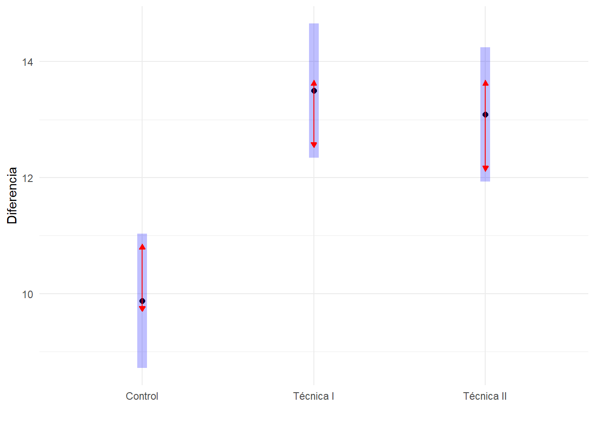
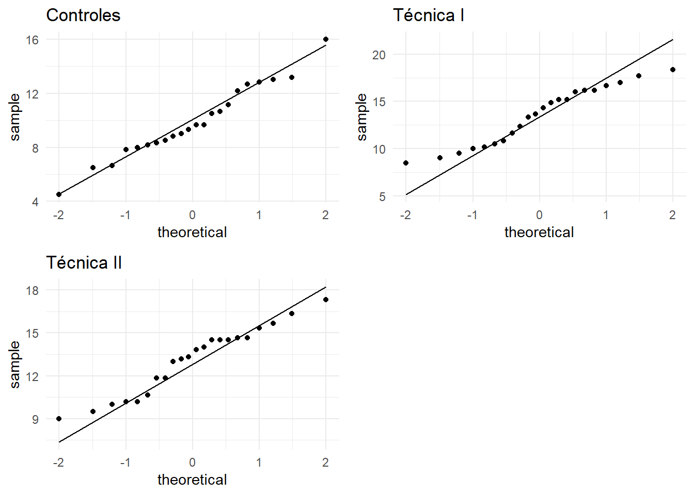
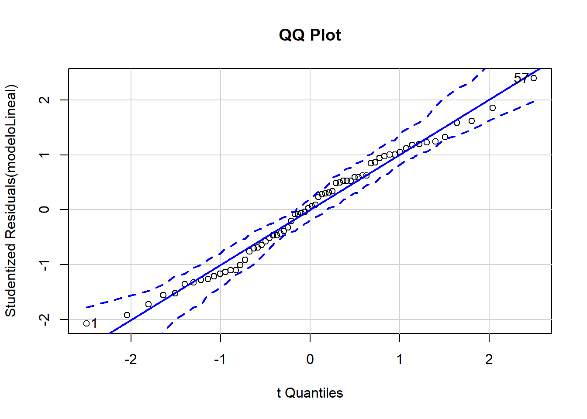
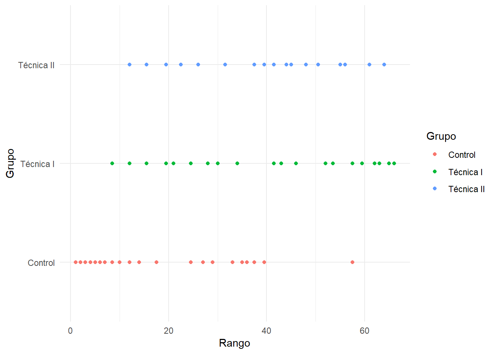

#Diferencias que presenta una variable numérica entre varios grupos

En este capítulo vamos a generalizar las ideas del anterior, donde comparábamos las diferencias observadas en una variable en dos grupos, al caso de más grupos. De hecho, si aplicamos algunas de las técnicas que aquí veremos a sólo dos grupos, darían los mismos resultados que técnicas tratadas con anterioridad.

Como ilustración del tipo de problemas que podemos tratar, está el de comparar los resultados de 4 tratamientos. Uno podría ser un placebo aplicado a un grupo de control, y los otros tres podrían corresponder a sendas dosis de un medicamento. La variable respuesta sería una variable numérica.

Al igual que en el capítulo anterior consideraremos dos tipos de técnicas:

- Paramétricas: Cuando suponemos que las distribución de los datos de cada muestra tienen cierta distribución particular. La técnica que mostraremos se denomina ANOVA de una vía.

- No paramétricas: No es necesario suponer nada sobre la distribución de los datos. Interpretaremos la prueba de Kruskal-Wallis, que puede extenderse a variables ordinales.

Sea cual sea el contraste que utilicemos, la **hipótesis nula** traducirá la idea de que *en los diferentes grupos se obtienen resultados similares (“no efecto”)*, y la *hipótesis alternativa* lo negará. La significación del contraste nos dará una idea de si las diferencias observadas en los diferentes grupos son imputables al azar (significación grande) o hay una diferencia intrínseca entre algunos grupos (significación pequeña).

## Anova de un factor o una vía

Para usar el modelo ANOVA  debe poder suponerse que son válidas una serie de condiciones:

-	La variabilidad de todas las muestras debe ser similar. Ésta es la condición más importante. 

-	Las muestras deben tener una distribución aproximadamente normal. Cierto alejamiento de esta hipótesis no es muy problemático. 

-	Los tamaños de las muestras no deben ser muy dispares. Esta condición en realidad no es estrictamente necesaria, y además es controlable al realizar un experimento. Pero, si se sospecha una cierta heterogeneidad en la variabilidad en los diferentes grupos (como es razonable esperar en la práctica), el tener grupos desequilibrados en tamaño sólo puede empeorar las cosas. Esta condición simplifica el poder interpretar los resultados.

Si se dan las dos primeras condiciones, el modelo ANOVA contrasta la hipótesis nula de que en todos los grupos se obtienen valores similares de las variables por una condición equivalente: Que las medias (como parámetros) en los diferentes grupos son iguales. 

### En qué se basa el contraste ANOVA

Si suponemos que la hipótesis nula de la igualdad de medias en los diferentes grupos es cierta, podríamos decir que todas las observaciones pueden considerarse que provienen de un único grupo cuya media y variabilidad es la misma que la de cualquiera de los grupos por separado. Por tanto observamos que hay diferentes maneras de estimar la variabilidad en la población. De las discrepancias entre diferentes estimaciones de la variabilidad surge toda una familia de técnicas conocidas como análisis de la varianza, de las cuales el ANOVA de una vía no es más que el representante más simple.

La cuestión es que si alguno de los grupos presenta unos valores que en media se alejan del resto, esto se apreciará en el contraste como una fuente extra de variabilidad no explicable por el azar. La significación del contraste se calcula evaluando si esta variabilidad extra es muy grande con respecto una variabilidad que sería de esperar si la hipótesis nula fuese cierta. Es por ello, que al realizar un contraste ANOVA siempre veremos varias fuentes de variabilidad. Los detalles son engorrosos, y en esta explicación resumida de la técnica nos limitaremos a tomar la decisión de rechazar o aceptar la hipótesis nula en función de la significación del contraste (que es fácilmente identificable).

Suele llevar a confusión el nombre, pues hace pensar que estamos contrastando igualdad de varianzas, pero en realidad esto es algo que se supone. Lo que contrastamos es la igualdad de medias.

### Cómo se interpreta ANOVA

Si al realizar la prueba ANOVA se obtiene una significación baja (por ejemplo **p< 0.05**) rechazaremos la hipótesis de que en todos los grupos las medias son iguales. La siguiente cuestión que aparece de modo natural en esta situación es la de identificar en qué grupos se han producido las diferencias. Básicamente tenemos las siguientes aproximaciones para abordar la cuestión:

-	Cuando no tenemos una idea previa de en qué grupos eran de esperar las mayores diferencias, utilizamos los contrastes no planeados o contrastes post-hoc. 

-	Antes de recoger datos es posible que tengamos algunas sospechas de dónde se deberían producir las diferencias. A esto se le denomina comparaciones planeadas. En SPSS lo encontramos pulsando el botón “contrastes” en la ventana para realizar el contraste ANOVA.

#### Contrastes no planeados o post-hoc

Bajo ese nombre encontramos múltiples técnicas. Éstas se consideran bastante conservadoras, en el sentido de que intentan reducir la posibilidad de errores de tipo I, a costa de aumentar la posibilidad de errores de tipo II. Dicho de otro modo, es probable que en situaciones donde realmente haya diferencias entre grupos, las pruebas post-hoc no lo detecten. Tienen que ser las diferencias entre grupos realmente grandes para poder ser reconocidas por estas pruebas.

Como hemos mencionado, dentro de la categoría de contrastes no planeados, hay muchas técnicas disponibles. Debe ser por algo. A continuación presentamos unas indicaciones que nos pueden ayudar a decidir cuál se adecua mejor a un estudio si estamos usando SPSS. Sólo indicaremos las más populares.

Una primera división entre estas pruebas es:

-	Tests de rangos: Son aquellas que buscan identificar grupos homogéneos (medias parecidas).

-	 Comparaciones múltiples: Buscan establecer diferencias entre grupos basándose en diferencias dos a dos.

Esta división no es estricta pues hay técnicas que se pueden incluir en esas dos categorías a la vez.


-	Grupos equilibrados y varianzas similares: Cuando todos los grupos tienen el mismo número de individuos, y podemos asumir que están igualmente dispersos.
o	Diferencia Honestamente Significativa de Tukey (HSD de Tukey). Se puede considerar a la vez como una técnica de comparaciones múltiples y a la vez de rangos. Es un test que se suele utilizar cuando se quiere comparar cada grupo con todos los demás y el número de grupos es alto (6 o más). Es una prueba conservadora (mantiene bajo el error de tipo I, sacrificando la capacidad de detectar diferencias existentes).
o	Test de Scheffé: Hace todas las comparaciones posibles. Por ejemplo, el primer grupo con respecto a cada uno de los restantes, pero también el primero con respecto al grupo formado por la unión de dos de los restantes, etc. Si sólo se desea comparar grupos dos a dos es preferible la prueba HSD de Tukey, pero si las comparaciones que buscamos son más complejas, preferimos esta prueba.

-	Grupos desequilibrados: Cuando tenemos un número diferente de individuos en cada grupo puede interesarnos elegir alguna de las siguientes pruebas:
  + LSD de Fisher (sólo si hay 3 grupos),
  +	T3 de Dunnett,
  +	C de Dunnett,
  +	Scheffé,
  + Games-Howell.

-	Varianzas desiguales: Cuando la prueba de igualdad de varianzas (por ejemplo Levene) nos hace sospechar que las varianzas no son similares en todos los grupos, podemos considerar alguna de estas pruebas:
  +	T2 de Tamhane
  + T3 de Dunnett,
  + C de Dunnett,
  + Scheffé,
  + Games-Howell.

#### Comparaciones planeadas

Son las que deberíamos hacer cuando honestamente tenemos una sospecha sobre el posible resultado del análisis, es decir entre qué grupos esperamos encontrar diferencias, y estas sospechas han sido formuladas con anterioridad a la recogida de datos.

Esto ocurre por ejemplo cuando a un grupo de control se le aplica un placebo, al segundo cierta cantidad de un medicamento experimental, y al tercero una cantidad mayor, pero que no esperamos en principio que mejore en mucho los resultados del segundo grupo. Posiblemente sospechemos que el grupo control va a obtener resultados muy diferentes al segundo y al tercero. No pensamos encontrar diferencias entre el segundo y el tercero. Este es el tipo de cuestiones que podemos resolver con las comparaciones planeadas.
Estas pruebas se realizan de la siguiente manera usando SPSS:

-	En la ventana donde se realiza el contraste ANOVA (“Analizar – Comparar medias – ANOVA de un factor…”) pulsamos en el botón etiquetado “contrastes”. Allí marcamos la casilla “polinómicos”.

-	Tomamos nota de un grupo (o más si pensamos que pueden ofrecer resultados parecidos) para compararlos con otro grupo (o más) que pensamos que ofrecerán resultados diferentes.

-	A cada uno de los primeros les asociamos unos coeficientes positivos que reflejen la importancia de ese grupo, y a los grupos con los que queremos contrastarlos les asociamos unos coeficientes negativos. Esto se hace de modo que al sumarlos todos los coeficientes obtengamos un total de cero.

-	Pulsando en “siguiente” podemos ir añadiendo todas las hipótesis que queramos.

Por ejemplo si pensamos que el primer grupo es diferente del segundo y el tercero, podemos asociarle al primer grupo un coeficiente 1 y  -0.5 a cada uno de los otros dos; Así indicamos que queremos contrastar el primer grupo frente al conjunto formado por los dos restantes.

### ¿Qué hacer si no se verifican las premisas del modelo ANOVA?
Hemos mencionado que para que el contraste ANOVA sea válido es necesario que podamos suponer una serie de propiedades sobre la distribución de la variable en los diferentes grupos.

La más importante es la de igualdad de las varianzas. Para ello podemos prestar atención al resultado de la prueba de Levene. Dado lo sensible que es el contraste ANOVA a la falta de este requisito, se acostumbra a rechazar la igualdad de varianzas con un nivel de significación superior al habitual (el 0.15=15% por ejemplo). En caso de que no se pueda admitir la igualdad de varianzas podemos usar las pruebas de Welch o de Brown-Forsythe para decidir sobre la igualdad de medias. En SPSS estas últimas, junto a la prueba de Levene, las encontramos al pulsar el botón “opciones…” que aparece en la misma ventana en la que se hace la prueba ANOVA.

Otra condición que necesitamos para la validez de la prueba ANOVA es la de la normalidad en cada uno de los grupos, aunque indicábamos que esta condición no es tán crítica como la de  la igualdad de varianzas. Si la variable que medimos es un parámetro biológico, con frecuencia tiene sentido hacer un cambio de variable logarítmico, que habitualmente normaliza las observaciones e iguala varianzas.

###Ejemplo paramétrico{-}

Se realizó un experimento para comparar tres métodos de aprendizaje de lectura. Se asignó aleatoriamente los estudiantes a cada uno de los tres métodos. Cada método fue probado con 22 estudiantes (experimento equilibrado). Se evaluó mediante diferentes pruebas la capacidad de comprensión de los estudiantes, antes y después de recibir la instrucción. Los resultados se recogen en la base de datos [lectura-anova.sav](datos/lectura-anova.sav), de la que exploramos las primeras líneas:

```r
df=read_sav("datos/lectura-anova.sav", user_na=FALSE) %>% haven::as_factor() 
```


```r
df %>% head()  %>% knitr::kable(booktabs=T)
```

<table>
 <thead>
  <tr>
   <th style="text-align:left;"> Grupo </th>
   <th style="text-align:right;"> Antes </th>
   <th style="text-align:right;"> Despues </th>
   <th style="text-align:right;"> Diferencia </th>
   <th style="text-align:right;"> gr1 </th>
   <th style="text-align:right;"> gr2 </th>
  </tr>
 </thead>
<tbody>
  <tr>
   <td style="text-align:left;"> Control </td>
   <td style="text-align:right;"> 10.0 </td>
   <td style="text-align:right;"> 19 </td>
   <td style="text-align:right;"> 9.3 </td>
   <td style="text-align:right;"> 0 </td>
   <td style="text-align:right;"> 0 </td>
  </tr>
  <tr>
   <td style="text-align:left;"> Control </td>
   <td style="text-align:right;"> 7.0 </td>
   <td style="text-align:right;"> 20 </td>
   <td style="text-align:right;"> 13.0 </td>
   <td style="text-align:right;"> 0 </td>
   <td style="text-align:right;"> 0 </td>
  </tr>
  <tr>
   <td style="text-align:left;"> Técnica I </td>
   <td style="text-align:right;"> 6.5 </td>
   <td style="text-align:right;"> 23 </td>
   <td style="text-align:right;"> 16.2 </td>
   <td style="text-align:right;"> 1 </td>
   <td style="text-align:right;"> 0 </td>
  </tr>
  <tr>
   <td style="text-align:left;"> Técnica I </td>
   <td style="text-align:right;"> 9.5 </td>
   <td style="text-align:right;"> 19 </td>
   <td style="text-align:right;"> 9.5 </td>
   <td style="text-align:right;"> 1 </td>
   <td style="text-align:right;"> 0 </td>
  </tr>
  <tr>
   <td style="text-align:left;"> Control </td>
   <td style="text-align:right;"> 7.5 </td>
   <td style="text-align:right;"> 16 </td>
   <td style="text-align:right;"> 8.5 </td>
   <td style="text-align:right;"> 0 </td>
   <td style="text-align:right;"> 0 </td>
  </tr>
  <tr>
   <td style="text-align:left;"> Técnica II </td>
   <td style="text-align:right;"> 7.5 </td>
   <td style="text-align:right;"> 17 </td>
   <td style="text-align:right;"> 9.5 </td>
   <td style="text-align:right;"> 0 </td>
   <td style="text-align:right;"> 1 </td>
  </tr>
</tbody>
</table>


Queremos contrastar la hipótesis nula de que las tres técnicas ofrecen resultados medios similares, frente a la hipótesis alternativa de que esto no es así. Para ello podríamos considerar el resultado obtenido “después”. Pero esto estaría sin duda influido por la habilidad previa de cada estudiante. Para eliminar esta fuente de variabilidad podríamos considerar a cada estudiante como su propio control, y considerar una nueva variable que sería la diferencia entre “después” y “antes”. Ahora la hipótesis nula es que la variable “diferencia”, posee medias similares, frente a la hipótesis alternativa de que esto es falso. Un análisis descriptivo exploratorio muestra que aparentemente el grupo control tiene resultados peores que los que siguieron la técnica I y II. 


La siguiente tabla muestra los resultados de la prueba ANOVA para las 3 variables, en morma de media y error estándar, así como las comparaciones paramétricas (ANOVA) y no paramétricas (Kruskal-Wallis, que veremos posteriormente):

```r
generaTablaANOVA1F(df,"Grupo",c("Antes","Despues","Diferencia"),columnas = c("mediaet","p.F","p.kw"))  %>%
  knitr::kable( booktabs = T, 
                col.names=c("Variable",
                         "Control", 
                        "Técnica I",
                        "Técnica II",
                        "p (parám.)", "P (no parám)."))
```

<table>
 <thead>
  <tr>
   <th style="text-align:left;"> Variable </th>
   <th style="text-align:left;"> Control </th>
   <th style="text-align:left;"> Técnica I </th>
   <th style="text-align:left;"> Técnica II </th>
   <th style="text-align:left;"> p (parám.) </th>
   <th style="text-align:left;"> P (no parám). </th>
  </tr>
 </thead>
<tbody>
  <tr>
   <td style="text-align:left;"> Antes </td>
   <td style="text-align:left;"> 7.89±0.51 </td>
   <td style="text-align:left;"> 7.41±0.44 </td>
   <td style="text-align:left;"> 7.05±0.45 </td>
   <td style="text-align:left;"> 0.436 </td>
   <td style="text-align:left;"> 0.440 </td>
  </tr>
  <tr>
   <td style="text-align:left;"> Despues </td>
   <td style="text-align:left;"> 17.76±0.56 </td>
   <td style="text-align:left;"> 20.91±0.63 </td>
   <td style="text-align:left;"> 20.14±0.63 </td>
   <td style="text-align:left;"> 0.001* </td>
   <td style="text-align:left;"> 0.002* </td>
  </tr>
  <tr>
   <td style="text-align:left;"> Diferencia </td>
   <td style="text-align:left;"> 9.87±0.58 </td>
   <td style="text-align:left;"> 13.50±0.67 </td>
   <td style="text-align:left;"> 13.09±0.52 </td>
   <td style="text-align:left;"> &lt;0.001* </td>
   <td style="text-align:left;"> &lt;0.001* </td>
  </tr>
</tbody>
</table>


Las puntuaciones antes de recibir la enseñanza eran de media muy similares. La prueba ANOVA con dichas puntuaciones no mostró diferencia estadísticamente significativa (p=0.45) como sería de esperar en una asignación aleatoria al grupo. Al observar la variable *Después*, La prueba ANOVA sí resulta significativa, es decir, los 3 grupos no presentan el mismo cambio medio.

El análisis posthoc lo podemos hacer con la prueba *HSD (Diferencia Honestamente Significativa) de Tukey*,

```r
modeloLineal <- lm(Diferencia ~ Grupo,data=df)
modeloLineal %>% aov() %>% TukeyHSD() %>% .[["Grupo"]] %>% knitr::kable()
```

<table>
 <thead>
  <tr>
   <th style="text-align:left;">   </th>
   <th style="text-align:right;"> diff </th>
   <th style="text-align:right;"> lwr </th>
   <th style="text-align:right;"> upr </th>
   <th style="text-align:right;"> p adj </th>
  </tr>
 </thead>
<tbody>
  <tr>
   <td style="text-align:left;"> Técnica I-Control </td>
   <td style="text-align:right;"> 3.63 </td>
   <td style="text-align:right;"> 1.7 </td>
   <td style="text-align:right;"> 5.6 </td>
   <td style="text-align:right;"> 0.00 </td>
  </tr>
  <tr>
   <td style="text-align:left;"> Técnica II-Control </td>
   <td style="text-align:right;"> 3.22 </td>
   <td style="text-align:right;"> 1.2 </td>
   <td style="text-align:right;"> 5.2 </td>
   <td style="text-align:right;"> 0.00 </td>
  </tr>
  <tr>
   <td style="text-align:left;"> Técnica II-Técnica I </td>
   <td style="text-align:right;"> -0.41 </td>
   <td style="text-align:right;"> -2.4 </td>
   <td style="text-align:right;"> 1.6 </td>
   <td style="text-align:right;"> 0.87 </td>
  </tr>
</tbody>
</table>

Donde vemos para cada par de variables, la diferencia entre las medias, un intervalo de confianza (con extremos inferior y superior para la diferencia de medias), y la significación de la diferencia. En él vemos que el grupo de Control presenta diferencias significativas con respecto a los demás grupos, que no presentan diferencias significativas entre sí. 

Observe que en todos los intervalos de confianza donde se ha obtenido diferencias estadísticamente significativas para parejas de grupos, se obtienen intervalos de confianza que no contienen el valor cero para la diferencia de medias. Esto es otra manera de leer un contraste de hipótesis que permite obtener una interpretación clínica de los resultados de un experimento más interesante que la más abstracta significación.


El análisis post-hoc viene reflejado en el siguiente gráfico en el que se usa la prueba HSD para contrastar las diferencias entre pares de grupos, usando una flecha roja dentro del intervalo de confianza en cada grupo. Si las líneas rojas se superponen, la diferencia no es significativa.

```r
modeloLineal %>% emmeans("Grupo") %>% 
                plot(comparisons=TRUE)+xlab("Diferencia")+ylab("")+coord_flip()
```



En cuanto a las condiciones de validez de la prueba ANOVA, veamos como podemos explorarlo:

 - **Normalidad:** Podemos estudiar la normalidad en cada una de los grupos:

```r
grid.arrange(
ggplot(df %>% filter(Grupo=="Control"),aes(sample=Diferencia))+stat_qq() + stat_qq_line()+ggtitle("Controles"),
ggplot(df %>% filter(Grupo=="Técnica I"),aes(sample=Diferencia))+stat_qq() + stat_qq_line()+ggtitle("Técnica I"),
ggplot(df %>% filter(Grupo=="Técnica II"),aes(sample=Diferencia))+stat_qq() + stat_qq_line()+ggtitle("Técnica II"),
ncol=2)
```



Al estudiar muchos gráficos a la vez, es posible que en algunos encontremos desviaciones de la normalidad que nos hagan dudar. Es normal por la abundancia de comparaciones múltiples. Es más conveniente es tratar a todos los datos juntos estudiando todos los residuos del ajuste ANOVA (desviación de cada dato con respecto a la media de su propio grupo), en un solo gráfico QQ:


```r
qqPlot(modeloLineal, main="QQ Plot") 
```



```
## [1] 12 65
```
No se aprecia una notable desviación de la normalidad.


 - En cuanto a la **homogeneidad de varianzas (heterocedasticidad)**, podemos usar la prueba de Levene:

```r
leveneTest(modeloLineal)
```

```
## Levene's Test for Homogeneity of Variance (center = median)
##       Df F value Pr(>F)
## group  2    1.27   0.29
##       63
```
Al haber obtenido *p bastante grande* para la prueba de homogeneidad de varianzas, podemos asumir que las tres muestras presentan similar dispersión.

Como se aprecia es algo pesado ir comprobando todas las cuestiones de validez una a una. La librería de R **gvlma** hace una buena cantidad de comprobaciones de una forma muy simple:
  

```r
(modeloLineal %>% gvlma() %>% summary()) %>% knitr::kable(booktabs=T)
```

```
## 
## Call:
## lm(formula = Diferencia ~ Grupo, data = df)
## 
## Residuals:
##    Min     1Q Median     3Q    Max 
## -5.371 -1.996  0.121  2.098  6.129 
## 
## Coefficients:
##                 Estimate Std. Error t value Pr(>|t|)    
## (Intercept)        9.871      0.579   17.04  < 2e-16 ***
## GrupoTécnica I     3.629      0.819    4.43  3.8e-05 ***
## GrupoTécnica II    3.220      0.819    3.93  0.00021 ***
## ---
## Signif. codes:  0 '***' 0.001 '**' 0.01 '*' 0.05 '.' 0.1 ' ' 1
## 
## Residual standard error: 2.7 on 63 degrees of freedom
## Multiple R-squared:  0.272,	Adjusted R-squared:  0.249 
## F-statistic: 11.8 on 2 and 63 DF,  p-value: 4.54e-05
## 
## 
## ASSESSMENT OF THE LINEAR MODEL ASSUMPTIONS
## USING THE GLOBAL TEST ON 4 DEGREES-OF-FREEDOM:
## Level of Significance =  0.05 
## 
## Call:
##  gvlma(x = .) 
## 
##                       Value p-value                Decision
## Global Stat        1.89e+00   0.756 Assumptions acceptable.
## Skewness           1.11e-02   0.916 Assumptions acceptable.
## Kurtosis           1.87e+00   0.171 Assumptions acceptable.
## Link Function      3.13e-15   1.000 Assumptions acceptable.
## Heteroscedasticity 6.81e-03   0.934 Assumptions acceptable.
```

<table>
 <thead>
  <tr>
   <th style="text-align:left;">   </th>
   <th style="text-align:right;"> Value </th>
   <th style="text-align:right;"> p-value </th>
   <th style="text-align:left;"> Decision </th>
  </tr>
 </thead>
<tbody>
  <tr>
   <td style="text-align:left;"> Global Stat </td>
   <td style="text-align:right;"> 1.89 </td>
   <td style="text-align:right;"> 0.76 </td>
   <td style="text-align:left;"> Assumptions acceptable. </td>
  </tr>
  <tr>
   <td style="text-align:left;"> Skewness </td>
   <td style="text-align:right;"> 0.01 </td>
   <td style="text-align:right;"> 0.92 </td>
   <td style="text-align:left;"> Assumptions acceptable. </td>
  </tr>
  <tr>
   <td style="text-align:left;"> Kurtosis </td>
   <td style="text-align:right;"> 1.87 </td>
   <td style="text-align:right;"> 0.17 </td>
   <td style="text-align:left;"> Assumptions acceptable. </td>
  </tr>
  <tr>
   <td style="text-align:left;"> Link Function </td>
   <td style="text-align:right;"> 0.00 </td>
   <td style="text-align:right;"> 1.00 </td>
   <td style="text-align:left;"> Assumptions acceptable. </td>
  </tr>
  <tr>
   <td style="text-align:left;"> Heteroscedasticity </td>
   <td style="text-align:right;"> 0.01 </td>
   <td style="text-align:right;"> 0.93 </td>
   <td style="text-align:left;"> Assumptions acceptable. </td>
  </tr>
</tbody>
</table>

 
Para hacer algo similar en SPSS tenemos el menú: * Analizar -Comparar medias - ANOVA de un factor*. Las variables dependientes son *Antes* y *Diferencia*. El factor es *Grupo*. En pruebas posthoc, podemos seleccionar *Tukey*. En el botón *Opciones*, podemos marcar la prueba de *homogeneidad de varianzas*. La normalidad en cada muestra puede ser comprobada como hicimos en ocasiones anteriores en el menú, *Analizar - Estadísticos descriptivos - Explorar*, eligiendo como gráfico el histograma y añadiéndole las *pruebas de normalidad*.


## Contraste no paramétrico de Kruskal-Wallis
Si tenemos dudas sobre la validez de las condiciones del ANOVA, o incluso si la variable respuesta es ordinal, la prueba no paramétrica de Kruskal-Wallis contrasta unas hipótesis análogas a la prueba ANOVA de un factor. No requiere condiciones de validez especiales.

El contraste de Kruskal-Wallis no contrasta que las medias sean iguales, sino simplemente si los valores obtenidos en los diferentes grupos son similares. Esto lo realiza de un modo sorprendentemente simple. Se ordenan todas las observaciones, de menor a mayor de todos los grupos. Si al ordenarse de esta manera se da la circunstancia de que muchas de las observaciones más pequeñas (o más grandes) pertenecen a un grupo sería una indicación de que los grupos no presentan valores similares. Es decir, si al ordenar las observaciones de menor a mayor, aparecen muy poco “mezcladas”, se rechaza la hipótesis nula. Como demostración, vamos a hacerlo en el caso del ejemplo anterior:

```r
df %>% arrange(Diferencia) %>% .[["Grupo"]] %>% as.character()
```

```
##  [1] "Control"    "Control"    "Control"    "Control"    "Control"   
##  [6] "Control"    "Control"    "Control"    "Técnica I"  "Control"   
## [11] "Técnica I"  "Control"    "Técnica II" "Control"    "Técnica I" 
## [16] "Técnica II" "Control"    "Control"    "Técnica II" "Técnica I" 
## [21] "Técnica I"  "Técnica II" "Técnica II" "Técnica I"  "Control"   
## [26] "Técnica II" "Control"    "Técnica I"  "Control"    "Técnica I" 
## [31] "Técnica II" "Técnica II" "Control"    "Técnica I"  "Control"   
## [36] "Control"    "Control"    "Técnica II" "Técnica II" "Control"   
## [41] "Técnica II" "Técnica I"  "Técnica I"  "Técnica II" "Técnica II"
## [46] "Técnica I"  "Técnica II" "Técnica II" "Técnica II" "Técnica II"
## [51] "Técnica II" "Técnica I"  "Técnica I"  "Técnica I"  "Técnica II"
## [56] "Técnica II" "Control"    "Técnica I"  "Técnica I"  "Técnica I" 
## [61] "Técnica II" "Técnica I"  "Técnica I"  "Técnica II" "Técnica I" 
## [66] "Técnica I"
```

O si se prefiere de modo más visual:

```r
ggplot(df %>% arrange(Diferencia) %>% mutate(Rango=rank(Diferencia)), aes(x=Rango, y=Grupo,fill=Grupo,col=Grupo))+geom_point()
```



Aparentemente tras ordenar por la variable *Diferencia* de menor a mayor, abundan en las primeras posiciones (rangos bajos) los individuos del grupo de Control. Es decir, estos son los que menor *Diferencia* han experimentado, por tanto nos hace pensar que ese grupo es diferente a los otros dos. Eso es lo que obteníamos en la primera tabla del ejemplo, en la columna **"P no paramétrica"**


El equivalente a la prueba posthoc de ANOVa para el test de Kruskal Wallis es el test de Dunn:

```r
FSA::dunnTest(Diferencia ~ Grupo, data=df, method="bh") 
```

```
##               Comparison     Z P.unadj   P.adj
## 1    Control - Técnica I -3.84 0.00012 0.00037
## 2   Control - Técnica II -3.48 0.00050 0.00075
## 3 Técnica I - Técnica II  0.36 0.72079 0.72079
```


La prueba de no paramétrica de Kruskal-Wallis la encontramos en SPSS en el menú “Analizar - Pruebas no paramétricas - k muestras independientes”.

